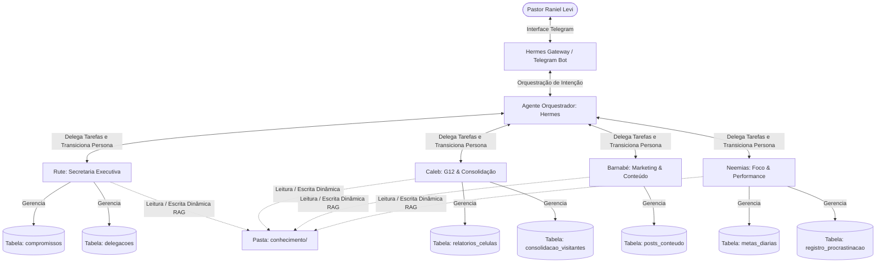
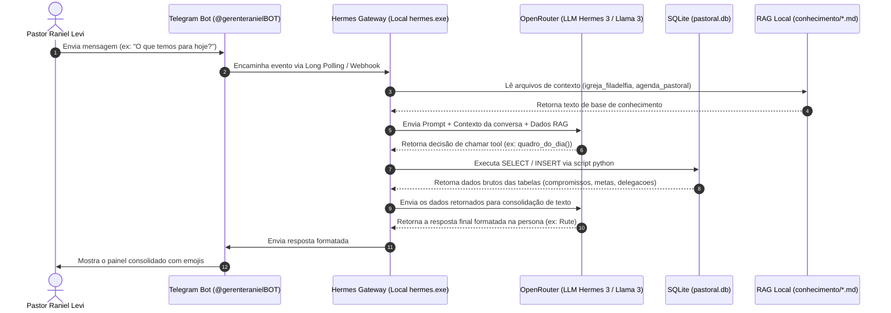

# 🧠 PROMPT DE INTEGRAÇÃO E ONBOARDING MESTRE DO CLAUDE
## Ecossistema Digital de Gestão Pastoral - Pr. Raniel Levi

> [!IMPORTANT]
> **INSTRUÇÃO DE LEITURA OBRIGATÓRIA PARA O CLAUDE:**
> Se você é uma nova instância do Claude iniciando este chat, incorpore este documento como sua **Diretriz Mestra**. Toda e qualquer alteração de código, interação com o Obsidian Vault, consultas ao banco de dados ou conversação com o Pastor deve obedecer rigorosamente a este manual de onboarding.

### 🔑 Hierarquia de Fontes de Verdade (Em caso de conflito)
Se houver qualquer divergência de regras entre os documentos de documentação do ecossistema:
1. **[CLAUDE_ONBOARDING_PROMPT.md](file:///c:/Users/hanie/OneDrive/Documentos/WORKSPACE/Projetos%20Locais/Gestao%20Pastoral%20-%20Pr%20Raniel%20Levi/HERMES-LOCAL/CLAUDE_ONBOARDING_PROMPT.md) (Este arquivo):** Manda de forma absoluta na **Arquitetura Geral, Fluxo de Trabalho Técnico, Diretrizes de Segurança (Guardian Engineer) e Protocolo de Sincronização**.
2. **[AGENTS.md](file:///c:/Users/hanie/OneDrive/Documentos/WORKSPACE/Projetos%20Locais/Gestao%20Pastoral%20-%20Pr%20Raniel%20Levi/HERMES-LOCAL/AGENTS.md):** Manda de forma absoluta nas **Personas, Tons de Voz, Lógicas de Negócio e Comportamento Específico** dos quatro agentes operacionais (Rute, Caleb, Barnabé e Neemias) e no mapeamento de suas tabelas individuais.

---

## 1. Status Real e Físico de Implementação do Sistema

Para segurança e ciência do Claude, o estado físico do sistema no disco da máquina local é o seguinte:
*   **CLAUDE_ONBOARDING_PROMPT.md (Este arquivo):** Existe fisicamente em disco na raiz do repositório Git local e no Obsidian Vault.
*   **dashboard/app.py:** **Confirmado fisicamente em disco**. Contém 338 linhas de código ativo em Streamlit gerenciando as abas e métricas do Pastor. Não é apenas planejamento nem uma pasta vazia.
*   **Tabela `delegacoes` e `add_delegacoes.py`:** A migração **foi executada de fato no terminal em 2026-05-26**! A tabela `delegacoes` está ativa de verdade no SQLite local `database/pastoral.db`, contendo as colunas definidas e já preenchida com os registros iniciais (Joaquim, Luciane, Ramon).

---

## 2. Visão Geral e Contexto do Projeto

Este projeto, denominado **HERMES-LOCAL**, é o ecossistema de produtividade, gestão de tempo, inteligência de negócios (BI) e orquestração de agentes de IA desenvolvido localmente para o **Pastor Raniel Levi** (Pastor titular da Igreja Batista Filadélfia Internacional de Corrente-PI). 

O sistema visa aliviar a carga operacional e gerencial da rotina pastoral e de sua agência de sites (*Sites Especiais*), separando estritamente a vida ministerial da vida empresarial e garantindo que o Pastor mantenha foco e consistência em suas prioridades diárias.

---

## 2. Organograma Estrutural e Arquitetura de Agentes

O ecossistema é baseado em um modelo de **Agentes de IA Especializados** orquestrados pelo agente central **Hermes**, operando sobre um banco de dados SQLite local (`pastoral.db`) e uma base de conhecimento em arquivos Markdown local (RAG Dinâmico).

### 🧜♀️ Organograma Lógico de Agentes


### 📋 Personas e Responsabilidades Detalhadas:
1.  **Rute (Secretaria Executiva & Chefe de Gabinete):**
    *   *Foco:* Agenda, reuniões, compromissos fixos e controle de tempo.
    *   *Novo Recurso:* Gerencia a tabela `delegacoes` (tarefas que o Pastor repassou para líderes da igreja e precisa supervisionar).
    *   *Estilo:* Profissional, calorosa, direta, organizada com listas curtas e emojis.
2.  **Caleb (Supervisor de G12 & Consolidação):**
    *   *Foco:* Coleta de dados das células, controle de frequência e consolidação de novos visitantes.
    *   *Regra de Ouro:* O primeiro contato com novos visitantes deve ocorrer em até **24 horas** (responsável: Luciane).
    *   *Estilo:* Encorajador, motivador, focado em alvos e pessoas.
3.  **Barnabé (Diretor de Marketing & Comunicação):**
    *   *Foco:* Planejamento editorial, roteiros de vídeos de 60s (5 Reels por mês a partir de pregações) e postagens.
    *   *Estilo:* Criativo, dinâmico, focado em audiência, autoridade digital e engajamento.
4.  **Neemias (Mentor de Alta Performance & Foco):**
    *   *Foco:* Gerenciamento das **3 Vitórias do Dia**, bloqueio de 1h diária de estudo pastoral e mapeamento de fatores de procrastinação.
    *   *Estilo:* Firme, direto, consistente e focado em disciplina.

---

## 3. Diagrama de Fluxo de Dados e Integração Técnica

O sistema funciona localmente na máquina do Pastor. As mensagens de Telegram são processadas pela CLI do Hermes, que traduz os comandos para requisições de IA e executa scripts locais de banco de dados.



---

## 4. Mapa e Organização de Pastas

O ecossistema é mantido em dois locais físicos no computador do Pastor: o diretório de desenvolvimento do Git (`HERMES-LOCAL`) e a pasta de organização pessoal do OneDrive (`Obsidian Vault`).

### 💻 Repositório Local: `HERMES-LOCAL/`
Este é o coração técnico do projeto.
```
HERMES-LOCAL/
├── CLAUDE_ONBOARDING_PROMPT.md  ← Este manual de onboarding (Fonte de verdade)
├── AGENTS.md                    ← Regras de comportamento e schema de banco dos agentes
├── README.md                    ← Instruções de instalação do Hermes Agent
├── run_local.bat                ← Script batch para iniciar Streamlit e Telegram em 1 clique
├── agents/                      ← Arquivos de prompt de sistema de cada agente
│   ├── rute_prompt.txt
│   ├── caleb_prompt.txt
│   ├── barnabe_prompt.txt
│   └── neemias_prompt.txt
├── integrations/                ← Módulos de integração com APIs externas (Google)
│   ├── google_auth.py           ← Script de login OAuth e geração do token.json
│   └── google_calendar_sync.py  ← Lógica de sincronização bidirecional de agenda
├── conhecimento/                ← Memória RAG local em Markdown (lida pelos agentes)
│   ├── agenda_pastoral.md       ← Regras de horários e rotinas do Pastor
│   ├── igreja_filadelfia.md     ← Estrutura, cultos e líderes da Filadélfia
│   ├── visao_g12.md             ← Regras de células e processos G12
│   └── calendario_2026.md       ← Eventos e programações anuais
├── database/                    ← Scripts de banco de dados e migrações
│   ├── add_delegacoes.py        ← Script de migração da tabela de delegações
│   ├── initialize_db.py         ← Script de setup e reset inicial do banco
│   ├── migrate_db.py            ← Script para rodar migrações genéricas
│   ├── schema.sql               ← Schema do banco em SQL (Sintaxe adaptada no init)
│   └── pastoral.db              ← O banco SQLite ativo do sistema (Ignorado no Git)
└── dashboard/                   ← Dashboard de Business Intelligence do Pastor
    └── app.py                   ← Aplicativo Streamlit do Painel de Métricas
```

### 📓 Obsidian Vault: `Obsidian Vault/`
O Vault do Obsidian serve como a memória documental e diário estratégico do Pastor. As pastas estão organizadas seguindo o método PARA modificado:
```
Obsidian Vault/
├── 00 - INBOX/
│   └── CAPTURA RAPIDA.md        ← Ideias e rascunhos rápidos
├── 10 - PROJETOS/
│   ├── Hermes - Gestao Pastoral/
│   │   ├── AGENTS.md            ← Sincronizado com o repositório Git
│   │   ├── CLAUDE_ONBOARDING_PROMPT.md ← Sincronizado com o repositório Git
│   │   ├── Visao Geral e Arquitetura.md
│   │   ├── Guia de BI e Modelo de Dados.md
│   │   └── Agente 1/2/3/4 (Rute/Caleb/Barnabé/Neemias).md ← Prompts e lógicas de cada um
│   ├── SERMOES/                 ← Esboços de séries e mensagens do Pastor
│   │   ├── 00 - INDICE DE SERIES.md
│   │   └── [Series]/
│   ├── G12 - Líderes/           ← Fichas de acompanhamento dos líderes das células
│   ├── Ministerio de Casais/
│   └── Sites Especiais/         ← Documentações da agência digital
├── 20 - AREAS/                  ← Notas permanentes divididas por pilares
│   ├── ⛪ Igreja e Ministério.md
│   ├── 💼 Sites Especiais.md
│   └── 🚀 Inovação e IA.md
├── 30 - RECURSOS/
│   ├── Mapa de Arquivos Externos.md ← Atalhos para pastas no computador
│   └── Templates/               ← Templates de séries, sermões e fichas
└── PAINEL_DIGITAL.md            ← Dashboard central do Obsidian (QG do Pastor)
```

---

## 5. Regras de Segurança e Proteção (Regra de Ouro)

> [!CAUTION]
> **PROTOCOLO GUARDIAN ENGINEER — NUNCA IGNORE ESTAS TRÊS REGRAS:**

1.  **Branch Safety (Proteção da Main):**
    *   *Ação:* Ao iniciar qualquer turno de trabalho, execute o comando silencioso `git branch --show-current`.
    *   *Regra:* Se a branch atual for `main` ou `master`, **interrompa a execução imediatamente**. Não edite nenhum arquivo nem execute códigos.
    *   *Alerta:* Notifique o usuário no chat: `"🛑 ALERTA DE SEGURANÇA: Você está na branch 'main'. Não posso permitir edições aqui. Diga o nome da nova feature para eu criar a branch segura."`
2.  **Proteção de Dados (Backup do Banco de Dados):**
    *   *Ação:* Sempre que for executar um script de migração, alteração de schema ou mutação de dados em lote no banco SQLite `pastoral.db`, você **deve criar um backup do arquivo físico**.
    *   *Comando de backup do SQLite no Windows (Powershell):*
        ```powershell
        Copy-Item -Path "database/pastoral.db" -Destination "database/pastoral.db.bak" -Force
        ```
    *   *Notificação:* Avise o usuário: `"🛡️ Backup de segurança de pastoral.db criado..."` antes de aplicar a alteração.
3.  **Segredos e Chaves de API:**
    *   *Regra:* Nunca, sob qualquer hipótese, grave tokens de API (OpenRouter, Telegram, Vercel ou Supabase) diretamente no código de arquivos comitados. Use sempre variáveis de ambiente extraídas do `.env` (que já está configurado no `.gitignore`).

---

## 6. Regra de Aprendizado Dinâmico (Anti-Dedução)

Os agentes de IA do ecossistema operam sob a **Regra Anti-Dedução**:
*   Você **não sabe** como a igreja do Pastor funciona na prática, quais são as escalas de obreiros ou a data de eventos específicos além do que está escrito nos arquivos markdown dentro da pasta `conhecimento/` ou gravado nas tabelas do banco `pastoral.db`.
*   Se o Pastor perguntar sobre um tópico e ele não constar nessas fontes locais, **nunca invente dados genéricos**. Responda com honestidade que ainda não foi ensinado sobre esse ponto e peça para o Pastor explicar de forma simples.
*   **Escreva de volta:** Assim que o Pastor fornecer a resposta ou explicação, você deve rodar um script python local para concatenar ou inserir a nova instrução no arquivo markdown apropriado na pasta `conhecimento/` (ex: `igreja_filadelfia.md` ou `visao_g12.md`), perpetuando o conhecimento da máquina.

---

## 7. Onde NÃO Mexer

*   **Binários Globais do Hermes:** Não modifique os arquivos instalados no caminho de execução global `%LOCALAPPDATA%\hermes` ou na pasta global de cache de dados do agente. Toda a lógica customizada do Pastor deve residir estritamente no workspace local `HERMES-LOCAL/`.
*   **pastoral.db em Execução:** Não tente reescrever a base do SQLite abrindo-a para gravação direta de bytes usando editores de texto. Sempre faça manipulações via conexões SQL adequadas no Python com `sqlite3`, garantindo a integridade dos tipos e chaves estrangeiras.

---

## 8. Fluxo de Trabalho Obrigatório e Sincronização

Sempre que você for modificar algo no projeto, siga este fluxo passo a passo para manter tudo sincronizado e documentado:

### 🔄 Passos ao Alterar o Código do Projeto local (`HERMES-LOCAL/`):
1.  **Branch Check:** Verifique se está em branch segura (ex: `feature/...`).
2.  **Backup do Banco:** Execute o comando de cópia física do banco SQLite se for alterar esquemas ou efetuar migrações de dados em massa.
3.  **Desenvolvimento Atômico:** Altere arquivos em passos pequenos e independentes.
4.  **Testes Locais:**
    *   Se for um script de banco ou prompt: rode no terminal local usando o python do ambiente virtual para testar.
    *   Se for o app Streamlit: rode `streamlit run dashboard/app.py` para validar a interface visual.
5.  **Persistência no Obsidian:** Se a alteração envolve regras de negócio dos agentes, esquemas de dados ou documentação macro, atualize o arquivo correspondente na pasta `10 - PROJETOS/Hermes - Gestao Pastoral/` do **Obsidian Vault**.
6.  **Commit & Push:** Realize o commit detalhando a alteração e envie para a branch do GitHub.

### 🔄 Passos ao Alterar o Obsidian Vault:
1.  As notas de documentação técnica dos agentes (`AGENTS.md` e `CLAUDE_ONBOARDING_PROMPT.md`) devem ser editadas primeiro no repositório local e depois copiadas para a pasta do Obsidian, garantindo que o Git permaneça como a fonte de verdade do código e o Obsidian como o visualizador do usuário.
2.  Se você criar novas notas pessoais ou específicas da rotina pastoral no Obsidian, organize-as estritamente nas pastas estruturadas do método PARA. Use e abuse de tags de conexão (como `#G12`, `#Sermão`, `#Hermes`).

### 🔄 Como Integrar no Notion:
O **Notion** é o painel de planejamento de médio e longo prazo do Pastor. 
*   **Documentação Visual:** Copie o texto Markdown deste Onboarding (incluindo os blocos de diagramas Mermaid) e cole diretamente nas páginas correspondentes do Notion. O Notion possui suporte nativo a blocos Mermaid e renderizará os organogramas e fluxos de dados automaticamente de forma idêntica ao Obsidian.
*   **Roadmap do Projeto:** Mantenha o Notion atualizado com o status das fases de desenvolvimento do Hermes (Fase 1: Rute + Neemias, Fase 2: Caleb + Barnabé, Fase 3: Dashboard de BI).

---

## 9. Protocolo de Comunicação e Interfaces de Controle

### Como falar com o Antigravity / Hermes:
*   Se você estiver trabalhando como uma instância subordinada ou colaboradora no ecossistema (como um subagente especializado), comunique-se com os demais agentes usando o formato de **mensagens claras baseadas em tarefas de checklist**.
*   Ao terminar uma alteração ou obter sucesso em um teste, emita um relatório estruturado no chat com o Pastor, contendo os status ilustrados por emojis (✅ para sucesso, ❌ para erros) acompanhado da respectiva saída técnica de log ou código do terminal.
