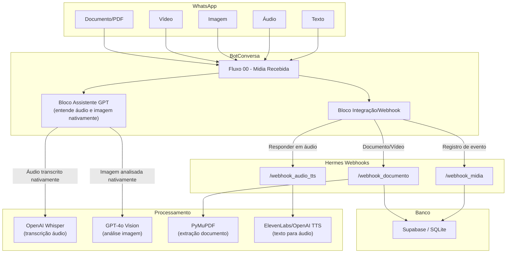

# 01 - Visão Geral Multimodal

**Data:** 2026-06-05  
**Contexto:** Atualização do plano de mídia para o ecossistema Hermes Filadélfia

---

## 1. O que mudou?

**Antes (plano original):**
```
Mídia recebida -> "Do que se trata?" -> Pessoa explica -> IA interpreta -> Roteia
```

**Agora (plano atualizado):**
```
Mídia recebida -> BotConversa entende direto -> IA interpreta contexto -> Responde ou roteia
```

---

## 2. O que cada tipo de mídia vira

| Tipo | Processamento | Saída para a IA |
|---|---|---|
| **Áudio (WhatsApp)** | BotConversa transcreve automaticamente usando Whisper/OpenAI | Texto transcrito |
| **Imagem (JPEG/PNG)** | BotConversa envia para GPT-4o Vision (nativo) | Descrição do conteúdo |
| **Vídeo (MP4)** | Webhook Hermes -> extrai frame inicial + transcrição áudio | Descrição + transcrição |
| **Documento (PDF)** | Webhook Hermes -> extrai texto (PyMuPDF) | Texto extraído |
| **Documento (DOCX/DOC)** | Webhook Hermes -> extrai texto (python-docx) | Texto extraído |
| **Planilha (XLSX)** | Webhook Hermes -> extrai texto das células | Dados em formato texto |
| **Figurinha (Sticker)** | BotConversa -> imagem pequena -> GPT-4o Vision | Descrição |

---

## 3. Arquitetura final



---

## 4. Pesquisa de mercado: como os grandes players resolvem

### 4.1 BotConversa (nossa plataforma)

**Capacidade nativa:** O bloco Assistente GPT (GPT Especialista) do BotConversa **já entende texto, áudio e imagens** sem configuração extra. Conforme a documentação oficial: *"O assistente entende: texto, áudio e imagens."*

**O que isso significa:**
- Áudio recebido no WhatsApp é automaticamente transcrito e enviado ao GPT
- Imagem recebida é analisada por visão computacional (GPT-4o)
- Não precisa de webhook externo para áudio e imagem
- Documentos (PDF, DOCX) ainda precisam de processamento externo

**Limitação:** o bloco Assistente GPT não extrai texto de PDFs/DOCX nativamente.

### 4.2 WaliChat (concorrente direto)

**Arquitetura:** 
1. Detecta o tipo de mídia (texto, áudio, imagem, PDF)
2. Áudio → Whisper transcreve
3. Imagem → GPT-4o Vision analisa
4. PDF → extração de texto
5. Tudo alimenta o OpenAI Chat Agent
6. Se usuário enviou áudio, responde em áudio (OpenAI TTS)

**Diferencial:** resposta em áudio quando o input foi áudio.

### 4.3 n8n (plataforma de automação)

Vários templates no n8n Community fazem exatamente isso:
- WhatsApp Trigger → detecta tipo de mídia
- Get Image/Audio/File URL → baixa o arquivo
- Transcribe Audio → Whisper
- Analyze Image → GPT-4o Vision
- Generate Audio Response → OpenAI TTS
- AI Agent processa tudo como texto normalizado

**Diferencial:** arquitetura modular e reprodutível.

### 4.4 ElevenLabs Agents

Em 2026, ElevenLabs lançou suporte nativo a WhatsApp. Os agentes:
- Entendem texto e áudio
- Respondem com voz natural
- Podem ser configurados com knowledge base, ferramentas e guardrails
- Suportam conversas multimodais

**Diferencial:** qualidade de voz superior, mas é uma plataforma separada.

### 4.5 Blip (Take Blip)

Plataforma brasileira madura. Usa:
- Builder visual para fluxos
- IA para classificação de intenção
- Atendimento humano com fila
- WhatsApp Flows para coleta estruturada

**Diferencial:** maturidade em atendimento humano híbrido.

---

## 5. WhatsApp AI Policy 2026

**Regra da Meta a partir de 15 Jan 2026:**
- Proibido: chatbot IA de propósito geral (GPT genérico no WhatsApp)
- Permitido: atendimento estruturado (FAQ, suporte, agendamento, cadastro, notificações)

**Como o Hermes se enquadra:**
- O Hermes é um sistema de **atendimento pastoral estruturado** → PERMITIDO
- As áreas cobertas: cadastro, visitantes, células, aconselhamento, oração, eventos, ministérios → todas são atendimento de negócio/organização religiosa
- O chatbot não responde perguntas aleatórias sobre o clima, programação, etc → NÃO é propósito geral

**Posicionamento recomendado:**
```text
"Assistente de atendimento, cadastro, cuidado pastoral, agenda,
consolidação e comunicação da Igreja Batista Filadélfia Internacional de Corrente."
```

---

## 6. Decisões de arquitetura

### Decisão 1: Áudio e imagem → BotConversa nativo
O bloco Assistente GPT do BotConversa já entende áudio e imagem.  
**Não precisamos de webhook externo para isso.**

### Decisão 2: Documento (PDF, DOCX, XLSX) → Webhook Hermes
O BotConversa não extrai texto de documentos nativamente.  
**Criar endpoint `/webhook_documento` que baixa, extrai texto e devolve.**

### Decisão 3: Resposta em áudio → Webhook TTS
Quando fizer sentido (explicação longa, aconselhamento, salmo, oração), o Hermes gera áudio.  
**Criar endpoint `/webhook_audio_tts` que recebe texto, gera MP3 com ElevenLabs/OpenAI TTS e envia via API BotConversa.**

### Decisão 4: Registro de eventos → Webhook mídia
Toda mídia recebida deve ser registrada para BI.  
**Criar endpoint `/webhook_midia` que salva evento e retorna 200 rápido.**

---

## 7. Matriz de responsabilidade

| Tipo de mídia | Quem entende | Quem registra | Quem responde |
|---|---|---|---|
| Texto | BotConversa (Assistente GPT) | Webhook genérico | BotConversa ou Hermes |
| Áudio | BotConversa (transcrição nativa) | Webhook mídia | BotConversa (txt) ou Hermes TTS (áudio) |
| Imagem | BotConversa (GPT-4o Vision nativo) | Webhook mídia | BotConversa |
| Vídeo | Hermes (webhook + transcrição) | Webhook mídia | Hermes |
| Documento | Hermes (webhook + extração) | Webhook mídia | Hermes |