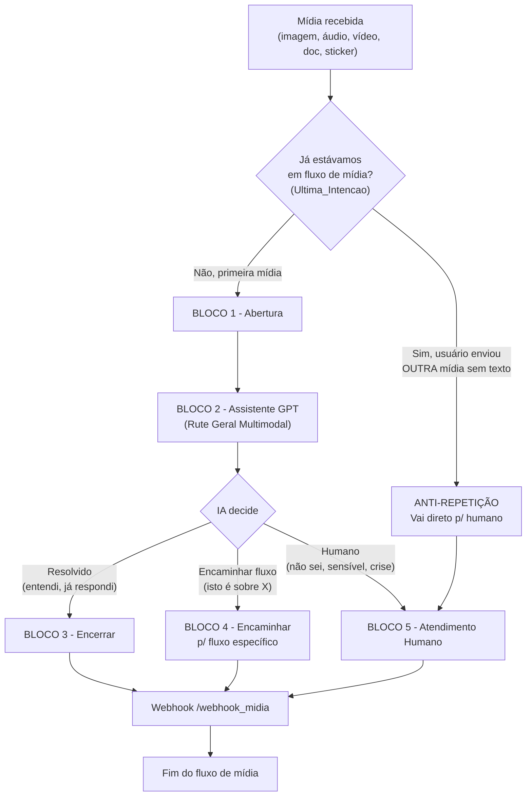

# 02 - Fluxo Completo: 00 - Midia Recebida - Rute

**Data:** 2026-06-05  
**Base:** Pesquisa de mercado + documentação BotConversa + Guia Mestre Hermes

---

## 1. Mudança principal neste fluxo

**Antes:**
```
Perguntava "Do que se trata?" -> Pessoa explicava -> IA interpretava
```

**Agora:**
```
BotConversa entende a mídia diretamente -> IA decide o que fazer -> Responde / Roteia
```

---

## 2. Visão geral do fluxo



---

## 3. Blocos detalhados

### BLOCO 1 - Abertura

**Tipo:** Bloco de Ação + Conteúdo

**Condição de entrada (anti-loop):**
```
Se Ultima_Intencao == "Midia_Recebida" E mensagem atual é mídia:
   -> Pular para ANTI-REPETIÇÃO (humano direto)
```

**Ações:**
1. Aplicar etiqueta: `IA - Em Atendimento`
2. Salvar campo: `Ultima_Intencao = Midia_Recebida`
3. Salvar campo: `Status_Atendimento_IA = Aberto`
4. Salvar campo: `Tipo_Midia` (imagem, video, audio, documento, sticker) — se disponível

**Mensagem:**

> Recebi sua mídia! 📎
> 
> Deixa eu dar uma olhada aqui enquanto você digita...

*(esta mensagem é exibida APENAS se o BotConversa precisar de um momento para processar; se o processamento for instantâneo, pode pular)*

**Inatividade:**
- Se não responder em 5 minutos:
  - Remover `IA - Em Atendimento`
  - Aplicar `IA - Inativo`
  - Salvar `Status_Atendimento_IA = Inativo`
  - Mensagem de pausa
  - Conectar para `Encerrar Conversa`

---

### BLOCO 2 - Assistente GPT (Rute Geral Multimodal)

**Tipo:** Bloco Assistente GPT

**Assistente:** `Rute Geral` (o mesmo usado no fluxo `1- RUTE SECRETARIA`)  
**Ou:** Pode-se criar um assistente específico `Rute Midia` para tratar mídia, com instruções específicas.

**Como o BotConversa entende cada tipo:**

| Tipo | Processamento automático do BotConversa |
|---|---|
| Áudio | Transcrito automaticamente (Whisper) → IA recebe como texto |
| Imagem | Enviada para GPT-4o Vision → IA "vê" a imagem |
| Texto | Direto para IA |
| Sticker | Tratado como imagem (o GPT-4o Vision analisa) |

**Instruções para o assistente:**

```
Você é a Rute, assistente virtual da Igreja Batista Filadélfia 
Internacional de Corrente. Você está no fluxo de Mídia Recebida.

A pessoa enviou uma mídia (imagem, áudio, documento ou vídeo) 
pelo WhatsApp. Você CONSEGUE ver/ouvir/entender esta mídia 
diretamente.

Regras:
1. Se a mídia for uma IMAGEM: analise o conteúdo. Pode ser 
   um convite, um documento escaneado, uma foto de evento, 
   um print de conversa, uma arte de divulgação, etc.
2. Se a mídia for um ÁUDIO: você recebeu a transcrição. 
   Analise o conteúdo do que foi dito.
3. Se a mídia for um DOCUMENTO/PDF: o texto foi extraído 
   automaticamente. Analise o conteúdo.
4. NUNCA diga "Não consigo ver/ouvir esta mídia" — você 
   consegue sim! Apenas analise o que recebeu.

O que fazer com a mídia:
- Se for uma informação simples (horário, endereço, 
  confirmação): responda e encerre.
- Se for um pedido (oração, cadastro, célula, ministério, 
  evento): identifique a intenção e encaminhe para o fluxo 
  correto usando as saídas:
  * AtualizaCadastro
  * Visitante
  * PedidoOracao
  * Aconselhamento
  * CelulaG12
  * Ministerio
  * Evento
  * Humano (se não souber ou for assunto sensível)
- Se for uma arte/convite/divulgação: agradeça e confirme 
  recebimento.
- Se for uma reclamação ou assunto sensível: Humano.
- Se NÃO CONSEGUIR entender o conteúdo mesmo após analisar: 
  pergunte educadamente sobre o que se trata.

Tom: profissional, pastoral, acolhedor.
Sempre use "Graça e Paz!" nas saudações.

IDIOMA: Responda sempre em português brasileiro.
```

**Configurações do assistente:**
- Temperatura: 0.3 (baixa — mídia precisa de precisão)
- Tempo de agrupamento: 5 segundos
- Sucesso: quando a resposta foi dada e a mídia foi processada
- Interrupção: quando a pessoa pede humano ou o assunto foge do escopo
- Inatividade: 5 minutos

**Saídas configuradas:**
```
AtualizaCadastro -> Fluxo "Atualizacao Cadastral"
Visitante -> Fluxo "VISITANTE"
PedidoOracao -> Fluxo "Pedido de Oracao"
Aconselhamento -> Fluxo "Pedido de Aconselhamento" + Humano
CelulaG12 -> Fluxo "G12 e Celulas"
Ministerio -> Fluxo "Ministerios"
Evento -> Fluxo "Eventos e Agenda"
Humano -> Fluxo "Atendimento Humano"
```

---

### BLOCO 3 - Encerrar (saída: resolvido)

**Ações:**
1. Remover etiqueta: `IA - Em Atendimento`
2. Aplicar etiqueta: `IA - Resolvido`
3. Salvar campo: `Status_Atendimento_IA = Resolvido`
4. Salvar campo: `Resumo_Atend_IA` (resumo automático do assistente)
5. Chamar webhook: `/webhook_midia`
6. Conectar para: `Encerrar Conversa`

---

### BLOCO 4 - Encaminhar (saída: outro fluxo)

**Ações:**
1. Salvar campo: `Ultima_Intencao` (valor vindo da IA)
2. Salvar campo: `Ultimo_Fluxo_Encaminhado`
3. Salvar campo: `Resumo_Atend_IA`
4. Aplicar etiqueta: `IA - Encaminhado`
5. Remover etiqueta: `IA - Em Atendimento`
6. Chamar webhook: `/webhook_midia`
7. Conectar para: fluxo específico (conexão de fluxo)

---

### BLOCO 5 - Atendimento Humano (saída: humano)

**Ações:**
1. Aplicar etiqueta: `Humano Necessario`
2. Aplicar etiqueta: `Em Atendimento Humano`
3. Remover etiqueta: `IA - Em Atendimento`
4. Salvar campo: `Status_Atendimento_IA = Humano`
5. Salvar campo: `Nivel_Urgencia` (vindo da IA)
6. Salvar campo: `Resumo_Atend_IA`
7. Abrir atendimento humano (bloco de ação do BotConversa)
8. Chamar webhook: `/webhook_midia`

**Mensagem:**

> Graça e Paz! Entendi.
> 
> Vou encaminhar sua mensagem para uma pessoa da nossa equipe te atender com mais cuidado.
> 
> Em breve alguém vai falar com você por aqui.

---

## 4. Bloco ANTI-REPETIÇÃO

**Quando ativa:** Se `Ultima_Intencao == Midia_Recebida` e pessoa enviou outra mídia sem texto explicativo.

**Ações:**
1. Pular todo o fluxo de mídia
2. Aplicar `Humano Necessario`
3. Remover `IA - Em Atendimento`
4. Abrir atendimento humano direto

**Mensagem:**

> Percebi que você está enviando arquivos. Como não consegui entender o conteúdo, vou encaminhar para nossa equipe te ajudar. ✅

---

## 5. Integração com webhooks

### Webhook `/webhook_midia` (chamado em TODAS as saídas)

**Payload:**
```json
{
  "evento": "midia_recebida",
  "subscriber_id": "{{subscriber_id}}",
  "nome": "{{nome}}",
  "telefone": "{{telefone}}",
  "acao": "resolvido|encaminhado|humano|inativo|loop",
  "tipo_midia": "imagem|video|audio|documento|sticker",
  "ultima_intencao": "{{Ultima_Intencao}}",
  "resumo_ia": "{{Resumo_Atend_IA}}",
  "nivel_urgencia": "{{Nivel_Urgencia}}"
}
```

### Webhook `/webhook_audio_tts` (se resposta em áudio)

Ver documento `06_WEBHOOK_AUDIO_TTS.md` para detalhes.

---

## 6. Testes obrigatórios

1. Enviar **imagem de convite** de evento → deve reconhecer e confirmar
2. Enviar **áudio pedindo oração** → deve transcrever e encaminhar para oração
3. Enviar **print de conversa com reclamação** → deve identificar como humano
4. Enviar **PDF com documento** → webhook extrai texto, IA analisa
5. Enviar **sticker aleatório** → IA responde educadamente
6. Enviar **imagem + texto explicativo junto** → IA considera ambos
7. Enviar **2 mídias seguidas** → anti-repetição ativa, vai para humano
8. Enviar **vídeo curto** → webhook extrai frame + transcrição
9. Enviar **áudio em outro idioma** → Whisper transcreve, IA responde em português
10. **Ficar inativo** após enviar mídia → inatividade, encerrar