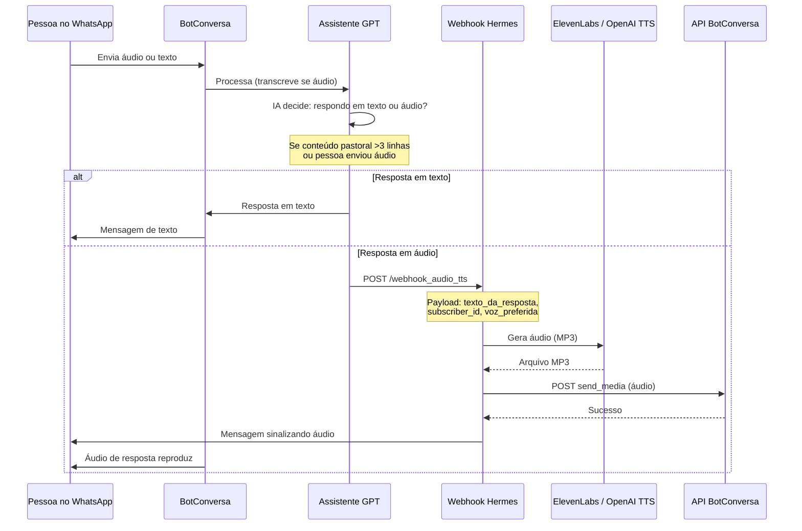
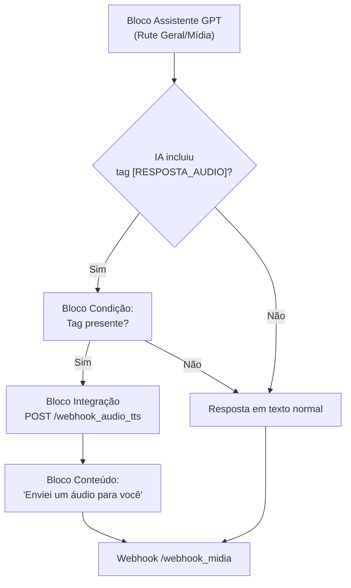

# 04 - Resposta por Áudio no WhatsApp

**Data:** 2026-06-05  
**Tema:** Como implementar resposta em áudio no ecossistema Hermes Filadélfia

---

## 1. Por que responder em áudio?

| Situação | Texto | Áudio |
|---|---|---|
| Resposta curta ("Sim", "OK") | ✅ Melhor | ❌ Exagerado |
| Horário de culto | ✅ Melhor | ✅ Funciona |
| Explicação sobre G12 | ✅ Funciona | ✅ **Melhor** — mais acolhedor |
| Aconselhamento | ✅ Funciona | ✅ **Melhor** — transmite cuidado |
| Salmo ou oração | ✅ Funciona | ✅ **Muito melhor** — mais espiritual |
| Instruções complexas | ✅ Funciona | ✅ **Melhor** — mais claro |
| Confirmação de cadastro | ✅ Melhor | ❌ Desnecessário |

**Decisão:** usar áudio quando:
1. A pessoa enviou áudio (responder com áudio é natural)
2. A resposta tem mais de 3 linhas (áudio é mais agradável)
3. É um conteúdo pastoral/espiritual (oração, salmo, aconselhamento)
4. O assistente julgar que áudio seria melhor

---

## 2. Arquitetura de resposta em áudio



---

## 3. Opções de TTS (Text-to-Speech)

### Opção A: ElevenLabs ✅ Recomendada

**Vantagens:**
- Voz natural e emocional
- Voz clone do Pastor disponível (se ele gravar amostra)
- Suporta português brasileiro perfeitamente
- Lançou suporte nativo a WhatsApp em 2026

**Desvantagens:**
- Custo por caractere (plano pago)
- Latência um pouco maior que outras opções

**Custo estimado:**
- Plano Creator ($22/mês): 100.000 caracteres/mês
- Plano Pro ($99/mês): 500.000 caracteres/mês
- Para uso pastoral (respostas moderadas), Creator deve bastar

### Opção B: OpenAI TTS (via API)

**Vantagens:**
- Mais barato que ElevenLabs
- API simples e rápida
- Modelos: `tts-1` (rápido) e `tts-1-hd` (alta qualidade)
- Vozes: alloy, echo, fable, nova, onyx, shimmer

**Desvantagens:**
- Voz menos natural que ElevenLabs
- Sem clone de voz personalizado
- Latência baixa mas qualidade inferior

**Custo:** ~$0.015/1000 caracteres (muito barato)

### Opção C: Microsoft Edge TTS (gratuito)

**Vantagens:**
- Gratuito
- Vozes femininas e masculinas em português
- Qualidade boa para uso interno

**Desvantagens:**
- Não tem API oficial estável
- Pode quebrar com mudanças da Microsoft
- Não recomendado para produção confiável

### Comparativo

| Critério | ElevenLabs | OpenAI TTS | Edge TTS |
|---|---|---|---|
| Naturalidade | ★★★★★ | ★★★★ | ★★★ |
| Voz clone | ✅ Sim | ❌ Não | ❌ Não |
| PT-BR | ✅ Excelente | ✅ Bom | ✅ Bom |
| Custo | $$ | $ | Gratuito |
| API confiável | ✅ Sim | ✅ Sim | ❌ Instável |
| Latência | Média | Baixa | Baixa |

**Escolha:** **ElevenLabs** para respostas pastorais e públicas.  
**OpenAI TTS** como fallback (para quando ElevenLabs estiver indisponível ou para testes).

---

## 4. Criando o prompt da IA para decidir quando usar áudio

No assistente `Rute Geral` (ou `Rute Midia`), adicione:

```
REGRAS DE RESPOSTA EM ÁUDIO:

Você pode responder em texto ou solicitar que a resposta 
seja enviada em ÁUDIO.

Use ÁUDIO quando:
1. A pessoa enviou ÁUDIO (responder com áudio é mais natural)
2. Sua resposta vai ter mais de 3 linhas ou conteúdo denso
3. O conteúdo é pastoral/espiritual (oração, salmo, 
   aconselhamento, palavra de fé)
4. A pessoa parece emotiva ou precisa de acolhimento

Use TEXTO quando:
1. A resposta é curta (sim, não, ok, obrigado)
2. São informações práticas (horários, endereço, números)
3. A pessoa pediu especificamente por texto

Se decidir por ÁUDIO, inclua a tag no final da sua resposta:
[RESPOSTA_AUDIO]

Se decidir por TEXTO, apenas responda normalmente.

IMPORTANTE: A tag [RESPOSTA_AUDIO] faz o sistema gerar 
um áudio com sua resposta. Você não precisa se preocupar 
com isso — apenas inclua a tag quando achar que áudio 
seria melhor.
```

---

## 5. Como o fluxo no BotConversa fica



---

## 6. Experiência do usuário

**Quando o Hermes decide responder em áudio:**

1. A IA processa a mensagem
2. Gera o texto da resposta
3. Inclui a tag `[RESPOSTA_AUDIO]`
4. BotConversa detecta a tag → chama webhook
5. Webhook gera MP3 → envia via API BotConversa
6. Usuário recebe uma mensagem de áudio no WhatsApp

**Exemplo de experiência:**

```
Usuário: [envia áudio de 2 minutos pedindo oração]
Rute: [áudio de 30 segundos]
  "Graça e Paz! Recebi seu pedido de oração.
  Vou registrar aqui e incluir em nossas orações.
  Que Deus te abençoe e te dê paz nesta situação."
```

---

## 7. Endpoint `/webhook_audio_tts`

**Payload:**
```json
{
  "evento": "resposta_audio",
  "subscriber_id": "{{subscriber_id}}",
  "nome": "{{nome}}",
  "telefone": "{{telefone}}",
  "texto_resposta": "texto completo da resposta que será convertida em áudio",
  "voz": "elevenlabs|openai",
  "tom": "pastoral|normal|acolhedor"
}
```

**Resposta:**
```json
{
  "status": "ok",
  "audio_url": "URL para download do MP3 (se necessário)",
  "message_id": "id da mensagem enviada"
}
```

**Processo interno:**
1. Recebe payload
2. Gera áudio (ElevenLabs ou OpenAI TTS)
3. Envia mídia para o subscriber via API BotConversa
4. Registra evento no banco (tabela `eventos_midia` ou `eventos_audio`)
5. Retorna 200

---

## 8. Qualidade de voz recomendada para ElevenLabs

Para uso pastoral, a voz deve ser:

- **Calorosa** — tom que transmita acolhimento
- **Clara** — dicção limpa para informações
- **Respeitosa** — adequada para aconselhamento

**Sugestões de voz:**
- Vozes disponíveis no ElevenLabs: Rachel, Nicole, Emily, Adam, Antoni
- Para o Pastor: clone de voz `Pr. Raniel` (precisa de ~30 min de gravação)

Caso opte por clone de voz do Pastor, as respostas em áudio soarão como se fossem dele — o que pode ser **muito positivo** para aconselhamento e mensagens pastorais, mas requer **revisão e autorização** para garantir que o tom e conteúdo estejam corretos.