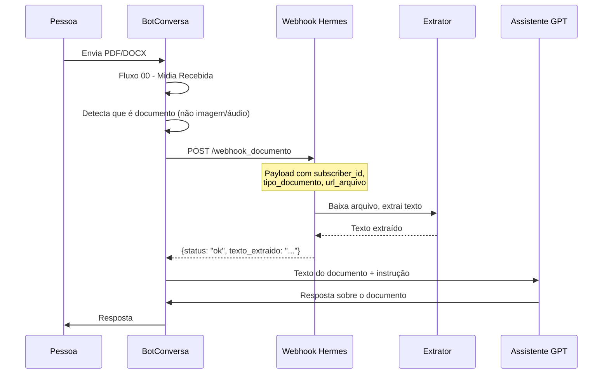

# 07 - Documento e Vídeo: Processamento por Webhook Hermes

**Data:** 2026-06-05  
**Status:** Proposto para implementação

---

## 1. O problema

O BotConversa entende áudio e imagem nativamente, mas **não processa:**
- Documentos (PDF, DOCX, DOC, XLSX)
- Vídeos (MP4, MOV)

Para estes tipos, o fluxo deve encaminhar para um webhook Hermes que:
1. Baixa o arquivo (via API BotConversa ou WhatsApp Cloud API)
2. Extrai o conteúdo (texto de documento, frame + transcrição de vídeo)
3. Devolve o texto extraído para a IA continuar o atendimento

---

## 2. Fluxo para documentos



---

## 3. Endpoint `/webhook_documento`

### Payload

```json
{
  "evento": "documento_recebido",
  "subscriber_id": "{{subscriber_id}}",
  "nome": "{{nome}}",
  "telefone": "{{telefone}}",
  "tipo_documento": "pdf|docx|xlsx",
  "url_arquivo": "URL para download do arquivo (se disponível)",
  "mensagem_usuario": "texto opcional que acompanhou o documento"
}
```

### Resposta

```json
{
  "status": "ok",
  "texto_extraido": "Conteúdo completo extraído do documento...",
  "total_paginas": 3,
  "tamanho_chars": 4520,
  "tipo_documento": "pdf"
}
```

---

## 4. Extração por tipo

### PDF (mais comum)

```python
import PyMuPDF  # pymupdf

def extrair_pdf(url: str) -> str:
    """Baixa PDF de URL e extrai texto."""
    import requests
    import tempfile
    
    response = requests.get(url)
    with tempfile.NamedTemporaryFile(suffix=".pdf", delete=False) as tmp:
        tmp.write(response.content)
        tmp_path = tmp.name
    
    doc = fitz.open(tmp_path)
    texto = "\n".join([page.get_text() for page in doc])
    doc.close()
    os.unlink(tmp_path)
    return texto
```

### DOCX

```python
from docx import Document

def extrair_docx(url: str) -> str:
    """Baixa DOCX e extrai texto."""
    import requests
    import tempfile
    
    response = requests.get(url)
    with tempfile.NamedTemporaryFile(suffix=".docx", delete=False) as tmp:
        tmp.write(response.content)
        tmp_path = tmp.name
    
    doc = Document(tmp_path)
    texto = "\n".join([p.text for p in doc.paragraphs])
    os.unlink(tmp_path)
    return texto
```

### XLSX (planilhas)

```python
import pandas as pd

def extrair_xlsx(url: str) -> str:
    """Baixa XLSX e extrai texto de todas as abas."""
    import requests
    import tempfile
    
    response = requests.get(url)
    with tempfile.NamedTemporaryFile(suffix=".xlsx", delete=False) as tmp:
        tmp.write(response.content)
        tmp_path = tmp.name
    
    dfs = pd.read_excel(tmp_path, sheet_name=None)
    textos = []
    for sheet_name, df in dfs.items():
        textos.append(f"--- Aba: {sheet_name} ---")
        textos.append(df.to_string(index=False))
    
    os.unlink(tmp_path)
    return "\n".join(textos)
```

---

## 5. Fluxo para vídeos

Vídeos são mais complexos. Estratégia:

1. Baixar o vídeo
2. Extrair o primeiro frame (imagem) para análise visual
3. Extrair o áudio e transcrever (Whisper)
4. Combinar descrição do frame + transcrição para a IA

```python
import subprocess
import tempfile

def processar_video(url: str) -> dict:
    """Baixa vídeo, extrai frame e transcrição."""
    import requests
    
    # 1. Baixa vídeo
    response = requests.get(url)
    with tempfile.NamedTemporaryFile(suffix=".mp4", delete=False) as tmp:
        tmp.write(response.content)
        video_path = tmp.name
    
    # 2. Extrai primeiro frame como imagem
    frame_path = video_path + "_frame.jpg"
    subprocess.run([
        "ffmpeg", "-i", video_path, "-ss", "00:00:01",
        "-vframes", "1", frame_path
    ], capture_output=True)
    
    # 3. Extrai áudio
    audio_path = video_path + "_audio.mp3"
    subprocess.run([
        "ffmpeg", "-i", video_path, "-q:a", "0", "-map", "a",
        audio_path
    ], capture_output=True)
    
    # 4. Transcreve áudio (usando Whisper via OpenAI API)
    with open(audio_path, "rb") as f:
        transcricao = openai.Audio.transcribe("whisper-1", f)
    
    # 5. (Opcional) Envia frame para GPT-4o Vision
    # descricao_frame = analisar_imagem_com_vision(frame_path)
    
    # Limpeza
    os.unlink(video_path)
    if os.path.exists(frame_path):
        os.unlink(frame_path)
    if os.path.exists(audio_path):
        os.unlink(audio_path)
    
    return {
        "transcricao": transcricao["text"],
        "frame_path": frame_path,  # se quiser manter para análise
    }
```

**Nota:** Processamento de vídeo é intensivo. Em produção, deve ser feito em background com fila.

---

## 6. Como o BotConversa chama o webhook de documento

No fluxo `00 - Midia Recebida - Rute`, o bloco Assistente GPT não consegue processar documentos nativamente. Então:

1. Bloco de Condição: `Tipo de mídia == Documento` ou `Tipo de mídia == Vídeo`?
2. Se sim → Bloco de Integração: `POST /webhook_documento`
3. Aguarda resposta do webhook
4. Usa o texto extraído como contexto para o Assistente GPT

**No prompt da IA, incluir instrução sobre documentos:**

```
Se o usuário enviou um DOCUMENTO (PDF, DOCX) ou VÍDEO,
você receberá o texto extraído automaticamente pelo sistema.

Analise o conteúdo extraído como se fosse uma mensagem
de texto normal do usuário. Responda com base no conteúdo.
```

---

## 7. Dependências a instalar

```bash
pip install pymupdf      # PDF
pip install python-docx   # DOCX
pip install pandas openpyxl  # XLSX
pip install openai        # Whisper (se for usar)
```

FFmpeg precisa estar instalado no sistema para processamento de vídeo.

---

## 8. Limitação importante

**Documentos muito grandes:**

| Tipo | Limite prático | Ação se exceder |
|---|---|---|
| PDF texto | 50 páginas (~50KB) | Extrair primeiras 50 páginas |
| PDF escaneado | 10 páginas (OCR é caro) | Marcar para humano |
| DOCX | 100 páginas | Extrair completo |
| XLSX | 10 abas, 1000 linhas | Truncar |
| Vídeo | 5 minutos | Marcar para humano |

Para documentos que exigem OCR (PDF escaneado), o processamento é mais pesado e pode não valer a pena para o fluxo de mídia. Nestes casos, o webhook retorna um aviso e o fluxo encaminha para humano.