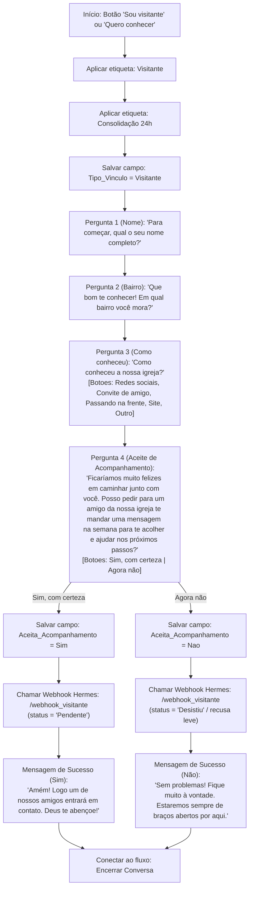

# 08 - Acolhimento de Visitantes 24h (Consolidação)

**Data:** 2026-06-05  
**Autor:** Hermes (Caleb)  
**Módulo:** G12, Células e Consolidação  
**Status:** Planejado para Implementação

---

## 1. Visão Geral e Princípios

O acolhimento de visitantes (Consolidação) é o processo mais crítico para o crescimento saudável da igreja. O princípio central é: **nenhum visitante deve passar mais de 24 horas sem um contato amigável e personalizado.**

Na linguagem falada com o visitante, **nunca** usamos termos técnicos como "consolidação", "consolidador" ou "funil". Apresentamos os responsáveis como:
- *"Um amigo próximo"*
- *"Alguém da nossa equipe"*
- *"Uma pessoa da nossa igreja para te apoiar"*

Este plano organiza e automatiza o processo no BotConversa + Hermes + Banco de Dados.

---

## 2. Desenho do Fluxo no BotConversa (`flow_consolidacao_visitante`)

O fluxo visual de visitantes no BotConversa deve seguir a seguinte estrutura lógica:



---

## 3. Webhooks de Visitantes

Precisamos garantir suporte total tanto para SQLite (ambiente de desenvolvimento local) quanto para Postgres/Supabase (produção).

### 3.1 Correção: Criar `criar_visitante_pg` no Hermes

Atualmente, `webhook_server.py` chama `criar_visitante_pg` se o banco configurado for Postgres (Supabase), mas essa função **não está implementada**, o que causa um erro de execução. Vamos implementar essa função.

### 3.2 Novo Webhook: `/webhook_consolidacao_contato`

Quando o consolidador (ex: Luciane ou líder alocado) fizer o contato de 24h com o visitante, o sistema precisa ser atualizado de `Pendente` para `Contatado`.

Criaremos um endpoint para atualizar este status via painel administrativo, dashboard ou clique de botão.

**Payload:**
```json
{
  "evento": "contato_realizado",
  "visitante_id": 12, // ou UUID se Postgres
  "consolidador_nome": "Luciane",
  "feedback": "Contato realizado por ligação. Muito receptivo, quer ir na célula quarta-feira.",
  "status": "Contatado" // Contatado, Integrado, Desistiu
}
```

---

## 4. Estrutura do Banco de Dados

### SQLite & Postgres

Tabela `consolidacao_visitantes` (já existe em ambos, precisamos apenas alimentar corretamente):
- `id`: Chave primária
- `data_visita`: Data da visita inicial (geralmente data atual)
- `visitante_nome`: Nome completo do visitante
- `visitante_whatsapp`: WhatsApp normalizado
- `consolidador_nome`: Responsável alocado (Padrão: "Luciane")
- `contato_24h`: Booleano (0 ou 1) que indica se o contato foi feito no prazo
- `data_contato`: Data em que o contato foi efetivamente feito
- `feedback`: Texto com observações do acompanhamento
- `status`: 'Pendente', 'Contatado', 'Integrado', 'Desistiu'
- `criado_em`: Timestamp

---

## 5. Próximos Passos de Código (Pronto para Execução)

1. **Implementar `criar_visitante_pg`** em `integrations/webhook_server.py`.
2. **Implementar endpoint `/webhook_consolidacao_contato`** em `integrations/webhook_server.py`.
3. **Criar testes automatizados** para verificar ambos os fluxos (local e Postgres se configurado).

Esta engrenagem garante que Luciane e a equipe de consolidação tenham um dashboard limpo e alertas automatizados de quem precisa de contato em 24h!
