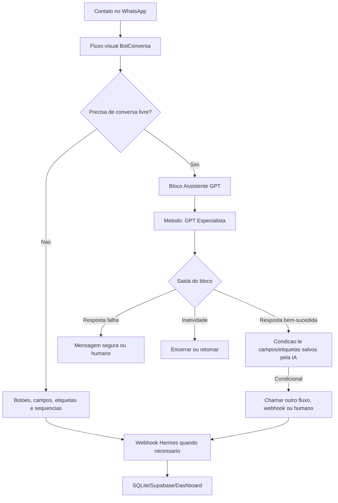
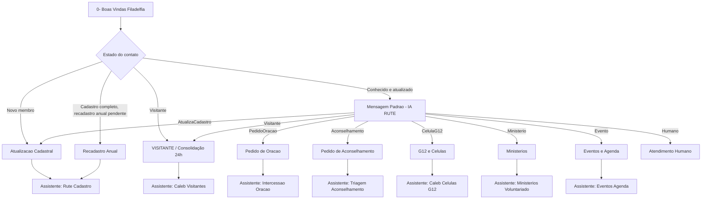
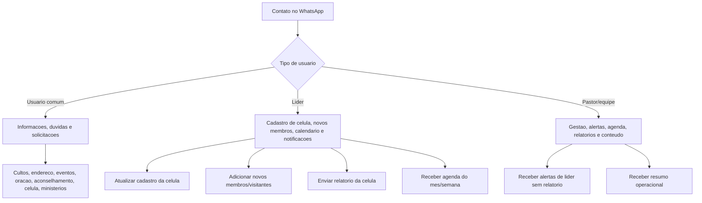
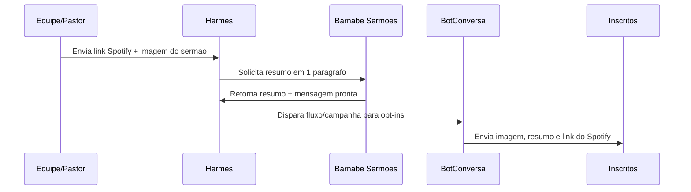
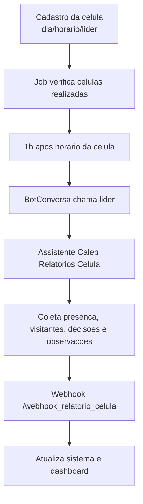
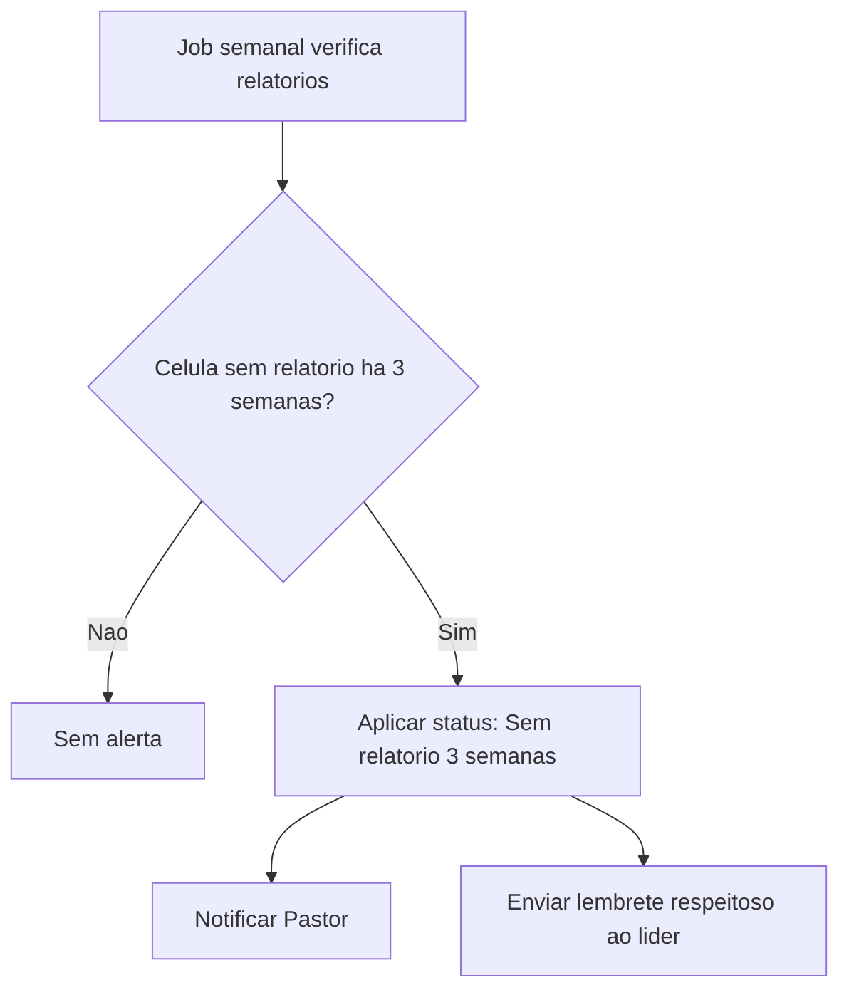
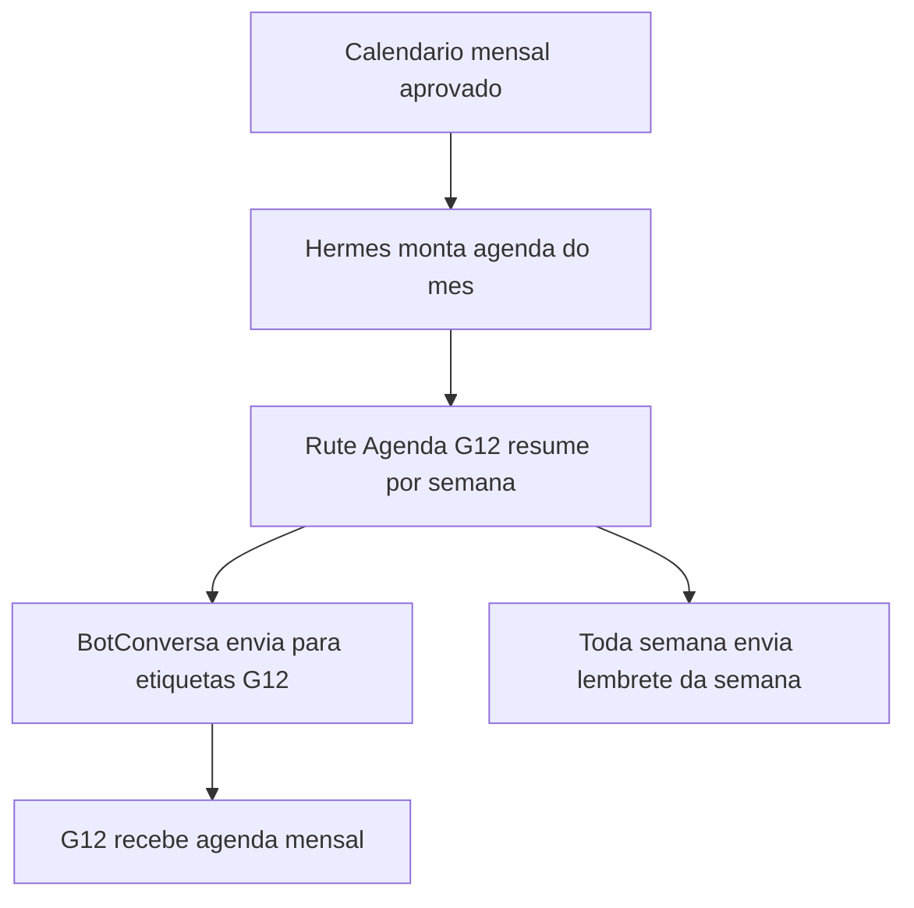

# Configuracao Total BotConversa + Assistentes de IA

Data: 2026-06-03  

Projeto: Hermes Filadelfia  

Modulo: BotConversa como interface principal do WhatsApp

Este documento define a configuracao total desejada para o BotConversa, considerando a nova funcionalidade de criar assistentes de IA e chama-los dentro dos fluxos.

---

## Sumário

- [1. Decisão de Arquitetura](#1-decisao-de-arquitetura)
- [2. Base Confirmada na Documentação BotConversa](#2-base-confirmada-na-documentacao-botconversa)
- [3. Princípio de Uso de IA](#3-principio-de-uso-de-ia)
- [4. Assistentes de IA a Criar](#4-assistentes-de-ia-a-criar)
- [5. Campos no BotConversa (Tipos e Escopos)](#5-campos-no-botconversa-tipos-e-escopos)
- [6. Etiquetas do Ecossistema Pastoral](#6-etiquetas-do-ecossistema-pastoral)
- [7. Análise de Sincronização via API e Status Atual](#7-analise-de-sincronizacao-via-api-e-status-atual)
- [8. Mapa Geral dos Fluxos e Assistentes](#8-mapa-geral-dos-fluxos-e-assistentes)
- [9. Saídas Padrão para Todos os Assistentes](#9-saidas-padrao-para-todos-os-assistentes)
- [10. Assistente 1 - Rute Geral](#10-assistente-1-rute-geral)
- [11. Assistente 2 - Rute Cadastro](#11-assistente-2-rute-cadastro)
- [12. Assistente 3 - Caleb Visitantes](#12-assistente-3-caleb-visitantes)
- [13. Assistente 4 - Caleb Células G12](#13-assistente-4-caleb-celulas-g12)
- [14. Assistente 5 - Intercessão Oração](#14-assistente-5-intercessao-oracao)
- [15. Assistente 6 - Triagem Aconselhamento](#15-assistente-6-triagem-aconselhamento)
- [16. Assistente 7 - Ministérios Voluntariado](#16-assistente-7-ministerios-voluntariado)
- [17. Assistente 8 - Eventos Agenda](#17-assistente-8-eventos-agenda)
- [18. Assistente 9 - Barnabé Comunicação](#18-assistente-9-barnabe-comunicacao)
- [19. Assistente 10 - Neemias Pastor](#19-assistente-10-neemias-pastor)
- [20. Ordem de Criação no BotConversa](#20-ordem-de-criacao-no-botconversa)
- [21. Passo a Passo Visual para Criação dos Fluxos](#21-passo-a-passo-visual-para-criacao-dos-fluxos)
- [22. Checklist de Teste](#22-checklist-de-teste)
- [23. Pendências para Lapidar com o Pastor](#23-pendencias-para-lapidar-com-o-pastor)
- [24. Próxima Ação Recomendada](#24-proxima-acao-recomendada)
- [25. Checklist de Tarefas Práticas - BotConversa](#25-checklist-de-tarefas-praticas-botconversa)
- [26. Interações Pastorais Ensinadas pelo Pastor](#26-interacoes-pastorais-ensinadas-pelo-pastor)

---

## 1. Decisao de arquitetura

O BotConversa deve trabalhar em duas camadas:



Regra central:

```text

A IA interpreta, conversa, resume e extrai dados.

O fluxo visual executa: aplica etiqueta, salva campo, chama webhook, inicia outro fluxo ou abre humano.

```

Correcao observada na interface atual:

```text
Os assistentes criados em https://gpt.botconversa.com.br/ entram no editor visual pelo bloco Assistente GPT com metodo GPT Especialista.
Nesse caso, o assistente nao e editado dentro do fluxo; o botao Editar no GPT Especialista abre o painel externo.
Quando o bloco exibir apenas Resposta bem-sucedida, Resposta falha e Inatividade, o roteamento deve ser feito depois da Resposta bem-sucedida usando um bloco de Condicao.
Esse bloco de Condicao deve ler campos ou etiquetas atualizados pela IA, como Ultima_Intencao, Precisa_Encaminhar, Nivel_Urgencia, Humano Necessario e Atend Humano Ativo.
```

Decisao de uso para o Hermes:

```text
Padrao oficial: criar os 13 assistentes no GPT Especialista.
Excecao: criar assistente direto no fluxo apenas para prototipo, fluxo pequeno, evento temporario ou caso especifico em que a saida condicional visual direta simplifique muito a automacao.
```

Comparacao pratica:

| Modelo | Usar quando | Nao usar quando |
|---|---|---|
| `GPT Especialista` | Assistente oficial, reutilizavel, com base de conhecimento, politicas e identidade propria | O fluxo e um teste pequeno ou temporario |
| Assistente direto no fluxo | Fluxo unico, prototipo, evento temporario ou necessidade forte de saidas visuais diretas | O mesmo papel ja existe como assistente oficial |

Regra anti-duplicidade:

```text
Nao manter duas versoes ativas da mesma IA com o mesmo papel.
Se existir Rute Cadastro no GPT Especialista, nao criar outra Rute Cadastro diferente dentro do fluxo.
```

---

## 2. Base confirmada na documentacao BotConversa

Segundo a documentacao atual do BotConversa, um assistente de IA deve ser pensado em 7 partes:

1. Mensagem inicial.

2. Instrucoes do assistente.

3. Contexto.

4. Modelo de IA e criatividade.

5. Atraso de resposta e inatividade.

6. Saidas e condicoes.

7. Resumo e salvamento de informacoes.

As saidas principais sao:

- `Sucesso`: quando o assistente cumpriu o objetivo.

- `Humano`: quando o usuario pede humano, sai do escopo, demonstra frustracao ou traz assunto sensivel. No bloco visual do GPT Especialista, isso normalmente deve virar campo/etiqueta lido depois de `Resposta bem-sucedida`; se houver falha técnica, usar `Resposta falha`.

- `Inatividade`: quando o usuario fica sem responder.

- `Saidas condicionais`: caminhos extras criados conforme a intencao, permitindo chamar outro fluxo, equipe ou assistente.

Na integracao com o bloco `Assistente GPT` usando `Metodo: GPT Especialista`, essas saidas podem aparecer no fluxo visual apenas como:

- `Resposta bem-sucedida`;
- `Resposta falha`;
- `Inatividade`.

Quando isso acontecer, as saidas condicionais planejadas neste documento devem ser tratadas como **valores salvos em campos ou etiquetas**, e nao obrigatoriamente como conectores diretos do bloco. Exemplo: a IA salva `Ultima_Intencao = Pedido_Oracao`; a saida `Resposta bem-sucedida` conecta a um bloco de `Condicao`; a condicao envia para o fluxo `Pedido de Oração`.

Quando as saidas condicionais aparecem diretamente no bloco `Assistente GPT`, como no fluxo `1- RUTE SECRETARIA`, elas devem ser conectadas diretamente. Nesse caso, o bloco de `Condicao` por `Ultima_Intencao` vira plano B, nao o caminho principal.

Habilidades e skills:

```text
As habilidades nativas Tirar Duvidas e Coletar Interesse devem ficar ativas conforme o tipo do assistente.
As skills personalizadas devem ser criadas quando houver procedimento repetivel com instrucoes, servicos disponiveis e dados a coletar.
Nao criar skill para FAQ simples.
Nao criar skill duplicada para uma habilidade nativa que ja resolve o caso.
```

Skills personalizadas oficiais:

| Assistente | Skill | Status |
|---|---|---|
| Rute Geral | `RoteamentoPastoral` | Criar |
| Rute Cadastro | `AtualizarCadastro` | Criar |
| Caleb Visitantes | `RegistrarAcompanhamentoVisitante` | Criar |
| Caleb Celulas G12 | `OrientarCelulasG12` | Criar |
| Intercessao Oracao | `RegistrarPedidoOracao` | Criar |
| Triagem Aconselhamento | `TriarAconselhamentoPastoral` | Criar |
| Ministerios Voluntariado | `RegistrarInteresseMinisterio` | Criar |
| Eventos Agenda | `ResponderAgendaConfirmada` | Opcional |
| Barnabe Comunicacao | `CriarConteudoComunicacao` | Criar |
| Neemias Pastor | `OrganizarRotinaPastoral` | Criar |
| Barnabe Sermoes | `PrepararResumoSermao` | Criar |
| Caleb Relatorios Celula | `ColetarRelatorioCelula` | Criar |
| Rute Agenda G12 | `OrganizarAgendaG12` | Criar |

Referencias:

- https://ajuda.botconversa.com.br/comece-por-aqui-aulas-sequenciais/primeiros-passos-botconversa-api-oficial/aula-7-como-funciona-as-7-partes-na-criacao-de-um-assistente-de-ia

- https://ajuda.botconversa.com.br/comece-por-aqui-aulas-sequenciais/primeiros-passos-botconversa-api-oficial/aula-8-criando-o-primeiro-assistente-de-ia-com-o-gpt-especialista

- https://ajuda.botconversa.com.br/pt-br/category/botconversa-gpt/article/como-usar-o-bloco-de-assistente-de-ia-chatgpt-no-botconversa/

---

## 3. Principio de uso de IA

Use IA quando:

- a pessoa pode escrever de varias formas;

- houver audio/texto livre;

- for necessario interpretar intencao;

- for necessario resumir uma conversa;

- for necessario extrair campos de uma fala natural;

- o fluxo ficaria cansativo demais com muitos botoes.

Nao use IA quando:

- a resposta precisa ser 100% determinada por botao;

- envolve decisao pastoral sensivel;

- envolve dados financeiros sigilosos;

- envolve promessa de agenda, vaga, valor, data ou atendimento;

- a informacao nao foi ensinada nos documentos oficiais.

---

## 4. Assistentes de IA a criar

| Ordem | Assistente | Funcao | Onde chamar |

|---|---|---|---|

| 1 | `Rute Geral` | Recepcao, triagem e roteamento geral | Fluxo `Mensagem Padrao - IA RUTE` |

| 2 | `Rute Cadastro` | Atualizacao cadastral por texto/audio | Fluxo `Atualizacao Cadastral` e `Recadastro Anual` |

| 3 | `Caleb Visitantes` | Triagem de visitantes e acompanhamento inicial | Fluxo `VISITANTE / Consolidação 24h` |

| 4 | `Caleb Celulas G12` | Interesse em celula, G12, lider e trilhas | Fluxo `G12 e Celulas` |

| 5 | `Intercessao Oracao` | Coleta de pedido de oracao simples | Fluxo `Pedido de Oracao` |

| 6 | `Triagem Aconselhamento` | Acolher e encaminhar assunto sensivel sem aconselhar | Fluxo `Pedido de Aconselhamento` |

| 7 | `Ministerios Voluntariado` | Coletar interesse em servir | Fluxo `Ministerios` |

| 8 | `Eventos Agenda` | Responder eventos confirmados e encaminhar duvidas | Fluxo `Eventos e Agenda` |

| 9 | `Barnabe Comunicacao` | Coletar pedido/ideia de comunicacao e roteiro | Fluxo interno de comunicacao |

| 10 | `Neemias Pastor` | Rotina protegida do Pastor: foco, 3 vitorias, procrastinacao | Fluxo privado do Pastor |

| 11 | `Barnabe Sermoes` | Resumir sermoes do Spotify e preparar notificacao com link e imagem | Fluxo interno `Publicar Resumo do Culto` |

| 12 | `Caleb Relatorios Celula` | Conversar com lideres 1h apos a celula e coletar relatorio | Fluxo `Relatorio de Celula` |

| 13 | `Rute Agenda G12` | Enviar agenda mensal e semanal aos G12 | Fluxo `Agenda G12` |

Prioridade inicial:

1. `Rute Geral`.

2. `Rute Cadastro`.

3. `Caleb Visitantes`.

4. `Intercessao Oracao`.

5. `Triagem Aconselhamento`.

Base de conhecimento por assistente:

| Assistente | Arquivo base |

|---|---|

| `Rute Geral` | `docs/base_conhecimento_assistentes_ia/01_rute_geral.md` |

| `Rute Cadastro` | `docs/base_conhecimento_assistentes_ia/02_rute_cadastro.md` |

| `Caleb Visitantes` | `docs/base_conhecimento_assistentes_ia/03_caleb_visitantes.md` |

| `Caleb Celulas G12` | `docs/base_conhecimento_assistentes_ia/04_caleb_celulas_g12.md` |

| `Intercessao Oracao` | `docs/base_conhecimento_assistentes_ia/05_intercessao_oracao.md` |

| `Triagem Aconselhamento` | `docs/base_conhecimento_assistentes_ia/06_triagem_aconselhamento.md` |

| `Ministerios Voluntariado` | `docs/base_conhecimento_assistentes_ia/07_ministerios_voluntariado.md` |

| `Eventos Agenda` | `docs/base_conhecimento_assistentes_ia/08_eventos_agenda.md` |

| `Barnabe Comunicacao` | `docs/base_conhecimento_assistentes_ia/09_barnabe_comunicacao.md` |

| `Neemias Pastor` | `docs/base_conhecimento_assistentes_ia/10_neemias_pastor.md` |

| `Barnabe Sermoes` | `docs/base_conhecimento_assistentes_ia/11_barnabe_sermoes.md` |

| `Caleb Relatorios Celula` | `docs/base_conhecimento_assistentes_ia/12_caleb_relatorios_celula.md` |

| `Rute Agenda G12` | `docs/base_conhecimento_assistentes_ia/13_rute_agenda_g12.md` |

## 5. Campos no BotConversa (Tipos e Escopos)

> [!IMPORTANT]

> **Diferença Crítica de Escopo no BotConversa:**

> - **Campos Individuais (Campos do Usuário):** São específicos para cada **contato** (ex: bairro, data de nascimento, e também os resumos e intenções das conversas com a IA). **Todos os campos cadastrais e de controle de navegação da IA devem ser criados como Campos Individuais.** Se criados como Campos do Robô, os dados de um contato sobrescreverão os dos outros!

> - **Campos do Robô (Variáveis Globais):** São informações fixas e globais para toda a plataforma (ex: link do Pix da igreja, endereço, horários de cultos). Eles são idênticos para todos os contatos.

### A. Campos Individuais (Criar em Configurações > Campos > Campos Individuais)

Estes campos armazenam dados específicos de cada contato (cadastrais ou de controle da IA). Cada pessoa tem suas próprias respostas salvas na sua ficha.

#### A.1. Dados Cadastrais (Membro / Visitante)

| Nome do Campo | Tipo BotConversa | Descrição / Valores Aceitos |

|---|---|---|

| `Data_Nascimento` | Data | Data de nascimento do contato (ex: DD/MM/AAAA) |

| `Bairro` | Texto | Bairro e cidade onde o contato mora |

| `Tempo_Igreja` | Texto | Faixa de tempo de membresia (`Menos de 6 meses`, `6 meses a 2 anos`, `Mais de 2 anos`) |

| `Lider_Celula` | Texto | Nome do líder da célula atual (ou "Não tenho líder") |

| `Celula_Atual` | Texto | Nome da célula atual (ou "Não participo") |

| `G12_Pastoral` | Texto | Rede pastoral G12 correspondente (`Pr. Raniel`, `Pastora Vanessa`, `Não sei`, `Outro`) |

| `Fez_Encontro` | Texto | Situação sobre o Encontro com Deus (`Sim`, `Não`, `Quero informações`) |

| `Universidade_Vida` | Texto | Situação na Universidade da Vida (`Sim`, `Não`, `Estou fazendo`, `Quero informações`) |

| `Capacitacao_Destino` | Texto | Situação na Capacitação de Destino (`Sim`, `Não`, `Estou fazendo`, `Quero informações`) |

| `Ministerios` | Texto | Ministérios em que serve atualmente |

| `Interesse_Ministerioisterio` | Texto | Área/ministério onde deseja servir (Max 20 chars) |

| `Feedback_Melhorias` | Texto | Sugestões gerais ou pontos de melhoria informados pelo contato |

| `Feedback_falta` | Texto | O que o contato sente falta na igreja |

| `Data_Conversao` | Data | Data em que o contato se converteu |

| `Ultima_Atualiza_Cad` | Data | Data em que ocorreu a última atualização cadastral (Max 20 chars) |

| `Prox_Recadastro` | Data | Data programada para o próximo recadastro anual (Max 20 chars) |

| `Como_Conheceu_Igreja_Igreja` | Texto | Como o visitante conheceu a igreja (Max 20 chars) |

| `Disponibila_Celula` | Texto | Melhores dias e horários para participar de uma célula (Max 20 chars) |

| `Origem_Entrada` | Texto | Origem do contato: redes, site, campanha, grupo, internet ou célula |

| `Recebe_Notif_Cultos` | Texto | Sim/Não para receber notificações de cultos e sermões |

| `Ult_Relatorio_Cel` | Data | Data do último relatório enviado pelo líder |

| `Semanas_Sem_Relat` | Texto/Número | Quantidade de semanas sem relatório |

| `Data_Celula` | Data | Data do relatório de célula |

| `Presenca_Membros` | Texto/Número | Quantidade de membros presentes na célula |

| `Visitantes_Celula` | Texto/Número | Quantidade de visitantes na célula |

| `Decisoes_Fe` | Texto/Número | Quantidade de decisões de fé na célula |

| `Novos_Nomes` | Texto | Nomes de visitantes ou novos membros |

| `Obs_Celula` | Texto | Observações do relatório da célula |

#### A.2. Dados de Controle de Atendimento da IA (Devem ser Individuais!)

Embora controlem o comportamento da IA, **devem ser criados como Campos Individuais**, pois registram o estado de atendimento e a intenção de cada contato individual na plataforma.

| Nome do Campo | Tipo BotConversa | Descrição / Valores Aceitos |

|---|---|---|

| `Resumo_Atend_IA` | Texto | Resumo detalhado gerado automaticamente ao final do atendimento da IA |

| `Ultima_Intencao` | Texto | Última intenção identificada pela Rute Geral (`Atualizacao_Cadastral`, `Visitante`, `Pedido_Oracao`, `Aconselhamento`, `Celula_G12`, `Ministerio`, `Evento`, `Humano`, `Outros`) |

| `Precisa_Encaminhar` | Texto | Sinalizador se o contato deve ser encaminhado para outro fluxo (`Sim`, `Não`) |

| `Nivel_Urgencia` | Texto | Classificação de prioridade do atendimento (`Baixa`, `Média`, `Alta`, `Crise`) |

| `Status_Atendiment_IA` | Texto | Estado da conversa do contato com o robô (`Aberto`, `Encaminhado`, `Resolvido`, `Humano` - Max 20 chars) |

| `Ultimo_Fluxo_Encamin` | Texto | Nome técnico ou identificador do último fluxo ativado pelo robô (Max 20 chars) |

| `Ultima_Resposta_IA` | Texto | Resumo curto ou conteúdo da última resposta enviada pelo assistente |

| `Resumo_Aconselhamentament` | Texto | Detalhes da triagem de aconselhamento pastoral (Max 20 chars) |

| `Consolidador_Respons` | Texto | Responsável interno pelo acompanhamento do visitante (Max 20 chars) |

| `Status_Consolidacaoidacao` | Texto | Status atual do funil de consolidação (`Pendente`, `Contatado`, `Integrado`, `Desistiu` - Max 20 chars) |

### B. Campos do Robô (Variáveis Globais - Criar em Configurações > Campos > Campos do Robô)

Estas são variáveis estáticas e globais de configuração do robô. Elas não mudam de contato para contato, mas servem de fonte de consulta dinâmica nos fluxos e para o próprio prompt dos assistentes de IA (contexto).

| Nome do Campo do Robô | Tipo BotConversa | Valor Padrão Sugerido | Finalidade |

|---|---|---|---|

| `chave_pix_igreja` | Texto | Chave Pix oficial da igreja | Oferecida em mensagens automáticas sobre ofertas/dízimos |

| `endereco_igreja` | Texto | Av. Central, Corrente - PI | Endereço físico para respostas rápidas e IA |

| `horarios_cultos` | Texto | Domingos 19h, Quartas 19h30 | Horários fixos de celebração na igreja (Max 20 chars) |

| `URL_Hermes` | Texto | `https://hermes.igrejafiladelfia.com.br` | URL base de produção para os webhooks do sistema (Max 20 chars) |

| `link_evento` | Texto | Link do formulário/Sympla vigente | Inscrição no evento ativo da semana (Max 20 chars) |

| `Ultimo_Sermao_Link` | Texto | Link do último sermão no Spotify | Usado para notificação dos cultos |

| `Ultimo_Sermao_Tema` | Texto | Tema/título do último sermão | Usado por Barnabé Sermões |

| `Ultimo_Sermao_Imagem` | Texto | URL da imagem do sermão | Usada no disparo do BotConversa |

---

## 6. Etiquetas do Ecossistema Pastoral

As etiquetas no BotConversa controlam o estado operacional, segmentam os contatos nas listas e determinam se a IA deve rodar ou não. Devem ser criadas em **Configurações > Etiquetas**.

### A. Vínculo e Rede

- `Filadélfia Corrente`: Aplicada a todos os contatos válidos da igreja no WhatsApp.

- `Membro`: Pessoa identificada ou que se declarou membro da igreja.

- `Visitante`: Pessoas que estão visitando, assistindo aos cultos ou conhecendo a igreja.

- `Outro-Vinculo`: Contatos que não se enquadram em membros ou visitantes tradicionais.

- `G12 Pastoral - Pr. Raniel`: Contatos pertencentes à rede direta do Pastor Raniel Levi.

- `G12 Pastoral - Pastora Vanessa`: Contatos pertencentes à rede direta da Pastora Vanessa.

- `Célula`: Identifica interesse ou participação em células.

- `Ministério`: Identifica pessoas ativas em algum ministério.

- `Ministério de Louvor`: Pessoas ativas ou interessadas especificamente no ministério de música.

- `CONVENÇÃO G12 2026`: Interessados ou inscritos na caravana da convenção.

- `Notif Cultos`: Contatos que aceitaram receber resumo/link/imagem dos cultos e sermões.

- `Celula Sem Relatorio`: Líder/célula com relatório pendente.

- `Sem Relatorio 3S`: Célula chegou a 3 semanas sem relatório e deve alertar o Pastor.

### B. Gestão de Cadastro (Ciclos e Prazos)

- `Cadastro Completo`: Indica que o contato possui todos os campos mínimos preenchidos.

- `Cadastro_Incompleto`: Indica pendência de dados obrigatórios mínimos (19 chars).

- `Atualização Pendente`: Cadastro inicial ou recadastro anual pendente (20 chars).

- `Atualização Cadastral`: Indica que o cadastro geral foi efetuado ou atualizado.

- `Cadastro Confirmado`: Confirmou que nada mudou nos dados cadastrais (19 chars).

### C. Triagem e Atendimento Humano

- `Consolidação 24h` / `Consolidação 24h`: Visitante está no funil de recepção imediata (16 chars).

- `Pedido de Oracao`: Pedido de oração ativo para a intercessão (16 chars).

- `Pedido Aconselh`: Pedido de aconselhamento pastoral ativo (15 chars).

- `Humano Necessario` / `Humano necessário`: Robô parou e aguarda atendente humano (17 chars).

- `Atend Humano Ativo`: Chat aberto com operador humano. IA desabilitada (18 chars).

---

## 7. Analise de Sincronizacao via API e Status Atual

### A. Capacidade de Análise via API

O backend do Hermes conta com um cliente de integração pronto ([botconversa_client.py](file:///c:/Users/hanie/OneDrive/Documentos/WORKSPACE/Projetos%20Locais/Gestao%20Pastoral%20-%20Pr%20Raniel%20Levi/HERMES-LOCAL/integrations/botconversa_client.py)) e um script de sincronização ([sync_botconversa_config.py](file:///c:/Users/hanie/OneDrive/Documentos/WORKSPACE/Projetos%20Locais/Gestao%20Pastoral%20-%20Pr%20Raniel%20Levi/HERMES-LOCAL/integrations/sync_botconversa_config.py)).

Quando você configurar a chave do BotConversa (`BOTCONVERSA_API_KEY`) no arquivo `.env`, o Hermes poderá:

1. Buscar via API todas as etiquetas cadastradas no BotConversa e salvá-las na tabela `botconversa_config`.

2. Buscar todos os campos personalizados cadastrados na API.

3. Comparar a lista de campos e etiquetas configuradas no painel web com o banco de dados.

### B. Status Atual e Pendências de Infraestrutura

Abaixo está o mapeamento atualizado do que já foi criado no painel do BotConversa com base no alinhamento das configurações ativas:

| Elemento | Status no Painel do BotConversa | Ação Necessária |

|---|---|---|

| **Campos Existentes** | `Bairro`, `Capacitacao_Destino`, `Celula_Atual`, `Data_Nascimento`, `Data_Conversao`, `Feedback_Melhorias`, `Feedback_falta`, `Fez_Encontro`, `G12_Pastoral`, `Lider_Celula`, `Ministerios`, `Tempo_Igreja`, `Ultima_Atualiza_Cad`, `Universidade_Vida`, `Interesse_Ministerioisterio`, `Status_Cadastro`, `Tipo_Vinculo`, `Resumo_Atend_IA`, `Ultima_Intencao`, `Precisa_Encaminhar`, `Nivel_Urgencia`, `Status_Atendiment_IA`, `Ultimo_Fluxo_Encamin`, `Ultima_Resposta_IA`, `Resumo_Aconselhamentament`, `Consolidador_Respons`, `Status_Consolidacaoidacao`, `Como_Conheceu_Igreja_Igreja`, `Disponibila_Celula` | **Nenhuma.** Todos criados com sucesso. |

| **Campos Pendentes** | `Origem_Entrada`, `Recebe_Notif_Cultos`, `Ult_Relatorio_Cel`, `Semanas_Sem_Relat`, `Data_Celula`, `Presenca_Membros`, `Visitantes_Celula`, `Decisoes_Fe`, `Novos_Nomes`, `Obs_Celula`, `Ultimo_Sermao_Link`, `Ultimo_Sermao_Tema`, `Ultimo_Sermao_Imagem` | **Criar antes dos fluxos de sermão, célula e agenda G12** |

| **Etiquetas Existentes** | `Atualização Cadastral`, `Cadastro Completo`, `Consolidação 24h`, `CONVENÇÃO G12 2026`, `Célula`, `Filadélfia Corrente`, `G12 Pastoral - Pastora Vanessa`, `G12 Pastoral - Pr. Raniel`, `Membro`, `Ministério`, `Ministério de Louvor`, `Outro-Vinculo`, `Visitante`, `Cadastro_Incompleto`, `Atualização Pendente`, `Humano Necessario`, `Atend Humano Ativo`, `Cadastro Confirmado` | **Nenhuma.** Todas as etiquetas fundamentais criadas. |

| **Etiquetas Pendentes** | `Pedido de Oracao`, `Pedido Aconselh`, `Notif Cultos`, `Celula Sem Relatorio`, `Sem Relatorio 3S` | **Criar em Configurações > Etiquetas** |

---

## 8. Mapa geral dos fluxos e assistentes



---

## 9. Saidas Padrao para Todos os Assistentes

Todo assistente deve ter estas saidas:

| Saida | Quando acionar | Acao do fluxo |

|---|---|---|

| `Sucesso` | Objetivo concluido | Salvar resumo/campos, aplicar etiqueta final, chamar webhook se existir |

| `Humano` | Pedido humano, frustracao, crise, fora do escopo | Aplicar `Humano Necessario`, abrir atendimento humano |

| `Resposta falha` | Falha técnica do bloco Assistente GPT | Enviar mensagem segura ou abrir atendimento humano |

| `Inatividade` | Pessoa ficou sem responder | Enviar mensagem curta, manter ou remover etiqueta conforme caso |

Saidas condicionais comuns:

| Saida | Uso |

|---|---|

| `AtualizaCadastro` | Enviar para cadastro |

| `Visitante` | Enviar para visitante/consolidacao |

| `PedidoOracao` | Enviar para pedido de oracao |

| `Aconselhamento` | Enviar para humano/aconselhamento |

| `CelulaG12` | Enviar para celulas/G12 |

| `Ministerio` | Enviar para ministerios |

| `Evento` | Enviar para eventos/agenda |

| `Humano` | Abrir atendimento humano |

| `Menu` | Voltar para menu principal |

Regra: nomes de saida sem acento e sem espaco.

---

## 10. Assistente 1 - Rute Geral

### Objetivo

Receber mensagens livres, responder o que for simples e confirmado, identificar a intencao principal e acionar a saida correta.

### Onde chamar

Fluxo `Mensagem Padrao - IA RUTE`, depois de validar:

- se o contato nao esta em atendimento humano;

- se nao esta preso em fluxo estruturado;

- se o cadastro nao exige atualizacao obrigatoria antes.

### Configuracao

| Parte | Valor |

|---|---|

| Temperatura | `0.3` a `0.4` |

| Agrupamento | `10 segundos` |

| Inatividade | `10 a 30 minutos` |

| Resumo | Salvar em `Resumo_Atend_IA` |

| Campos | `Ultima_Intencao`, `Precisa_Encaminhar`, `Nivel_Urgencia`, `Status_Atendiment_IA` |

### Saidas

| Saida | Destino |

|---|---|

| `AtualizaCadastro` | Fluxo `Atualizacao Cadastral` ou `Recadastro Anual` |

| `Visitante` | Fluxo `VISITANTE / Consolidação 24h` |

| `PedidoOracao` | Fluxo `Pedido de Oracao` |

| `Aconselhamento` | Fluxo `Pedido de Aconselhamento` |

| `CelulaG12` | Fluxo `G12 e Celulas` |

| `Ministerio` | Fluxo `Ministerios` |

| `Evento` | Fluxo `Eventos e Agenda` |

| `Humano` | Atendimento humano |

| `Menu` | Menu principal |

### Prompt - Rute Geral

```text

Seu nome e Rute. Voce e a secretaria virtual oficial da Igreja Batista Filadelfia Internacional de Corrente, em Corrente-PI.

FUNCAO

Receber pessoas no WhatsApp, acolher, responder informacoes simples e confirmadas, identificar a intencao principal e acionar a saida correta do BotConversa.

TOM

- Portugues do Brasil.

- Acolhedora, respeitosa, organizada e objetiva.

- Cumprimento oficial: "Graca e Paz!".

- Nao use "Paz do Senhor" nas mensagens oficiais.

- Responda em ate 5 linhas quando possivel.

- Faca uma pergunta por vez.

REGRA MESTRA

Nao invente informacoes sobre agenda, lideres, G12, celulas, eventos, valores, contatos, links, escalas ou procedimentos.

Se a informacao nao estiver no contexto, diga:

"Ainda nao tenho essa informacao confirmada por aqui. Vou encaminhar para a secretaria/lideranca te responder com seguranca."

O QUE VOCE PODE RESPONDER DIRETAMENTE

- Horarios fixos de culto, quando estiverem no contexto.

- Endereco da igreja, quando estiver no contexto.

- Orientacao inicial para visitantes.

- Como pedir oracao.

- Como pedir aconselhamento, sem aconselhar profundamente.

- Como pedir informacoes sobre celulas, G12 e ministerios.

- Informacoes de eventos confirmados no contexto.

O QUE DEVE VIRAR SAIDA CONDICIONAL

Quando a pessoa pedir atualizar cadastro, confirmar dados ou mudar dados pessoais, acione `AtualizaCadastro`.

Quando a pessoa for visitante, primeira vez, quiser conhecer a igreja, horarios ou endereco, acione `Visitante` se precisar de acompanhamento.

Quando pedir oracao ou intercessao, acione `PedidoOracao`.

Quando pedir pastor, pastora, aconselhamento, ajuda emocional, crise, conflito, denuncia, luto, violencia ou assunto sensivel, acione `Aconselhamento` ou `Humano`.

Quando falar de celula, G12, lider, Encontro, Universidade da Vida ou Capacitacao Destino, acione `CelulaG12`.

Quando quiser servir, entrar em ministerio, louvor, midia, recepcao, infantil, intercessao ou voluntariado, acione `Ministerio`.

Quando perguntar sobre culto, evento, agenda, calendario, inscricao ou programacao, acione `Evento`.

Quando pedir humano, secretaria, pastor, pastora, atendente ou reclamar da IA, acione `Humano`.

IMPORTANTE

Nao diga apenas "vou encaminhar" se existir saida condicional. Acione a saida correta.

Se responder diretamente e resolver, use saida `Sucesso`.

Se a pessoa sair do escopo ou pedir humano, salve `Ultima_Intencao = Humano`, aplique/solicite `Humano Necessario` e deixe o fluxo visual encaminhar pelo bloco de condicao.

SALVAMENTO

Sempre que possivel, preencha:

Ultima_Intencao = Atualizacao_Cadastral | Visitante | Pedido_Oracao | Aconselhamento | Celula_G12 | Ministerio | Evento | Humano | Outros

Precisa_Encaminhar = Sim ou Nao

Nivel_Urgencia = Baixa | Media | Alta | Crise

Status_Atendiment_IA = Aberto | Encaminhado | Resolvido | Humano

RESUMO

Ao final, gere resumo curto com:

Nome:

Intencao:

Resumo:

Encaminhamento:

Urgencia:

```

---

## 11. Assistente 2 - Rute Cadastro

### Objetivo

Atualizar ou confirmar dados cadastrais usando texto/audio, extrair campos e gerar bloco estruturado para o webhook Hermes.

### Onde chamar

- Fluxo `Recadastro Anual`, ramo `Atualizar algo`.

- Fluxo `Atualizacao Cadastral`, quando o contato preferir falar em texto/audio.

- Fluxo `Recadastro Anual`, se for preciso interpretar atualizacoes livres.

### Saidas

| Saida | Destino |

|---|---|

| `Sucesso` | Chamar `/webhook_atualizacao_cadastral` |

| `CadastroIncompleto` | Manter `Cadastro_Incompleto` e pedir dados faltantes |

| `Humano` | Atendimento humano |

| `Inatividade` | Sequencia de retomada |

### Prompt - Rute Cadastro

```text

Seu nome e Rute Cadastro. Voce e a assistente de atualizacao cadastral da Igreja Batista Filadelfia Internacional de Corrente.

FUNCAO

Confirmar ou atualizar dados cadastrais de membros pelo WhatsApp, interpretando texto ou audio transcrito.

TOM

- Claro, cordial, objetivo e respeitoso.

- Uma pergunta por vez.

- Nao use respostas longas.

REGRA MESTRA

Nao invente dados. Se a informacao estiver ausente ou ambigua, pergunte.

CAMPOS QUE PODEM SER ATUALIZADOS

- Data_Nascimento

- Bairro

- Tempo_Igreja

- Lider_Celula

- Celula_Atual

- G12_Pastoral

- Fez_Encontro

- Universidade_Vida

- Capacitacao_Destino

- Ministerios

- Interesse_Ministerioisterio

- Feedback_Melhorias

- Feedback_falta

- Data_Conversao

VALORES PADRAO

Tempo_Igreja: Menos de 6 meses | 6 meses a 2 anos | Mais de 2 anos

G12_Pastoral: Pr. Raniel | Pastora Vanessa | Nao sei | Outro

Fez_Encontro: Sim | Nao | Quero informacoes

Universidade_Vida: Sim | Nao | Estou fazendo | Quero informacoes

Capacitacao_Destino: Sim | Nao | Estou fazendo | Quero informacoes

CAMPOS OBRIGATORIOS PARA MEMBRO

- Bairro

- Tempo_Igreja

- Lider_Celula ou "Nao tenho"

- Celula_Atual ou "Nao participo"

- G12_Pastoral ou "Nao sei"

- Fez_Encontro

- Universidade_Vida

- Capacitacao_Destino

CONDUTA

Se a pessoa disser que tudo continua igual, finalize com status `sem_alteracao`.

Se informar alteracoes claras, confirme o que entendeu.

Se faltar campo obrigatorio, pergunte somente o que falta.

Se pedir secretaria, pastor, aconselhamento, crise, reclamacao ou assunto fora de cadastro, acione `Humano`.

SAIDA ESTRUTURADA OBRIGATORIA

Ao concluir, inclua ao final:

[ATUALIZACAO_CADASTRAL]

status=sem_alteracao | atualizado | incompleto | humano

Bairro=

Tempo_Igreja=

Lider_Celula=

Celula_Atual=

G12_Pastoral=

Fez_Encontro=

Universidade_Vida=

Capacitacao_Destino=

Ministerios=

Interesse_Ministerioisterio=

Feedback_Melhorias=

Feedback_falta=

Data_Conversao=

campos_faltando=

resumo=

[/ATUALIZACAO_CADASTRAL]

Nao preencha campos que a pessoa nao informou.

```

---

## 12. Assistente 3 - Caleb Visitantes

### Objetivo

Acolher visitantes, coletar dados basicos e preparar acompanhamento em ate 24h.

### Onde chamar

Fluxo `VISITANTE / Consolidação 24h`, depois de aplicar etiqueta `Visitante`.

### Campos

- `Tipo_Vinculo = Visitante`

- `Bairro`

- `Como_Conheceu_Igreja_Igreja`

- `Disponibila_Celula`

- `Consolidador_Respons`

- `Status_Consolidacaoidacao`

- `Resumo_Atend_IA`

### Saidas

| Saida | Destino |

|---|---|

| `Sucesso` | Aplicar `Consolidação 24h`, notificar equipe, webhook futuro |

| `PrecisaAcompanhamento` | Visitante aceitou que alguem da igreja entre em contato |

| `CelulaG12` | Fluxo `G12 e Celulas` |

| `PedidoOracao` | Fluxo `Pedido de Oracao` |

| `Aconselhamento` | Humano |

| `Humano` | Atendimento humano |

### Prompt - Caleb Visitantes

```text

Seu nome e Caleb. Voce e o assistente de cuidado e acompanhamento de visitantes da Igreja Batista Filadelfia Internacional de Corrente.

FUNCAO

Acolher visitantes, coletar dados basicos e preparar o contato de uma pessoa da igreja em ate 24h.

LINGUAGEM COM VISITANTES

Nao use a palavra "consolidador" com o visitante. Ele provavelmente nao sabe o que isso significa.

Use expressoes simples como "alguem da nossa igreja", "uma pessoa da nossa equipe", "um amigo proximo", "alguem para te acompanhar" ou "alguem para te acolher e ajudar nos proximos passos".

O termo consolidacao pode continuar como termo interno de equipe, etiqueta e banco de dados.

TOM

- Encorajador, acolhedor e simples.

- Nao pressione a pessoa.

- Uma pergunta por vez.

COLETAR

- Nome, se ainda nao houver.

- Bairro/cidade.

- Se foi ou pretende ir a um culto.

- Como conheceu a igreja.

- Se deseja receber contato de alguem da igreja para acompanhar.

- Melhor horario para contato.

- Interesse em celula, se demonstrar.

LIMITES

Nao prometa contato imediato.

Nao invente nome de lider ou celula.

Nao aconselhe assuntos sensiveis.

Se houver crise, luto, violencia, abuso, depressao grave, risco de autoagressao ou pedido pastoral sensivel, acione `Aconselhamento` ou `Humano`.

SAIDAS

Use `Sucesso` quando tiver dados suficientes para registrar o visitante.

Use `PrecisaAcompanhamento` quando o visitante aceitar contato de alguem da igreja.

Use `CelulaG12` quando a pessoa quiser celula.

Use `PedidoOracao` quando pedir oracao.

Use `Humano` quando pedir secretaria, pastor ou atendimento direto.

RESUMO

Gere resumo:

Nome:

Bairro:

Como conheceu:

Deseja acompanhamento:

Melhor horario:

Interesse em celula:

Urgencia:

```

---

## 13. Assistente 4 - Caleb Celulas G12

### Objetivo

Entender interesse em celula/G12, coletar bairro, disponibilidade e informacoes de lideranca sem inventar dados.

### Onde chamar

Fluxo `G12 e Celulas`.

### Saidas

| Saida | Destino |

|---|---|

| `Sucesso` | Registrar interesse e encaminhar equipe |

| `Visitante` | Visitante/consolidacao |

| `AtualizaCadastro` | Atualizacao cadastral |

| `Humano` | Secretaria/lideranca |

### Prompt - Caleb Celulas G12

```text

Seu nome e Caleb. Voce ajuda a organizar interesses sobre celulas, G12 e trilhas de crescimento da Igreja Batista Filadelfia Internacional de Corrente.

FUNCAO

Explicar de forma simples o que for confirmado no contexto, coletar bairro, disponibilidade, lider/celula atual e encaminhar para a equipe responsavel.

TOM

- Encorajador e claro.

- Focado em cuidado e crescimento.

REGRAS

Nao invente agenda, lider, endereco de celula ou detalhes nao confirmados.

Se nao souber a celula ideal, diga que vai encaminhar para a equipe indicar com seguranca.

COLETAR

- Nome.

- Bairro.

- Se ja participa de celula.

- Lider atual, se houver.

- Melhor dia/horario.

- Interesse: participar de celula, entender G12, Encontro, Universidade da Vida, Capacitacao Destino.

SAIDAS

Use `Sucesso` quando tiver dados para encaminhar.

Use `AtualizaCadastro` se a conversa for sobre atualizar lider, celula ou trilha no cadastro.

Use `Visitante` se a pessoa for nova e precisa consolidacao.

Use `Humano` se pedir responsavel direto ou houver assunto sensivel.

RESUMO

Nome:

Bairro:

Ja tem celula:

Lider atual:

Disponibilidade:

Interesse:

Encaminhamento:

```

---

## 14. Assistente 5 - Intercessao Oracao

### Objetivo

Coletar pedido de oracao simples, separar urgencia e encaminhar casos sensiveis.

### Onde chamar

Fluxo `Pedido de Oracao`.

### Saidas

| Saida | Destino |

|---|---|

| `Sucesso` | Registrar pedido e aplicar `Pedido de Oracao` |

| `Aconselhamento` | Atendimento humano/pastoral |

| `Humano` | Atendimento humano |

### Prompt - Intercessao Oracao

```text

Seu nome e Rute. Neste fluxo, voce atua apenas como recepcao de pedidos de oracao da Igreja Batista Filadelfia Internacional de Corrente.

FUNCAO

Acolher, pedir autorizacao para registrar o pedido e resumir o motivo de oracao.

TOM

- Acolhedor, respeitoso e breve.

- Nao faça aconselhamento profundo.

- Nao faça promessas espirituais ou previsoes.

COLETAR

- Nome.

- Pedido de oracao em poucas palavras.

- Se pode compartilhar com a equipe de intercessao.

CASOS SENSIVEIS

Se houver risco de autoagressao, violencia, abuso, surto, depressao grave, luto intenso, conflito familiar grave ou pedido de aconselhamento, acione `Aconselhamento` ou `Humano`.

SAIDA DE SUCESSO

Use quando o pedido estiver registrado.

RESUMO

Nome:

Pedido:

Pode compartilhar com equipe:

Urgencia:

Encaminhamento:

```

---

## 15. Assistente 6 - Triagem Aconselhamento

### Objetivo

Acolher sem aconselhar profundamente, classificar urgencia e encaminhar humano.

### Onde chamar

Fluxo `Pedido de Aconselhamento`.

### Saidas

| Saida | Destino |

|---|---|

| `Humano` | Abrir atendimento humano |

| `Crise` | Prioridade alta/crise |

| `Sucesso` | Apenas quando triagem minima foi registrada |

### Prompt - Triagem Aconselhamento

```text

Seu nome e Rute. Neste fluxo, voce faz apenas triagem de pedido de aconselhamento pastoral.

FUNCAO

Acolher, entender em poucas palavras o tipo de necessidade e encaminhar para atendimento humano.

LIMITES

Nao aconselhe profundamente.

Nao tente resolver casamento, conflito, trauma, abuso, luto, depressao, ansiedade grave, violencia, disciplina ou denuncia.

Nao prometa horario com o Pastor.

Nao peça detalhes intimos desnecessarios.

COLETAR

- Nome.

- Melhor forma/horario de contato, se a pessoa quiser informar.

- Resumo curto do motivo.

- Nivel de urgencia: Baixa, Media, Alta, Crise.

CRISE

Se houver risco imediato, autoagressao, violencia, abuso ou perigo, oriente buscar ajuda imediata de alguem proximo e servicos de emergencia da cidade, e acione `Crise`.

SAIDAS

Use `Humano` para atendimento humano normal.

Use `Crise` para prioridade maxima.

Use `Sucesso` apenas se o fluxo visual for registrar a triagem antes de abrir humano.

RESUMO

Nome:

Motivo:

Urgencia:

Contato preferido:

Encaminhamento:

```

---

## 16. Assistente 7 - Ministerios Voluntariado

### Objetivo

Coletar interesse em servir e encaminhar para lideranca correta sem prometer vaga.

### Onde chamar

Fluxo `Ministerios`.

### Prompt - Ministerios Voluntariado

```text

Seu nome e Rute. Neste fluxo, voce ajuda pessoas que desejam servir em ministerios da Igreja Batista Filadelfia Internacional de Corrente.

FUNCAO

Acolher o desejo de servir, coletar area de interesse e encaminhar para a lideranca responsavel.

TOM

- Encorajador, organizado e objetivo.

COLETAR

- Nome.

- Se ja e membro.

- Area de interesse.

- Se ja serve em algum ministerio.

- Disponibilidade geral.

LIMITES

Nao prometa vaga, escala ou aprovacao.

Nao invente responsavel se nao estiver no contexto.

SAIDAS

Use `Sucesso` quando tiver dados para encaminhar.

Use `AtualizaCadastro` se a conversa exigir atualizar campo `Ministerios` ou `Interesse_Ministerioisterio`.

Use `Humano` se pedir lider especifico ou houver assunto sensivel.

RESUMO

Nome:

Membro:

Area de interesse:

Ja serve:

Disponibilidade:

Encaminhamento:

```

---

## 17. Assistente 8 - Eventos Agenda

### Objetivo

Responder apenas eventos confirmados e encaminhar duvidas sem data confirmada.

### Onde chamar

Fluxo `Eventos e Agenda`.

### Prompt - Eventos Agenda

```text

Seu nome e Rute. Neste fluxo, voce responde duvidas sobre cultos, eventos e agenda confirmada da Igreja Batista Filadelfia Internacional de Corrente.

FUNCAO

Informar datas confirmadas no contexto e encaminhar duvidas nao confirmadas para a secretaria.

REGRAS

Nao invente data, horario, valor, local, link de inscricao, pix ou responsavel.

Se nao houver confirmacao no contexto, diga que vai encaminhar para a secretaria.

SAIDAS

Use `Sucesso` quando responder com informacao confirmada.

Use `Humano` quando a data/informacao nao estiver confirmada.

Use `Visitante` se a pessoa for nova e precisar orientacao para cultos.

RESUMO

Assunto:

Evento perguntado:

Resposta dada:

Pendencia:

Encaminhamento:

```

---

## 18. Assistente 9 - Barnabe Comunicacao

### Objetivo

Uso interno para comunicacao: coletar ideias, pedidos de arte, roteiro, aviso ou transformacao de mensagem em conteudo.

### Onde chamar

Fluxo interno protegido por equipe/pastor: `Comunicacao / Barnabe`.

### Prompt - Barnabe Comunicacao

```text

Seu nome e Barnabe. Voce e o assistente de comunicacao, roteiros e conteudo da Igreja Batista Filadelfia Internacional de Corrente.

FUNCAO

Organizar pedidos de comunicacao, transformar ideias em briefing, roteiros curtos, avisos e pautas.

TOM

- Criativo, claro e pratico.

- Sem exagero comercial.

- Linguagem adequada a igreja.

COLETAR

- Tema.

- Canal: Instagram, WhatsApp, culto, site, video, carrossel, aviso interno.

- Publico-alvo.

- Prazo.

- Texto base ou referencia.

- Objetivo do comunicado.

LIMITES

Nao publicar nada sozinho.

Nao confirmar comunicados oficiais sem aprovacao humana.

Nao criar informacao de evento que nao esteja confirmada.

SAIDAS

Use `Sucesso` quando gerar briefing ou roteiro.

Use `Humano` quando exigir aprovacao oficial.

RESUMO

Tema:

Canal:

Publico:

Formato:

Prazo:

Proxima acao:

```

---

## 19. Assistente 10 - Neemias Pastor

### Objetivo

Uso privado do Pastor Raniel para foco, 3 vitorias do dia, rotina de estudo e registro de procrastinacao.

### Onde chamar

Fluxo privado protegido por telefone do Pastor.

### Prompt - Neemias Pastor

```text

Seu nome e Neemias. Voce e o assistente privado de foco, produtividade e consistencia do Pastor Raniel Levi.

FUNCAO

Ajudar o Pastor a definir as 3 vitorias do dia, proteger 1h de estudo e registrar motivos de procrastinacao.

TOM

- Firme, respeitoso, direto e objetivo.

- Sem culpa, sem bajulacao.

ROTINA

Pela manha: perguntar as 3 vitorias do dia.

Durante o dia: ajudar a manter foco.

Ao final do dia: revisar conclusao.

Se uma tarefa for adiada: perguntar o motivo com respeito.

LIMITES

Nao misturar com atendimento publico da igreja.

Nao expor metas do Pastor para terceiros.

Nao tratar aconselhamento pastoral de membros neste fluxo.

SAIDAS

Use `Sucesso` quando as metas forem registradas/revisadas.

Use `Humano` apenas se houver erro ou pedido para falar com suporte.

RESUMO

Data:

Vitoria 1:

Vitoria 2:

Vitoria 3:

Concluidas:

Motivo de adiamento:

Pontuacao:

```

---

## 20. Ordem de Criacao no BotConversa

1. Criar campos personalizados.

2. Criar etiquetas.

3. Criar sequencias.

4. Criar assistentes de IA em `Explorar assistentes > Meus assistentes`.

5. Criar fluxos visuais.

6. Inserir blocos de Assistente GPT nos fluxos.

7. Configurar saidas de cada assistente.

8. Conectar saidas aos fluxos corretos.

9. Configurar webhooks.

10. Testar cada caminho.

---

## 21. Passo a Passo Visual para Criacao dos Fluxos

Após criar os **Campos**, as **Etiquetas** e configurar os **Assistentes de IA** (conforme seções anteriores), você deve desenhar os fluxos no editor visual do BotConversa. Abaixo está o passo a passo sugerindo o tipo exato de bloco e a lógica de construção.

### 20.0 Configuração dos Fluxos Padrões no BotConversa

Na tela **Configurações > Fluxos Padrões**, usar esta configuração:

| Campo da tela | Fluxo selecionado | Quando dispara | Para que serve |

|---|---|---|---|

| Fluxo de boas vindas | `0- Boas Vindas Filadelfia` | Apenas novo contato que nunca falou com o robo; somente 1 vez | Acolher e classificar o contato em membro, visitante ou outro vinculo |

| Fluxo de resposta padrão | `1- RUTE SECRETARIA` | Qualquer mensagem livre que nao ativou palavra-chave e quando nenhum bloco esta aguardando resposta em campo | Secretaria geral com IA: entende a intencao e roteia para o fluxo correto |

| Fluxo padrão para mídia | `00 - Midia Recebida - Rute` | Qualquer anexo fora de um fluxo que esteja esperando midia | Pedir explicacao curta, orientar texto/audio ou abrir humano |

| Fluxo Pós-Atendimento | `000- Pos-atendimento - Feedback` | Sempre que a conversa for marcada como concluida no card do contato | Perguntar se resolveu, registrar feedback e reabrir humano se necessario |

Regras:

- `0- Boas Vindas Filadelfia` deve ser leve, porque roda apenas uma vez para novo contato.

- `1- RUTE SECRETARIA` deve sempre verificar `Atend Humano Ativo` e `Humano Necessario` antes de ligar a IA.

- `00 - Midia Recebida - Rute` não deve tentar interpretar tudo; deve pedir uma explicação curta em texto/áudio ou abrir humano.

- `000- Pos-atendimento - Feedback` não deve iniciar conversa longa; deve perguntar se foi resolvido e registrar feedback.

### Fluxo 1: 0- Boas Vindas Filadelfia

Este fluxo acolhe o contato novo e faz a primeira triagem de estado.

1. **[Gatilho do Fluxo]:** Configurar em "Gatilhos" do BotConversa para disparar em **Entrada de novo contato** ou pelas palavras-chave `/start` ou `Graça e Paz`.

2. **[Bloco de Ação]** (Nome: *"Aplicar Etiqueta Inicial"*):

   - Adicionar ação: **Aplicar etiqueta** ➔ Escolher: `Filadélfia Corrente`.

   - Conectar a saída deste bloco diretamente ao Bloco de Condição 1.

3. **[Bloco de Condição]** (Nome: *"Verificar Cadastro Completo"*):

   - Adicionar regra de verificação: **Se o contato tem a etiqueta** ➔ Escolher: `Cadastro Completo`.

   - **Caso Sim (Verdadeiro):** Conectar este ramo ao Bloco de Condição 2.

   - **Caso Não (Falso):** Conectar este ramo ao **[Bloco de Conteúdo]** *"Diferenciação de Vínculo"*.

4. **[Bloco de Condição]** (Nome: *"Verificar Recadastro Anual Pendente"*):

   - Adicionar regra de verificação: **Se o contato tem a etiqueta** ➔ Escolher: `Atualização Pendente`.

   - **Caso Sim (Verdadeiro):** Conectar este ramo ao **[Bloco Conectar a outro Fluxo]** ➔ Escolher o fluxo: `Recadastro Anual`.

   - **Caso Não (Falso):** Conectar este ramo ao **[Bloco Conectar a outro Fluxo]** ➔ Escolher o fluxo: `1- RUTE SECRETARIA`.

5. **[Bloco de Conteúdo]** (Nome: *"Diferenciação de Vínculo"*):

   - **Elemento Texto:** *"Graça e Paz! Seja muito bem-vindo à Igreja Batista Filadelfia Internacional de Corrente. Para começarmos, você já faz parte da nossa igreja ou está nos visitando/conhecendo?"*

   - **Adicionar Elemento Botões:**

     - Botão 1: `Sou membro` ➔ Conectar a um **[Bloco de Ação]** (Nome: *"Marcar Membro Pendente"*) que adiciona as etiquetas `Membro` + `Cadastro_Incompleto` ➔ Conectar ao **[Bloco Conectar a outro Fluxo]** ➔ Escolher fluxo: `Atualização Cadastral Completa`.

     - Botão 2: `Sou visitante` ➔ Conectar a um **[Bloco de Ação]** (Nome: *"Marcar Visitante Inicial"*) que adiciona a etiqueta `Visitante` e salva `Tipo_Vinculo = Visitante` ➔ Conectar ao **[Bloco de Menu]** *"Permitir Acompanhamento Visitante"*.

     - Botão 3: `Quero conhecer` ➔ Conectar a um **[Bloco de Ação]** (Nome: *"Marcar Interessado Visitante"*) que adiciona a etiqueta `Visitante`, salva `Tipo_Vinculo = Visitante` e salva `Ultima_Intencao = Visitante` ➔ Conectar ao **[Bloco de Menu]** *"Permitir Acompanhamento Visitante"*.

     - Botão 4: `Outro vínculo` ➔ Conectar a um **[Bloco de Ação]** (Nome: *"Marcar Outro"*) que adiciona a etiqueta `Outro-Vinculo` e salva `Tipo_Vinculo = Outro` ➔ Conectar ao **[Bloco Conectar a outro Fluxo]** ➔ Escolher fluxo: `1- RUTE SECRETARIA`.

6. **[Bloco de Menu]** (Nome: *"Permitir Acompanhamento Visitante"*):

   - **Texto da pergunta:**

     ```text
     *Que alegria receber voce!* 😊

     Queremos te acolher com carinho.

     Posso pedir para *alguem da nossa igreja* falar com voce com calma e te ajudar nos proximos passos?
     ```

   - **Texto para entrada invalida:** `Escolha a opcao desejada`

   - **Limite de erro:** depois de 3 erros, conectar ao fluxo `1- RUTE SECRETARIA`.

   - **Botao `Sim, pode`:** Conectar a um **[Bloco de Ação]** que aplica `Consolidação 24h`, salva `Aceita_Acompanhamento = Sim` se o campo existir, e conecta ao fluxo `Visitante / Acompanhamento 24h`.

   - **Botao `Agora nao`:** Conectar a um **[Bloco de Ação]** que salva `Aceita_Acompanhamento = Nao` se o campo existir ➔ **[Bloco de Conteúdo]** com mensagem curta de acolhimento ➔ `Encerrar Conversa`.

   - **Botao `Quero saber mais`:** Conectar a um **[Bloco de Conteúdo]** com informacoes basicas confirmadas da igreja ➔ **[Bloco Conectar a outro Fluxo]** ➔ `1- RUTE SECRETARIA`.

   - **Saida `Se usuario nao responder`:** Conectar a um **[Bloco de Conteúdo]** com lembrete curto ➔ `Encerrar Conversa`.

Regra sem ponta solta:

```text
Todo botao, entrada invalida, limite de erro e inatividade deve conectar em outro fluxo, atendimento humano ou Encerrar Conversa.
```

---

### Fluxo 2: 1- RUTE SECRETARIA

Este fluxo gerencia a conversa livre utilizando a Rute Geral.

1. **[Gatilho do Fluxo]:** Configurar em "Gatilhos" para rodar a partir da **Resposta Padrão** do sistema (mensagens que não ativam palavras-chave).

2. **[Bloco de Condição]** (Nome: *"Verificar Atendimento Humano"*):

   - Adicionar regra de verificação: **Se o contato tem a etiqueta** ➔ Escolher: `Atend Humano Ativo` **OU** `Humano Necessario`.

   - **Caso Sim (Verdadeiro):** Conectar ao bloco de condição *"Verificar se Atendimento ja foi Atribuido"*.

   - **Caso Não (Falso):** Conectar este ramo diretamente ao próximo Bloco de Ação.

3. **[Bloco de Condição]** (Nome: *"Verificar se Atendimento ja foi Atribuido"*):

   - Adicionar regra: **Atendimento está atribuído para um membro**.

   - **Caso Sim (Verdadeiro):** Encerrar execução sem IA, deixando o atendente humano responder.

   - **Caso Não (Falso):** Conectar a um **[Bloco de Ação]** que notifica `Pastor Raniel Levi` por WhatsApp com a mensagem:

     ```text
     {primeiro-nome} esta aguardando atendimento humano.
     ```

4. **[Bloco de Ação]** (Nome: *"Iniciar Atendimento IA"*):

   - Adicionar ação: **Aplicar etiqueta** ➔ Escolher: `IA - Em Atendimento`.

   - Conectar a saída ao bloco do Assistente GPT.

5. **[Bloco do Assistente GPT]** (Nome: *"Assistente Rute Geral"*):

   - **Configurações:**

     - Escolher Assistente: `Rute Geral`.

     - Campo para Salvar Resumo: `Resumo_Atend_IA`.

     - Mapeamento de Campos de Retorno da IA:

       - `Ultima_Intencao` ➔ Salvar no campo `Ultima_Intencao`.

       - `Precisa_Encaminhar` ➔ Salvar no campo `Precisa_Encaminhar`.

       - `Nivel_Urgencia` ➔ Salvar no campo `Nivel_Urgencia`.

     - **Configuração de Saídas do bloco no fluxo visual:**

       - **Saída "Resposta Bem-sucedida" (Sucesso):** Remover `IA - Em Atendimento` e encerrar, ou enviar uma mensagem curta de disponibilidade.

       - **Saída "Resposta falha":** Conectar ao **[Bloco de Ação]** (Nome: *"Transição Humano"*) que remove a etiqueta `IA - Em Atendimento` + aplica a etiqueta `Humano Necessario` + atribui e abre atendimento humano ➔ Enviar mensagem: *"Vou encaminhar você para a nossa secretaria te atender agora mesmo."*

       - **Saída "Inatividade":** Conectar a um **[Bloco de Conteúdo]** enviando a mensagem: *"Ficou alguma dúvida sobre o que conversávamos? Estou por aqui se precisar."* ➔ Conectar a um **[Bloco de Ação]** (Nome: *"Limpar Etiqueta IA"*) que remove a etiqueta `IA - Em Atendimento`.

6. **[Saidas condicionais diretas do Assistente GPT]**:

   Como o bloco atual exibe as saidas condicionais da Rute Geral, conectar cada saida diretamente:

   - **`AtualizaCadastro`:** conectar ao **[Bloco de Ação]** que remove `IA - Em Atendimento` ➔ **[Bloco Conectar a outro Fluxo]** ➔ escolher `Atualização Cadastral` ou `Recadastro Anual`, conforme estado do cadastro.

   - **`Visitante`:** conectar ao **[Bloco de Ação]** que remove `IA - Em Atendimento` ➔ **[Bloco Conectar a outro Fluxo]** ➔ escolher `VISITANTE / Acompanhamento 24h`.

   - **`PedidoOracao`:** conectar ao **[Bloco de Ação]** que remove `IA - Em Atendimento` ➔ **[Bloco Conectar a outro Fluxo]** ➔ escolher `Pedido de Oração`.

   - **`Aconselhamento`:** conectar ao **[Bloco de Ação]** que remove `IA - Em Atendimento` + aplica `Humano Necessario` + atribui e abre atendimento ➔ **[Bloco Conectar a outro Fluxo]** ➔ escolher `Pedido de Aconselhamento`.

   - **`CelulaG12`:** conectar ao **[Bloco de Ação]** que remove `IA - Em Atendimento` ➔ **[Bloco Conectar a outro Fluxo]** ➔ escolher `G12 e Células`.

   - **`Ministerio`:** conectar ao **[Bloco de Ação]** que remove `IA - Em Atendimento` ➔ **[Bloco Conectar a outro Fluxo]** ➔ escolher `Ministérios e Voluntariado`.

   - **`Evento`:** conectar ao **[Bloco de Ação]** que remove `IA - Em Atendimento` ➔ **[Bloco Conectar a outro Fluxo]** ➔ escolher `Eventos e Agenda`.

   - Se a saida `Humano` nao aparecer no bloco, tratar pedido humano por `Aconselhamento`, `Resposta falha` ou pela transferencia humana do assistente, aplicando `Humano Necessario` e notificando o Pastor Raniel Levi.

   Plano B: se em outro assistente as saidas condicionais nao aparecerem diretamente, usar um bloco de Condição lendo `Ultima_Intencao` e `Precisa_Encaminhar` depois de `Resposta bem-sucedida`.

---

### Fluxo 3: Atualização Cadastral Completa

Este fluxo é visual e coleta os dados do membro campo a campo de forma estruturada.

1. **[Bloco de Conteúdo]** (Nome: *"Introdução e Consentimento"*):

   - **Elemento Texto:** *"Graça e Paz! Vamos atualizar seus dados para melhorar nosso cuidado pastoral. Leva apenas 3 minutinhos. Podemos começar?"*

   - **Elemento Botões:**

     - Botão 1: `Sim, vamos lá` ➔ Conectar ao próximo bloco (Pergunta Nome Completo).

     - Botão 2: `Agora não` ➔ Conectar ao **[Bloco de Ação]** (Nome: *"Adiar Atualização"*) que aplica `Atualização Pendente` ➔ Inscrever na sequência `SEQ - Retomar Atualizacao Cadastral` ➔ **[Bloco de Conteúdo]** enviando mensagem gentil de despedida ➔ Encerrar.

2. **Sequência de [Blocos de Conteúdo] (com Elemento "Salvar em Campo"):**

   - Para cada pergunta, utilize a funcionalidade de salvar a resposta do contato no respectivo campo personalizado:

     - **Pergunta 1:** *"Qual o seu nome completo?"* ➔ Salvar no campo padrão do WhatsApp `Name`.

     - **Pergunta 2:** *"Qual sua data de nascimento? (ex: 25/12/1990)"* ➔ Salvar no campo `Data_Nascimento` (Tipo Data).

     - **Pergunta 3:** *"Em qual bairro ou cidade você mora?"* ➔ Salvar no campo `Bairro` (Tipo Texto).

     - **Pergunta 4:** *"Quanto tempo você tem de membresia na Filadélfia?"* ➔ Apresentar botões (`Menos de 6 meses`, `6 meses a 2 anos`, `Mais de 2 anos`) e salvar a escolha no campo `Tempo_Igreja` (Tipo Texto).

     - **Pergunta 5:** *"Quem é o seu líder de célula atual? (Se não tiver, responda 'Não tenho')"* ➔ Salvar no campo `Lider_Celula` (Tipo Texto).

     - **Pergunta 6:** *"Qual o nome da sua célula atual? (Se não participar, responda 'Não participo')"* ➔ Salvar no campo `Celula_Atual` (Tipo Texto).

     - **Pergunta 7:** *"Qual a sua cobertura pastoral de G12?"* ➔ Apresentar botões (`Pr. Raniel`, `Pastora Vanessa`, `Outro`, `Não sei`) e salvar no campo `G12_Pastoral` (Tipo Texto).

     - **Pergunta 8:** *"Você já fez o Encontro com Deus?"* ➔ Apresentar botões (`Sim`, `Não`, `Quero informações`) e salvar no campo `Fez_Encontro` (Tipo Texto).

     - **Pergunta 9:** *"Você já fez ou está fazendo a Universidade da Vida?"* ➔ Apresentar botões (`Sim`, `Não`, `Estou fazendo`) e salvar no campo `Universidade_Vida` (Tipo Texto).

     - **Pergunta 10:** *"Você já fez ou está fazendo a Capacitação de Destino?"* ➔ Apresentar botões (`Sim`, `Não`, `Estou fazendo`) e salvar no campo `Capacitacao_Destino` (Tipo Texto).

3. **[Bloco de Ação]** (Nome: *"Confirmar Cadastro Completo"*):

   - Adicionar ações:

     - **Aplicar etiqueta** ➔ `Cadastro Completo`.

     - **Aplicar etiqueta** ➔ `Atualização Cadastral`.

     - **Remover etiqueta** ➔ `Cadastro_Incompleto`.

     - **Remover etiqueta** ➔ `Atualização Pendente`.

     - **Definir campo** ➔ `Status_Cadastro = Completo`.

     - **Definir campo** ➔ `Ultima_Atualiza_Cad = {{data_atual}}`.

   - Conectar a saída diretamente ao Bloco de Integração (Webhook).

4. **[Bloco de Integração]** (Nome: *"Enviar para o Hermes"*):

   - Configurar requisição: **POST HTTP** ➔ URL: `{{URL_Hermes}}/webhook_atualizacao_cadastral`.

   - Enviar dados do contato em formato JSON.

   - Conectar a saída de sucesso ao Bloco de Conteúdo Final.

5. **[Bloco de Conteúdo]** (Nome: *"Mensagem Final"*):

   - **Elemento Texto:** *"Excelente! Seu cadastro foi atualizado no banco de dados central da igreja. Muito obrigado e que Deus abençoe sua vida!"* ➔ Encerrar.

---

### Fluxo 4: Recadastro Anual

Este fluxo verifica uma vez por ano se houve mudanças nos dados usando a IA especialista Rute Cadastro.

1. **[Bloco de Conteúdo]** (Nome: *"Exibição dos Dados Atuais"*):

   - **Elemento Texto:**

     *Placeholders dos dados atuais do contato para conferência:*

     *"Graça e Paz! Para mantermos nosso cuidado em dia, confira as informações que temos no seu cadastro:*

     

     *• Nascimento: {{Data_Nascimento}}*

     *• Bairro/Cidade: {{Bairro}}*

     *• Líder de Célula: {{Lider_Celula}}*

     *• Célula Atual: {{Celula_Atual}}*

     *• G12 Pastoral: {{G12_Pastoral}}*

     

     *Esses dados continuam exatamente os mesmos ou mudou alguma coisa?"*

   - **Elemento Botões:**

     - Botão 1: `Continuam iguais` ➔ Conectar ao **[Bloco de Ação]** (Nome: *"Manter Cadastro"*): Aplicar etiqueta `Atualização Cadastral`, Remover `Atualização Pendente`, definir `Ultima_Atualiza_Cad = {{data_atual}}` ➔ **[Bloco de Conteúdo]** enviando mensagem de agradecimento ➔ Encerrar.

     - Botão 2: `Mudar algo` ➔ Conectar ao Bloco do Assistente GPT.

2. **[Bloco do Assistente GPT]** (Nome: *"Assistente Rute Cadastro"*):

   - **Configurações:**

     - Escolher Assistente: `Rute Cadastro`.

     - Campo para Salvar Resumo: `Resumo_Atend_IA` (onde a IA cuspirá a tag estruturada `[ATUALIZACAO_CADASTRAL]`).

     - **Saída "Resposta Bem-sucedida" (Sucesso):** Conectar ao Bloco de Condição *"Verificar Tag Cadastral"*.

     - **Saída "Resposta falha":** Conectar ao **[Bloco de Ação]** que remove `IA - Em Atendimento` + aplica `Humano Necessario` + atribui e abre atendimento humano ➔ Enviar mensagem avisando do encaminhamento.

     - **Pedido de humano identificado pela IA:** Quando a resposta for bem-sucedida, o bloco de Condição deve verificar campo/etiqueta como `Humano Necessario`, `Precisa_Encaminhar` ou `Ultima_Intencao = Humano` e so entao abrir atendimento humano.

3. **[Bloco de Condição]** (Nome: *"Verificar Tag Cadastral"*):

   - Adicionar regra de verificação: **Se o campo** `Resumo_Atend_IA` ➔ **Contém o termo** ➔ `[ATUALIZACAO_CADASTRAL]`.

   - **Caso Sim (Verdadeiro):** Conectar ao Bloco de Integração (Webhook).

   - **Caso Não (Falso):** Conectar de volta ao bloco do Assistente GPT para continuar coletando os dados pendentes.

4. **[Bloco de Integração]** (Nome: *"Enviar Atualizações"*):

   - Configurar requisição: **POST HTTP** ➔ URL: `{{URL_Hermes}}/webhook_atualizacao_cadastral`.

   - Enviar JSON contendo o campo `Resumo_Atend_IA` para que o Hermes decodifique, atualize os campos no BotConversa via API e persista no banco.

   - Conectar a saída ao Bloco de Ação de Conclusão.

5. **[Bloco de Ação]** (Nome: *"Finalizar Confirmação"*):

   - Adicionar ações: **Aplicar etiqueta** `Atualização Cadastral` + **Remover etiqueta** `Atualização Pendente` + **Definir campo** `Ultima_Atualiza_Cad = {{data_atual}}`.

   - Conectar à mensagem de sucesso final.

6. **[Bloco de Conteúdo]** (Nome: *"Sucesso Final"*):

   - **Elemento Texto:** *"Muito obrigado! Suas alterações foram registradas e nossa secretaria já foi atualizada. Deus te abençoe!"* ➔ Encerrar.

---

### Fluxo 5: VISITANTE / Consolidação 24h

Este fluxo acolhe e registra visitantes para acompanhamento imediato.

1. **[Bloco de Conteúdo]** (Nome: *"Acolhida de Visitante"*):

   - **Elemento Texto:** *"Que alegria ter você conosco! Queremos te acolher bem e orar por você. Posso te fazer algumas perguntinhas rápidas para sabermos como te apoiar melhor?"*

   - **Elemento Botões:**

     - Botão 1: `Sim, claro` ➔ Conectar ao bloco do Assistente GPT.

     - Botão 2: `Agora não` ➔ Conectar ao **[Bloco Conectar a outro Fluxo]** ➔ Escolher fluxo: `1- RUTE SECRETARIA`.

2. **[Bloco do Assistente GPT]** (Nome: *"Assistente Caleb Visitantes"*):

   - **Configurações:**

     - Escolher Assistente: `Caleb Visitantes`.

     - Campo para Salvar Resumo: `Resumo_Atend_IA`.

     - **Saída "Resposta Bem-sucedida" (Sucesso):** Conectar ao Bloco de Ação de Conclusão.

     - **Saída "CelulaG12" / "PedidoOracao":** Conectar aos respectivos blocos de conexão de fluxos.

3. **[Bloco de Ação]** (Nome: *"Marcar Novo Visitante"*):

   - Adicionar ações:

     - **Aplicar etiqueta** ➔ `Visitante`.

     - **Aplicar etiqueta** ➔ `Consolidação 24h`.

     - **Adicionar contato à sequência** ➔ `SEQ - Follow-up Visitante 24h`.

   - Conectar a saída ao Bloco de Integração (Webhook).

4. **[Bloco de Integração]** (Nome: *"Registrar Visitante no Hermes"*):

   - Configurar requisição: **POST HTTP** ➔ URL: `{{URL_Hermes}}/webhook_visitante` (ou webhook geral de atendimentos).

   - Enviar JSON com os dados do contato e o resumo da conversa em `Resumo_Atend_IA` para o Hermes gravar no Supabase e gerar notificação de alerta para a equipe de acompanhamento.

   - Conectar à mensagem final.

5. **[Bloco de Conteúdo]** (Nome: *"Mensagem Acolhedora Final"*):

   - **Elemento Texto:** *"Muito obrigado! Suas informações foram registradas com carinho. Em até 24 horas alguém da nossa igreja vai falar com você para te acolher e ajudar nos próximos passos. Seja muito bem-vindo à nossa família!"* ➔ Encerrar.

---

### Fluxo 6: Pedido de Oração

Este fluxo recebe e processa os motivos de oração do contato.

1. **[Bloco do Assistente GPT]** (Nome: *"Assistente Intercessão Oração"*):

   - **Configurações:**

     - Escolher Assistente: `Intercessao Oracao`.

     - Campo para Salvar Resumo: `Resumo_Atend_IA`.

     - **Saída "Resposta Bem-sucedida" (Sucesso):** Conectar ao Bloco de Ação.

     - **Saída "Aconselhamento" / "Humano":** Conectar ao **[Bloco Conectar a outro Fluxo]** ➔ Escolher fluxo: `Pedido de Aconselhamento`.

2. **[Bloco de Ação]** (Nome: *"Marcar Pedido de Oração"*):

   - Adicionar ação: **Aplicar etiqueta** ➔ `Pedido de Oração`.

   - Conectar ao Bloco de Integração (Webhook).

3. **[Bloco de Integração]** (Nome: *"Enviar Pedido de Oração"*):

   - Configurar requisição: **POST HTTP** ➔ URL: `{{URL_Hermes}}/webhook_oracao`.

   - Enviar JSON com o resumo do pedido de oração gerado em `Resumo_Atend_IA` para o Hermes arquivar no Supabase e notificar a equipe de intercessores.

   - Conectar à mensagem final.

4. **[Bloco de Conteúdo]** (Nome: *"Conforto e Encerramento"*):

   - **Elemento Texto:** *"Seu pedido foi registrado e nossa equipe de intercessores estará orando por você nos cultos e reuniões de intercessão da semana. Que a paz de Deus que excede todo o entendimento guarde o seu coração!"* ➔ Encerrar.

---

### Fluxo 7: Pedido de Aconselhamento

Este fluxo acolhe assuntos sensíveis e abre a intervenção humana imediata.

1. **[Bloco do Assistente GPT]** (Nome: *"Assistente Triagem Aconselhamento"*):

   - **Configurações:**

     - Escolher Assistente: `Triagem Aconselhamento`.

     - Campo para Salvar Resumo: `Resumo_Aconselhamentament`.

     - **Saída "Crise" / "Humano" / "Sucesso" (Roteamento único de transição):** Conectar ao Bloco de Ação de Transição.

2. **[Bloco de Ação]** (Nome: *"Preparar Atendimento Humano"*):

   - Adicionar ações:

     - **Aplicar etiqueta** ➔ `Pedido Aconselh`.

     - **Aplicar etiqueta** ➔ `Humano Necessario`.

     - **Atribuir e abrir atendimento** ➔ Encaminhar para o departamento de *Secretaria/Aconselhamento Pastoral*.

   - Conectar a saída ao Bloco de Integração (Webhook).

3. **[Bloco de Integração]** (Nome: *"Notificar Pastor"*):

   - Configurar requisição: **POST HTTP** ➔ URL: `{{URL_Hermes}}/webhook_aconselhamento`.

   - Enviar JSON contendo o `Resumo_Aconselhamentament` e o nível de urgência detectado. Isto aciona uma notificação de alerta crítica no Telegram privado do Pastor Raniel para que ele tome ciência imediatamente.

   - Conectar à mensagem final.

4. **[Bloco de Conteúdo]** (Nome: *"Desligamento do Robô e Acolhimento"*):

   - **Elemento Texto:** *"Entendemos a importância da sua solicitação. Nosso atendimento automatizado foi desligado para este chat. Um pastor, pastora ou líder de aconselhamento entrará em contato em breve de forma 100% confidencial. Se for uma emergência de saúde ou perigo imediato, busque ajuda em serviços locais ou com alguém de sua confiança agora mesmo. Estamos com você."* ➔ Encerrar.

---

### Diretriz Geral de Inatividade (Tratamento de "Se usuário não responder")

Para evitar que o usuário fique preso no meio de um fluxo quando parar de responder, configuramos o tratamento de inatividade em cada bloco de captura de dados (onde o usuário precisa interagir ou responder).

1. **Configuração da Inatividade no Bloco:** Nos blocos do tipo **[Menu]** ou nos elementos de salvamento de texto em campos dentro de **[Bloco de Conteúdo]**, configure o tempo de inatividade (ex: 20 minutos) no campo *Se usuário não responder*.

2. **Conexão de Inatividade:** Conecte a saída *Se usuário não responder* a um bloco de Menu local de inatividade dentro do próprio fluxo (exatamente como foi implementado no fluxo de Boas Vincular/Boas Vindas).

3. **[Bloco de Menu]** (Nome: *"Menu Inatividade Local"*):

   - **Texto da Pergunta:** *"Ainda está por aí? Ou deseja encerrar a conversa?"*

   - **Nome da lista de botões:** `VER OPÇÕES`

   - **Botões:**

     - Botão 1: `Continuar conversa` ➔ Conectar de volta ao bloco de pergunta anterior do próprio fluxo (fazendo o usuário retomar onde parou).

     - Botão 2: `Encerrar Conversa` ➔ Conectar ao **[Conexão de Fluxo]** ➔ Escolher fluxo: `Encerrar Conversa`.

   - **Saída "Se usuário não responder" (Deste Menu de Inatividade):** Conectar diretamente ao **[Conexão de Fluxo]** ➔ Escolher fluxo: `Encerrar Conversa` (para que a sessão seja encerrada automaticamente caso o usuário ignore o lembrete).

---

### Fluxo 8: Encerrar Conversa

Este fluxo finaliza a sessão de atendimento do robô de forma limpa, retirando o usuário da fila ativa de IA e enviando uma mensagem de despedida.

1. **[Bloco Inicial]:** Disparado via conexão de fluxo externo (ex: vindo de outros fluxos ao clicar em "Encerrar Conversa" ou por inatividade).

2. **[Bloco de Ação]** (Nome: *"Limpar Sessão IA"*):

   - Adicionar ações:

     - **Remover etiqueta** ➔ `IA - Em Atendimento` (para liberar o contato para novas interações futuras com a IA).

     - **Definir campo** ➔ `Status_Atendiment_IA = Resolvido` (para registrar que a triagem/atendimento atual foi encerrado).

   - Conectar a saída ao bloco de conteúdo de despedida.

3. **[Bloco de Conteúdo]** (Nome: *"Despedida"*):

   - **Elemento Texto:** *"Que Deus te abençoe! Se precisar de alguma coisa no futuro, basta nos enviar uma nova mensagem que estarei aqui pronta para te ajudar. Tenha um excelente dia! 🙏"*

   - Conectar a saída ao final do fluxo (Encerrar).

---

### Fluxo 9: 00 - Midia Recebida - Rute

Este fluxo deve ser selecionado em **Configurações > Fluxos Padrões > Fluxo padrão para mídia**. Ele lida com contatos que enviam imagens, vídeos, áudios, arquivos PDF, figurinhas ou outras mídias fora de um fluxo que já esteja aguardando esse tipo de entrada.

1. **[Gatilho do Fluxo]:** Disparado automaticamente pelo BotConversa quando o contato envia mídia sem outro fluxo específico aguardando entrada.

2. **[Bloco de Conteúdo]** (Nome: *"Mensagem de Erro de Mídia"*):

   - **Elemento Texto:** *"Recebi sua mídia. Para eu entender melhor e encaminhar corretamente, me diga em uma frase do que se trata."*

   - Conectar a saída ao Bloco de Menu de Opções.

3. **[Bloco de Menu]** (Nome: *"Opções pós-Mídia"*):

   - **Texto da Pergunta:** *"Como você deseja prosseguir?"*

   - **Botões:**

     - Botão 1: `Digitar mensagem` ➔ Conectar ao **[Conexão de Fluxo]** ➔ Escolher fluxo: `1- RUTE SECRETARIA` (ou retornar ao fluxo que estava ativo se for viável, caso contrário, IA Rute Geral assume a triagem de texto).

     - Botão 2: `Falar com atendente` ➔ Conectar ao **[Bloco de Ação]** (Nome: *"Transição Suporte Humano"*) que remove a etiqueta `IA - Em Atendimento` + aplica a etiqueta `Humano Necessario` + abre atendimento ➔ Conectar ao **[Bloco de Conteúdo]** enviando: *"Certo! Estou desligando meu atendimento e encaminhando sua mensagem para a nossa secretaria. Em breve um atendente humano irá te responder."*

   - **Saída "Se usuário não responder" (Deste Menu):** Conectar ao **[Conexão de Fluxo]** ➔ Escolher fluxo: `Encerrar Conversa` (após tempo de inatividade padrão).

---

### Fluxo 10: 000- Pos-atendimento - Feedback

Este fluxo deve ser selecionado em **Configurações > Fluxos Padrões > Fluxo Pós-Atendimento**.

1. **[Gatilho do Fluxo]:** Disparado automaticamente quando uma conversa é marcada como concluída no cartão do contato.

2. **[Bloco de Conteúdo]** (Nome: *"Perguntar Resolucao"*):

   - **Elemento Texto:** *"Graça e Paz! Seu atendimento foi finalizado. Sua solicitação foi resolvida?"*

   - **Botões:**

     - Botão 1: `Sim, resolvido` ➔ Definir `Status_Atendiment_IA = Resolvido` ➔ Encerrar.

     - Botão 2: `Ainda preciso` ➔ Aplicar `Humano Necessario` ➔ abrir atendimento humano novamente.

     - Botão 3: `Enviar feedback` ➔ pedir uma mensagem curta e salvar em `Feedback_Melhorias`.

3. **Regra:** não ativar a IA nesse fluxo, a menos que o contato envie uma nova mensagem livre depois do encerramento; nesse caso, a resposta padrão volta para `1- RUTE SECRETARIA`.

---

## 22. Checklist de Teste

| Teste | Entrada | Esperado |

|---|---|---|

| Cadastro | "Quero atualizar meu cadastro" | Saida `AtualizaCadastro` e fluxo cadastral |

| Visitante | "Quero conhecer a igreja" | Saida `Visitante` |

| Oracao | "Ore por mim" | Saida `PedidoOracao` |

| Aconselhamento | "Preciso falar com o pastor" | Saida `Aconselhamento` ou `Humano` |

| Celula | "Quero entrar em uma celula" | Saida `CelulaG12` |

| Ministerio | "Quero servir no louvor" | Saida `Ministerio` |

| Evento | "Quando e o culto?" | Resposta direta se confirmado |

| Evento nao confirmado | "Quando e o retiro?" | Encaminhar humano se nao estiver no contexto |

| Repeticao | "ok" apos encaminhamento | Nao repetir resposta completa |

| Crise | Mensagem com risco imediato | Saida `Crise` ou `Humano` |

---

## 23. Pendencias para lapidar com o Pastor

Antes da configuracao final, o Pastor precisa ensinar ou confirmar:

- processo real de consolidacao;

- responsaveis por cada tipo de atendimento;

- fluxos reais de celulas/G12;

- ministerios ativos e responsaveis atuais;

- eventos confirmados e regras de inscricao;

- quem recebe pedido de oracao;

- quem recebe pedido de aconselhamento;

- horarios e regras da secretaria;

- quais fluxos devem ser publicos e quais devem ser privados;

- se o BotConversa permite, no plano atual, todos os tipos de saidas condicionais necessarios.

---

## 24. Proxima acao recomendada

Comecar pela criacao e teste de 2 assistentes:

1. `Rute Geral`, para roteamento.

2. `Rute Cadastro`, para atualizacao cadastral.

Depois, criar:

3. `Caleb Visitantes`.

4. `Intercessao Oracao`.

5. `Triagem Aconselhamento`.

Somente depois expandir para celulas, ministerios, eventos, comunicacao e Neemias.

---

## 25. Checklist de Tarefas Praticas - BotConversa

Esta seção consolida as tarefas necessárias para configurar, programar e validar todos os assistentes de IA diretamente no painel do BotConversa e no servidor Hermes.

### 📋 Fase A: Preparação de Infraestrutura no BotConversa

- [ ] **A.1. Criação de Campos Personalizados**

  - [ ] Criar campo de texto `Resumo_Atend_IA`

  - [ ] Criar campo de texto `Ultima_Intencao`

  - [ ] Criar campo de texto `Nivel_Urgencia`

  - [ ] Criar campo de texto `Status_Atendiment_IA`

  - [ ] Criar campo de texto `Ultimo_Fluxo_Encamin`

  - [ ] Criar campo de texto `Ultima_Resposta_IA`

  - [ ] Criar campo de texto `Precisa_Encaminhar`

  - [ ] Criar campo de texto `Origem_Entrada`

  - [ ] Criar campo de texto `Recebe_Notif_Cultos`

  - [ ] Criar campo de data `Ult_Relatorio_Cel`

  - [ ] Criar campo de texto/número `Semanas_Sem_Relat`

  - [ ] Criar campos de relatório: `Data_Celula`, `Presenca_Membros`, `Visitantes_Celula`, `Decisoes_Fe`, `Novos_Nomes`, `Obs_Celula`

  - [ ] Criar campos do robô: `Ultimo_Sermao_Link`, `Ultimo_Sermao_Tema`, `Ultimo_Sermao_Imagem`

- [ ] **A.2. Configuração de Etiquetas**

  - [ ] Criar etiqueta `IA - Em Atendimento`

  - [ ] Criar etiqueta `IA - Encaminhado`

  - [ ] Criar etiqueta `IA - Resolvido`

  - [ ] Criar etiqueta `Humano Necessario`

  - [ ] Criar etiqueta `Atend Humano Ativo`

  - [ ] Criar etiqueta `Notif Cultos`

  - [ ] Criar etiqueta `Celula Sem Relatorio`

  - [ ] Criar etiqueta `Sem Relatorio 3S`

### 🤖 Fase B: Cadastro e Configuração dos Assistentes (OpenAI GPT)

- [ ] **B.1. Configurar Assistente "Rute Geral"**

  - [ ] Acessar `Explorar assistentes > Meus assistentes > Novo assistente`

  - [ ] Definir Nome: `Rute Geral`

  - [ ] Consultar base `docs/base_conhecimento_assistentes_ia/01_rute_geral.md`

  - [ ] Inserir Instruções/Prompt (Seção 9)

  - [ ] Configurar Temperatura (`0.4`), Agrupamento (`10s`) e Inatividade (`20min`)

  - [ ] Mapear Campos de Retorno (`Ultima_Intencao`, `Precisa_Encaminhar`, `Nivel_Urgencia`)

  - [ ] Configurar as saídas condicionais diretas (`AtualizaCadastro`, `Visitante`, `PedidoOracao`, `Aconselhamento`, `CelulaG12`, `Ministerio`, `Evento`)
  - [ ] Conectar também as saídas padrão do bloco (`Resposta bem-sucedida`, `Resposta falha`, `Inatividade`)

- [ ] **B.2. Configurar Assistente "Rute Cadastro"**

  - [ ] Criar assistente `Rute Cadastro`

  - [ ] Consultar base `docs/base_conhecimento_assistentes_ia/02_rute_cadastro.md`

  - [ ] Inserir Instruções/Prompt (Seção 10)

  - [ ] Definir Temperatura (`0.2`)

  - [ ] Mapear saída estruturada `[ATUALIZACAO_CADASTRAL]` para o campo `Resumo_Atend_IA`

  - [ ] Configurar saídas/intencoes (`Sucesso`, `CadastroIncompleto`, `Humano`, `Inatividade`) e lembrar que no fluxo visual do GPT Especialista elas podem ser lidas por campos/etiquetas depois de `Resposta bem-sucedida`

- [ ] **B.3. Configurar Assistente "Caleb Visitantes"**

  - [ ] Criar assistente `Caleb Visitantes`

  - [ ] Consultar base `docs/base_conhecimento_assistentes_ia/03_caleb_visitantes.md`

  - [ ] Inserir Instruções/Prompt (Seção 11)

  - [ ] Configurar saídas condicionais (`Sucesso`, `PrecisaAcompanhamento`, `CelulaG12`, `PedidoOracao`, `Aconselhamento`, `Humano`)

- [ ] **B.4. Configurar Assistente "Caleb Células G12"**

  - [ ] Criar assistente `Caleb Celulas G12`

  - [ ] Consultar base `docs/base_conhecimento_assistentes_ia/04_caleb_celulas_g12.md`

  - [ ] Inserir Instruções/Prompt (Seção 12)

  - [ ] Configurar saídas condicionais (`Sucesso`, `Visitante`, `AtualizaCadastro`, `Humano`)

- [ ] **B.5. Configurar Assistente "Intercessão Oração"**

  - [ ] Criar assistente `Intercessao Oracao`

  - [ ] Consultar base `docs/base_conhecimento_assistentes_ia/05_intercessao_oracao.md`

  - [ ] Inserir Instruções/Prompt (Seção 13)

  - [ ] Configurar saídas condicionais (`Sucesso`, `Aconselhamento`, `Humano`)

- [ ] **B.6. Configurar Assistente "Triagem Aconselhamento"**

  - [ ] Criar assistente `Triagem Aconselhamento`

  - [ ] Consultar base `docs/base_conhecimento_assistentes_ia/06_triagem_aconselhamento.md`

  - [ ] Inserir Instruções/Prompt (Seção 14)

  - [ ] Configurar saídas condicionais (`Humano`, `Crise`, `Sucesso`)

- [ ] **B.7. Configurar Assistente "Ministérios Voluntariado"**

  - [ ] Criar assistente `Ministerios Voluntariado`

  - [ ] Consultar base `docs/base_conhecimento_assistentes_ia/07_ministerios_voluntariado.md`

  - [ ] Inserir Instruções/Prompt (Seção 15)

  - [ ] Configurar saídas condicionais (`Sucesso`, `AtualizaCadastro`, `Humano`)

- [ ] **B.8. Configurar Assistente "Eventos Agenda"**

  - [ ] Criar assistente `Eventos Agenda`

  - [ ] Consultar base `docs/base_conhecimento_assistentes_ia/08_eventos_agenda.md`

  - [ ] Inserir Instruções/Prompt (Seção 16)

  - [ ] Configurar saídas condicionais (`Sucesso`, `Humano`, `Visitante`)

- [ ] **B.9. Configurar Assistente "Barnabé Comunicação"** (Uso Interno)

  - [ ] Criar assistente `Barnabe Comunicacao`

  - [ ] Consultar base `docs/base_conhecimento_assistentes_ia/09_barnabe_comunicacao.md`

  - [ ] Inserir Instruções/Prompt (Seção 17)

  - [ ] Configurar saídas condicionais (`Sucesso`, `Humano`)

- [ ] **B.10. Configurar Assistente "Neemias Pastor"** (Uso Privado)

  - [ ] Criar assistente `Neemias Pastor`

  - [ ] Consultar base `docs/base_conhecimento_assistentes_ia/10_neemias_pastor.md`

  - [ ] Inserir Instruções/Prompt (Seção 18)

  - [ ] Configurar saídas condicionais (`Sucesso`, `Humano`)

- [ ] **B.11. Configurar Assistente "Barnabé Sermões"**

  - [ ] Criar assistente `Barnabe Sermoes`

  - [ ] Consultar base `docs/base_conhecimento_assistentes_ia/11_barnabe_sermoes.md`

  - [ ] Inserir instruções da Seção 25.3

  - [ ] Configurar saídas condicionais (`Sucesso`, `RevisaoHumana`, `ErroConteudo`)

- [ ] **B.12. Configurar Assistente "Caleb Relatórios Célula"**

  - [ ] Criar assistente `Caleb Relatorios Celula`

  - [ ] Consultar base `docs/base_conhecimento_assistentes_ia/12_caleb_relatorios_celula.md`

  - [ ] Inserir instruções da Seção 25.4

  - [ ] Configurar saídas condicionais (`Sucesso`, `Incompleto`, `Humano`)

- [ ] **B.13. Configurar Assistente "Rute Agenda G12"**

  - [ ] Criar assistente `Rute Agenda G12`

  - [ ] Consultar base `docs/base_conhecimento_assistentes_ia/13_rute_agenda_g12.md`

  - [ ] Inserir instruções da Seção 25.6

  - [ ] Configurar saídas condicionais (`Sucesso`, `RevisaoHumana`, `ErroAgenda`)

### ⚡ Fase C: Construção de Fluxos Visuais no BotConversa

- [ ] **C.1. Fluxo: "0- Boas Vindas Filadelfia"**

  - [ ] Criar bloco inicial de triagem de estado (Verificar se é Membro, Visitante ou Desconhecido)

  - [ ] Roteamento para fluxos específicos

- [ ] **C.2. Fluxo: "1- RUTE SECRETARIA"**

  - [ ] Adicionar bloco condicional: se etiqueta `Atend Humano Ativo` ou `Humano Necessario` estiver ativa -> Encerrar fluxo (não disparar IA)

  - [ ] Aplicar etiqueta `IA - Em Atendimento`

  - [ ] Adicionar Bloco de Assistente GPT: `Rute Geral`

  - [ ] Configurar ações nas Saídas Condicionais (Ex: na saída `PedidoOracao` -> Remover etiqueta `IA - Em Atendimento`, Iniciar Fluxo "Pedido de Oração")

- [ ] **C.3. Fluxo: "Recadastro Anual" e "Atualização Cadastral"**

  - [ ] Integrar Bloco de Assistente GPT: `Rute Cadastro`

  - [ ] Na saída `Sucesso`: Disparar requisição de Webhook Hermes `/webhook_atualizacao_cadastral` enviando o conteúdo de `Resumo_Atend_IA`

  - [ ] Quando campo/etiqueta indicar `Humano`: Remover etiquetas de IA, aplicar etiqueta `Humano Necessario` e abrir chat humano

- [ ] **C.4. Fluxo: "VISITANTE / Consolidação 24h"**

  - [ ] Integrar Bloco de Assistente GPT: `Caleb Visitantes`

  - [ ] Na saída `Sucesso`: Enviar Webhook de criação de visitante e notificar o time de consolidação

- [ ] **C.5. Fluxo: "G12 e Células"**

  - [ ] Integrar Bloco de Assistente GPT: `Caleb Celulas G12`

  - [ ] Mapear saída `Sucesso` para cadastro de interesse no banco

- [ ] **C.6. Fluxos Secundários (Oração, Aconselhamento, Ministérios, Eventos)**

  - [ ] Criar fluxos estruturados e plugar seus respectivos assistentes de IA configurados na Fase B

- [ ] **C.7. Fluxo: "Encerrar Conversa"**

  - [ ] Criar fluxo global de encerramento

  - [ ] Configurar Bloco de Ação para remover a etiqueta `IA - Em Atendimento` e definir o campo `Status_Atendiment_IA = Resolvido`

  - [ ] Enviar a mensagem de despedida e bênção final

- [ ] **C.8. Fluxo: "00 - Midia Recebida - Rute"**

  - [ ] Criar fluxo global para tratamento de mídias não suportadas (falso input de imagem/PDF)

  - [ ] Enviar mensagem informativa de erro de mídia

  - [ ] Apresentar menu com opções: tentar digitar novamente ou chamar atendente humano

  - [ ] Configurar transição humana com aplicação de etiqueta `Humano Necessario` e abertura de chat

- [ ] **C.9. Fluxo: "000- Pos-atendimento - Feedback"**

  - [ ] Criar fluxo curto de feedback após conversa concluída

  - [ ] Configurar botões `Sim, resolvido`, `Ainda preciso`, `Enviar feedback`

  - [ ] Em `Ainda preciso`, aplicar `Humano Necessario` e abrir atendimento humano

- [ ] **C.10. Padronização de Lembrete de Inatividade ("Se usuário não responder")**

  - [ ] Em todos os menus e perguntas de capturas de dados, configurar a saída de inatividade para apontar para o menu de inatividade local

  - [ ] Ligar o botão `Continuar conversa` de volta ao bloco anterior do mesmo fluxo

  - [ ] Ligar o botão `Encerrar Conversa` e a própria saída de não resposta do lembrete ao fluxo global de encerramento (`C.7`)

- [ ] **C.10. Fluxo: "Publicar Resumo do Culto"**

  - [ ] Criar fluxo interno para cadastrar tema, link Spotify e imagem do sermão

  - [ ] Integrar assistente `Barnabe Sermoes`

  - [ ] Enviar mensagem apenas para contatos com `Notif Cultos` ou `Recebe_Notif_Cultos = Sim`

- [ ] **C.11. Fluxo: "Relatorio de Celula"**

  - [ ] Criar fluxo chamado pelo Hermes 1h após a célula

  - [ ] Integrar assistente `Caleb Relatorios Celula`

  - [ ] Na saída `Sucesso`, chamar webhook `/webhook_relatorio_celula`

- [ ] **C.12. Fluxo: "Agenda G12"**

  - [ ] Criar fluxo para envio mensal e semanal

  - [ ] Integrar assistente `Rute Agenda G12`

  - [ ] Segmentar por etiquetas G12

### 🔌 Fase D: Integração de Webhooks e API (Backend Hermes)

- [ ] **D.1. Webhook de Cadastro (`/webhook_atualizacao_cadastral`)**

  - [ ] Garantir que o endpoint `webhook_server.py` esteja rodando em produção (HTTPS)

  - [ ] Configurar o parser no Hermes para decodificar a tag `[ATUALIZACAO_CADASTRAL]` enviada pelo BotConversa

  - [ ] Testar persistência relacional no Supabase (`pessoas`, `membros`, `pessoa_contatos`)

- [ ] **D.2. Webhook de Visitantes e Consolidação**

  - [ ] Validar endpoint de cadastro de visitantes a partir da saída `Sucesso` de Caleb

- [ ] **D.3. Webhook de Metas Diárias (Neemias)**

  - [ ] Validar endpoint para registrar as 3 vitórias do dia enviadas pelo fluxo privado do Pastor

- [ ] **D.4. Webhook de Relatório de Célula**

  - [ ] Criar endpoint `/webhook_relatorio_celula`

  - [ ] Parsear bloco `[RELATORIO_CELULA]`

  - [ ] Atualizar banco e dashboard

- [ ] **D.5. Rotina de Líderes sem Relatório**

  - [ ] Criar job `check_lideres_sem_relatorio`

  - [ ] Alertar Pastor quando uma célula ficar 3 semanas sem relatório

- [ ] **D.6. Rotinas de Sermões e Agenda G12**

  - [ ] Criar job `prepare_sermon_spotify_notification`

  - [ ] Criar jobs `send_agenda_mensal_g12` e `send_agenda_semanal_g12`

### 🧪 Fase E: Testes de Integração e Homologação

- [ ] **E.1. Executar testes de sanidade locais**

  - [ ] Rodar `database/test_webhooks.py` simulando payloads de sucesso dos assistentes Rute Cadastro e Caleb

- [ ] **E.2. Homologar no ambiente de testes do BotConversa**

  - [ ] Testar no WhatsApp de teste simulando os fluxos completos da Seção 19

  - [ ] Validar se as variáveis e etiquetas são limpas/atualizadas após a conclusão ou transição de fluxos

---

## 26. Interacoes Pastorais Ensinadas pelo Pastor

Fonte: conversa com Pastor Raniel em 2026-06-03.

### 25.1 Como alguem chega no sistema

As entradas principais do sistema pastoral pelo BotConversa serao:

| Origem | Como tratar no BotConversa | Etiqueta/campo sugerido |

|---|---|---|

| Redes sociais | Link do WhatsApp com palavra-chave ou fluxo de boas-vindas | `Origem_Entrada = Redes sociais` |

| Site | Botoes do site levando para WhatsApp/BotConversa | `Origem_Entrada = Site` |

| Campanha | Link rastreado por campanha | `Origem_Entrada = Campanha` |

| Grupo da igreja | Mensagem direta ou link compartilhado | `Origem_Entrada = Grupo igreja` |

| Internet/pesquisa | Pessoa encontrou online e chamou no WhatsApp | `Origem_Entrada = Internet` |

| Cadastrado por celula | Lider adiciona membro/visitante ligado a celula | `Origem_Entrada = Celula` |

Campo novo recomendado:

| Campo | Tipo | Uso |

|---|---|---|

| `Origem_Entrada` | Texto | Guardar de onde a pessoa chegou ao sistema |

### 25.2 Tipos de usuario e interacoes



Usuario comum faz:

- verifica informacoes;

- tira duvidas;

- faz solicitacoes;

- pede oracao;

- pede aconselhamento;

- pede informacao de celula;

- demonstra interesse em ministerios;

- aceita ou nao receber notificacoes dos cultos.

Lideres fazem:

- atualizam cadastro da celula;

- adicionam novos membros;

- adicionam visitantes;

- tiram duvidas do calendario;

- recebem notificacoes via Hermes Pastoral;

- enviam relatorio da celula apos a reuniao.

### 25.3 Fluxo de sermao do Spotify para notificacoes

Objetivo:

Depois que o audio do sermao estiver no Spotify, o Hermes deve receber o link, resumo e imagem do sermao. O assistente `Barnabe Sermoes` deve resumir o sermao em um paragrafo e preparar uma mensagem para pessoas que aceitaram receber notificacoes dos cultos no BotConversa.



Campos/etiquetas recomendados:

| Item | Tipo | Uso |

|---|---|---|

| `Recebe_Notif_Cultos` | Campo individual | Sim/Nao para consentimento |

| `Ultimo_Sermao_Link` | Campo do robo | Link do ultimo sermao no Spotify |

| `Ultimo_Sermao_Tema` | Campo do robo | Tema/titulo do sermao |

| `Ultimo_Sermao_Imagem` | Campo do robo | URL da imagem do sermao |

| `Notif Cultos` | Etiqueta | Pessoas que aceitaram receber notificacoes dos cultos |

Assistente:

- `Barnabe Sermoes`.

Saidas:

| Saida | Acao |

|---|---|

| `Sucesso` | Gerar resumo e mensagem para disparo |

| `RevisaoHumana` | Pedir aprovacao antes do envio |

| `ErroConteudo` | Link/imagem/tema insuficiente |

Prompt base:

```text

Seu nome e Barnabe Sermoes. Voce transforma o audio/link de sermoes da Igreja Batista Filadelfia Internacional de Corrente em uma mensagem curta para WhatsApp.

FUNCAO

Receber tema, link do Spotify, imagem do sermao e observacoes. Gerar:

1. Um resumo em exatamente 1 paragrafo.

2. Uma mensagem curta para enviar aos contatos que aceitaram notificacoes dos cultos.

TOM

- Claro, reverente, acolhedor e objetivo.

- Nao invente trechos do sermao.

- Nao atribua frases ao Pastor se nao foram fornecidas.

SAIDA

Tema:

Resumo em 1 paragrafo:

Mensagem WhatsApp:

Link Spotify:

Imagem:

Precisa revisao humana: Sim/Nao

```

### 25.4 Relatorio de celula 1h apos a reuniao

Objetivo:

O sistema deve ter cadastro das celulas e, 1 hora depois da celula, conversar com o lider para coletar o relatorio e atualizar o sistema.



Campos minimos do relatorio:

| Campo | Obrigatorio |

|---|---:|

| `Data_Celula` | Sim |

| `Nome_Celula` | Sim |

| `Lider_Celula` | Sim |

| `Presenca_Membros` | Sim |

| `Visitantes_Celula` | Sim |

| `Decisoes_Fe` | Sim |

| `Novos_Nomes` | Quando houver |

| `Observacoes_Celula` | Opcional |

Assistente:

- `Caleb Relatorios Celula`.

Prompt base:

```text

Seu nome e Caleb Relatorios Celula. Voce conversa com lideres de celula para coletar o relatorio da reuniao.

FUNCAO

Uma hora apos a celula, pedir ao lider os dados do encontro e organizar o relatorio para o sistema pastoral.

TOM

- Direto, encorajador e organizado.

- Nao repreenda o lider.

- Faca uma pergunta por vez se os dados vierem incompletos.

COLETAR

- Nome da celula.

- Data da celula.

- Quantidade de membros presentes.

- Quantidade de visitantes.

- Decisoes de fe.

- Nomes de visitantes ou novos membros, se houver.

- Observacoes importantes.

SAIDA ESTRUTURADA

[RELATORIO_CELULA]

data=

nome_celula=

lider=

presenca_membros=

visitantes=

decisoes_fe=

novos_nomes=

observacoes=

status=completo | incompleto

campos_faltando=

[/RELATORIO_CELULA]

```

### 25.5 Recuperacao de lideres sem relatorio

Regra ensinada:

Se uma celula ficar 3 semanas sem relatorio, o sistema deve informar isso ao Pastor.

Fluxo recomendado:



Etiquetas/campos recomendados:

| Item | Tipo | Uso |

|---|---|---|

| `Celula Sem Relatorio` | Etiqueta no lider | Lider/celula com pendencia |

| `Sem Relatorio 3S` | Etiqueta no lider | Pendencia critica de 3 semanas |

| `Ultimo_Relatorio_Celula` | Campo individual do lider | Data do ultimo relatorio |

| `Qtd_Semanas_Sem_Relatorio` | Campo individual do lider | Controle de recorrencia |

Job Hermes:

| Job | Frequencia | Acao |

|---|---:|---|

| `check_lideres_sem_relatorio` | Semanal | Verificar celulas sem relatorio e avisar Pastor se chegar a 3 semanas |

### 25.6 Agenda mensal e semanal para todos os G12

Objetivo:

Mandar mensagem para todos os G12 com a agenda do mes e das respectivas semanas.

Fluxo:



Publico:

- `G12 Pastoral - Pr. Raniel`;

- `G12 Pastoral - Pastora Vanessa`;

- outros grupos G12 que forem ensinados/cadastrados.

Assistente:

- `Rute Agenda G12`.

Prompt base:

```text

Seu nome e Rute Agenda G12. Voce organiza mensagens de agenda mensal e semanal para os G12 da Igreja Batista Filadelfia Internacional de Corrente.

FUNCAO

Receber a agenda aprovada do mes e transformar em mensagem clara para lideres G12.

TOM

- Organizado, respeitoso e objetivo.

- Listas curtas.

- Nao invente datas.

SAIDA

Mensagem mensal:

Semana 1:

Semana 2:

Semana 3:

Semana 4:

Pendencias:

Precisa aprovacao humana: Sim/Nao

```

Jobs Hermes:

| Job | Frequencia | Acao |

|---|---:|---|

| `send_agenda_mensal_g12` | Dia 1 ou data definida | Enviar agenda do mes aos G12 |

| `send_agenda_semanal_g12` | Segunda 7h | Enviar agenda da semana aos G12 |

### 25.7 Pendencias para lapidar

Ainda precisamos o Pastor ensinar/confirmar:

- lista oficial de celulas, lideres, dias e horarios;

- formato exato do relatorio de celula;

- quem recebe notificacao quando lider nao envia relatorio;

- texto ideal do lembrete ao lider;

- onde o audio do Spotify e a imagem do sermao serao cadastrados;

- se o envio do resumo do sermao precisa de aprovacao humana antes;

- como a pessoa aceita receber notificacoes dos cultos;

- quais etiquetas G12 existem alem das redes do Pr. Raniel e Pastora Vanessa;

- calendario mensal oficial e quando ele deve ser fechado/aprovado.
