# Documento Oficial - Fluxos e Assistentes de IA no BotConversa

Data: 2026-06-03  
Projeto: Hermes Filadelfia  
Fonte principal: `CONFIGURACAO_TOTAL_BOTCONVERSA_ASSISTENTES_IA.md`  
Objetivo: mostrar cada fluxo, qual assistente de IA atua nele, onde entra, quais saidas usa e quais mensagens aparecem no WhatsApp.

---

## 1. Correcao de Arquitetura

O BotConversa nao deve ser pensado apenas como "fluxos de mensagens". Ele tem tres camadas:

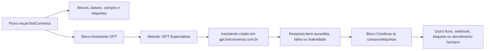

Regra:

```text
O fluxo visual controla o caminho.
O assistente de IA interpreta conversa livre.
O Hermes/webhook grava dados e atualiza o sistema.
```

Correcao de integracao:

```text
Assistentes criados no GPT Especialista nao sao editados dentro do fluxo.
No fluxo, inserir o bloco Assistente GPT, escolher o assistente criado e conferir o metodo GPT Especialista.
Quando o bloco mostrar as saidas condicionais do assistente, conectar cada saida diretamente ao fluxo correto.
Quando o bloco mostrar apenas Resposta bem-sucedida, Resposta falha e Inatividade, conectar Resposta bem-sucedida a um bloco de Condicao.
Esse bloco de Condicao deve ler campos e etiquetas salvos pela IA para decidir o proximo fluxo.
```

Decisao visual:

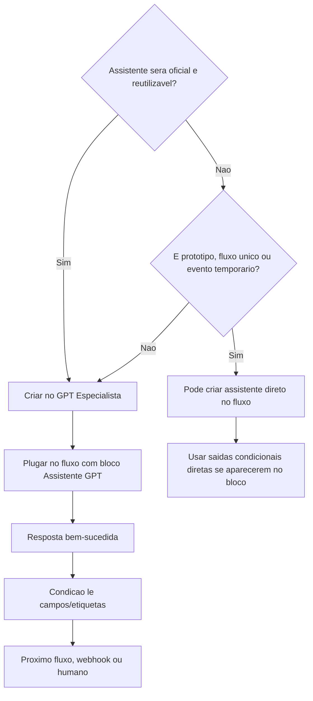

Regra:

```text
Os 13 assistentes oficiais do Hermes ficam no GPT Especialista.
Assistente direto no fluxo e excecao operacional, nao a base do projeto.
```

---

## 2. Fluxos Padroes do BotConversa

Na tela **Configuracoes > Fluxos Padroes**, configurar:

| Campo da tela | Fluxo selecionado | Quando dispara | Para que serve | Usa IA? |
|---|---|---|---|---:|
| Fluxo de boas vindas | `0- Boas Vindas Filadelfia` | Apenas para novo contato que nunca enviou mensagem ao robo; somente 1 vez | Acolher, identificar se e membro/visitante/outro vinculo e enviar para cadastro, visitante ou secretaria | Nao diretamente |
| Fluxo de resposta padrao | `1- RUTE SECRETARIA` | Qualquer mensagem que nao bate com palavra-chave e quando nenhum bloco esta aguardando resposta em campo | Ser a secretaria geral: entender mensagem livre, chamar `Rute Geral` e rotear para cadastro, visitante, oracao, aconselhamento, celula, ministerio ou evento | Sim |
| Fluxo padrao para midia | `00 - Midia Recebida - Rute` | Quando chega anexo fora de contexto: imagem, video, audio, arquivo ou figurinha | Pedir uma explicacao curta, orientar a pessoa a digitar ou encaminhar humano se a midia exigir atendimento | Nao diretamente |
| Fluxo Pos-Atendimento | `000- Pos-atendimento - Feedback` | Quando uma conversa e marcada como concluida no card do contato | Coletar feedback simples, registrar se resolveu e reabrir humano se a pessoa ainda precisar | Nao |

Regra de prioridade:

```text
Boas vindas abre a porta apenas uma vez.
Resposta padrao cuida da conversa livre do dia a dia.
Midia recebida protege o robo quando a pessoa manda anexo fora do fluxo esperado.
Pos-atendimento mede se o atendimento humano resolveu e pode reabrir o cuidado.
```

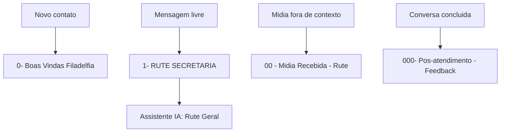

---

## 3. Mapa Geral - Fluxos + Assistentes

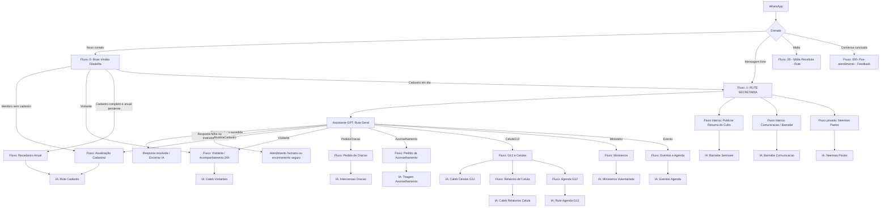

---

## 4. Matriz Oficial - Fluxo, Assistente, Entrada e Saida

| Fluxo | Assistente de IA | Onde a IA entra | Saidas principais | Acao final |
|---|---|---|---|---|
| `0- Boas Vindas Filadelfia` | Nenhum direto | Nao usa IA, usa botoes e condicoes | Membro, visitante, outro vinculo | Conecta para cadastro, visitante, recadastro ou Rute Geral |
| `1- RUTE SECRETARIA` | `Rute Geral` | Depois de checar se nao ha humano ativo | `AtualizaCadastro`, `Visitante`, `PedidoOracao`, `Aconselhamento`, `CelulaG12`, `Ministerio`, `Evento`, mais `Resposta bem-sucedida`, `Resposta falha` e `Inatividade` | Remove `IA - Em Atendimento` e conecta ao fluxo correto |
| `Atualização Cadastral` | `Rute Cadastro` | Quando a pessoa usa texto/audio livre ou faltam dados ambíguos | `Sucesso`, `CadastroIncompleto`, `Humano`, `Inatividade` | Webhook `/webhook_atualizacao_cadastral` |
| `Recadastro Anual` | `Rute Cadastro` | Quando a pessoa diz que algo mudou | `Sucesso`, `CadastroIncompleto`, `Humano`, `Inatividade` | Atualiza cadastro e reinscreve `SEQ - Recadastro Anual` |
| `Visitante / Acompanhamento 24h` | `Caleb Visitantes` | Depois de aplicar `Visitante` e `Consolidação 24h` | `Sucesso`, `PrecisaAcompanhamento`, `CelulaG12`, `PedidoOracao`, `Aconselhamento`, `Humano` | Webhook futuro `/webhook_visitante` e notifica equipe |
| `Pedido de Oracao` | `Intercessao Oracao` | Apos consentimento para registrar pedido | `Sucesso`, `Crise`, `Humano` | Aplica `Pedido de Oracao` e notifica equipe |
| `Pedido de Aconselhamento` | `Triagem Aconselhamento` | Logo apos mensagem de privacidade | `Humano`, `Crise`, `Resumo` | Aplica `Humano Necessario` e abre atendimento |
| `G12 e Celulas` | `Caleb Celulas G12` | Quando ha duvida ou pedido livre sobre celula/G12 | `InteresseCelula`, `Lider`, `RelatorioCelula`, `Humano` | Conecta para equipe, relatorio ou humano |
| `Relatorio de Celula` | `Caleb Relatorios Celula` | Depois do lider iniciar ou receber lembrete | `RelatorioCompleto`, `DadosFaltando`, `Humano` | Webhook `/webhook_relatorio_celula` |
| `Agenda G12` | `Rute Agenda G12` | Quando existe calendario aprovado | `MensagemMensal`, `MensagemSemanal`, `ErroAgenda`, `RevisaoHumana` | Envia por etiquetas G12 |
| `Publicar Resumo do Culto` | `Barnabe Sermoes` | Depois de receber link Spotify, imagem e base do sermao | `MensagemPronta`, `RevisaoHumana` | Envia para `Notif Cultos` |
| `Ministerios` | `Ministerios Voluntariado` | Depois de identificar interesse em servir | `Sucesso`, `RevisaoHumana`, `Humano` | Aplica `Ministério` e notifica responsavel |
| `Eventos e Agenda` | `Eventos Agenda` | Quando a pergunta envolve evento/data/programacao | `Sucesso`, `EventoNaoConfirmado`, `Humano` | Responde se confirmado ou encaminha secretaria |
| `Comunicacao / Barnabe` | `Barnabe Comunicacao` | Uso interno por equipe/Pastor | `Ideia`, `Roteiro`, `RevisaoHumana` | Salva demanda/conteudo para revisao |
| `Neemias Pastor` | `Neemias Pastor` | Uso privado do Pastor | `Metas`, `Procrastinacao`, `ResumoSemanal` | Atualiza metas e rotina |
| `00 - Midia Recebida - Rute` | Nenhum direto | Nao interpreta midia; pede explicacao | Digitar, humano, encerrar | Conecta para Rute Geral ou humano |
| `000- Pos-atendimento - Feedback` | Nenhum direto | Nao usa IA | Resolvido, ainda preciso, feedback | Reabre humano ou encerra |

---

## 5. Ordem Correta de Criacao

Nao criar os fluxos aleatoriamente. A ordem correta evita conexoes quebradas.

### 5.1 Base tecnica

1. Criar campos personalizados.
2. Criar etiquetas.
3. Criar sequencias.
4. Criar assistentes de IA.
5. Criar fluxos vazios.
6. Conectar assistentes dentro dos fluxos.
7. Configurar Fluxos Padroes.
8. Testar ponta a ponta.

### 5.2 Assistentes de IA primeiro

Criar estes assistentes antes de finalizar os fluxos:

| Ordem | Assistente | Base de conhecimento |
|---:|---|---|
| 1 | `Rute Geral` | `docs/base_conhecimento_assistentes_ia/01_rute_geral.md` |
| 2 | `Rute Cadastro` | `docs/base_conhecimento_assistentes_ia/02_rute_cadastro.md` |
| 3 | `Caleb Visitantes` | `docs/base_conhecimento_assistentes_ia/03_caleb_visitantes.md` |
| 4 | `Caleb Celulas G12` | `docs/base_conhecimento_assistentes_ia/04_caleb_celulas_g12.md` |
| 5 | `Intercessao Oracao` | `docs/base_conhecimento_assistentes_ia/05_intercessao_oracao.md` |
| 6 | `Triagem Aconselhamento` | `docs/base_conhecimento_assistentes_ia/06_triagem_aconselhamento.md` |
| 7 | `Ministerios Voluntariado` | `docs/base_conhecimento_assistentes_ia/07_ministerios_voluntariado.md` |
| 8 | `Eventos Agenda` | `docs/base_conhecimento_assistentes_ia/08_eventos_agenda.md` |
| 9 | `Barnabe Comunicacao` | `docs/base_conhecimento_assistentes_ia/09_barnabe_comunicacao.md` |
| 10 | `Neemias Pastor` | `docs/base_conhecimento_assistentes_ia/10_neemias_pastor.md` |
| 11 | `Barnabe Sermoes` | `docs/base_conhecimento_assistentes_ia/11_barnabe_sermoes.md` |
| 12 | `Caleb Relatorios Celula` | `docs/base_conhecimento_assistentes_ia/12_caleb_relatorios_celula.md` |
| 13 | `Rute Agenda G12` | `docs/base_conhecimento_assistentes_ia/13_rute_agenda_g12.md` |

### 5.3 Fluxos depois

| Ordem | Fluxo | Assistente conectado |
|---:|---|---|
| 1 | `Encerrar Conversa` | Nenhum |
| 2 | `Atendimento Humano` | Nenhum |
| 3 | `00 - Midia Recebida - Rute` | Nenhum direto |
| 4 | `000- Pos-atendimento - Feedback` | Nenhum |
| 5 | `0- Boas Vindas Filadelfia` | Nenhum direto |
| 6 | `1- RUTE SECRETARIA` | `Rute Geral` |
| 7 | `Atualização Cadastral` | `Rute Cadastro` |
| 8 | `Recadastro Anual` | `Rute Cadastro` |
| 9 | `Visitante / Acompanhamento 24h` | `Caleb Visitantes` |
| 10 | `Pedido de Oracao` | `Intercessao Oracao` |
| 11 | `Pedido de Aconselhamento` | `Triagem Aconselhamento` |
| 12 | `G12 e Celulas` | `Caleb Celulas G12` |
| 13 | `Relatorio de Celula` | `Caleb Relatorios Celula` |
| 14 | `Agenda G12` | `Rute Agenda G12` |
| 15 | `Publicar Resumo do Culto` | `Barnabe Sermoes` |
| 16 | `Ministerios` | `Ministerios Voluntariado` |
| 17 | `Eventos e Agenda` | `Eventos Agenda` |
| 18 | `Comunicacao / Barnabe` | `Barnabe Comunicacao` |
| 19 | `Neemias Pastor` | `Neemias Pastor` |

---

## 6. Fluxo 1 - 0- Boas Vindas Filadelfia

### Funcao

Receber novo contato, aplicar etiqueta geral e decidir caminho inicial.

### Usa assistente de IA?

Nao diretamente.

Este fluxo deve usar botoes e condicoes. Se a pessoa cair em conversa livre depois, conecta para `1- RUTE SECRETARIA`, onde entra `Rute Geral`.

### Diagrama

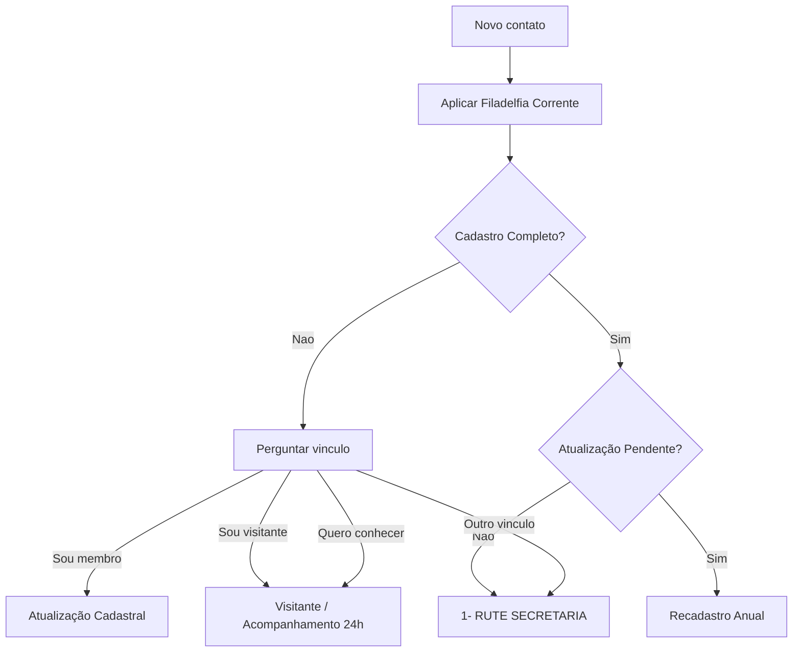

### Mensagem inicial

```text
*Graça e Paz!* 😊
Seja bem-vindo(a) à *Igreja Batista Filadélfia Internacional de Corrente*.

Eu sou a *Rute*, assistente da secretaria pastoral.

Para te atender melhor, escolha uma opção:
```

Botoes:

- `Sou membro`
- `Sou visitante`
- `Quero conhecer`
- `Outro vínculo`

### Se visitante

```text
*Que alegria receber voce!* 😊

Queremos te acolher com carinho.

Posso pedir para *alguem da nossa igreja* falar com voce com calma e te ajudar nos proximos passos?
```

Botoes:

- `Sim, pode`
- `Agora nao`
- `Quero saber mais`

### Conexoes obrigatorias do menu de visitante

Nenhuma saida deste menu pode ficar solta:

| Saida do menu | Acao antes de sair | Destino |
|---|---|---|
| `Sim, pode` | Aplicar `Visitante`; aplicar `Consolidação 24h`; salvar `Tipo_Vinculo = Visitante`; se existir campo, salvar `Aceita_Acompanhamento = Sim` | Conectar ao fluxo `Visitante / Acompanhamento 24h` |
| `Agora nao` | Aplicar `Visitante`; salvar `Tipo_Vinculo = Visitante`; se existir campo, salvar `Aceita_Acompanhamento = Nao` | Enviar mensagem curta de acolhimento e conectar ao fluxo `Encerrar Conversa` |
| `Quero saber mais` | Aplicar `Visitante`; salvar `Tipo_Vinculo = Visitante`; se existir campo, salvar `Ultima_Intencao = Visitante` | Enviar bloco de informacoes basicas e depois conectar ao fluxo `1- RUTE SECRETARIA` |
| `Escolha a opcao desejada` / entrada invalida | Nao aplicar novas etiquetas | Repetir o mesmo menu uma vez; apos limite de erro, conectar `1- RUTE SECRETARIA` |
| `Se usuario nao responder` | Aplicar `Visitante`; remover qualquer etiqueta temporaria de IA, se houver | Enviar lembrete curto e conectar ao fluxo `Encerrar Conversa` |

Mensagem para `Agora nao`:

```text
Tudo bem. 😊

Voce e muito bem-vindo(a) em nossa igreja.

Quando quiser, pode chamar por aqui que eu te ajudo.
```

Mensagem para `Quero saber mais`:

```text
Claro. 😊

Posso te passar as informacoes principais e, se voce quiser, depois peço para alguem da nossa igreja falar com voce com calma.
```

Regra tecnica:

```text
Todo botao, erro e inatividade deve terminar em outro fluxo, atendimento humano ou Encerrar Conversa.
Nunca deixar ponto azul sem conexao no editor do BotConversa.
```

Regra:

```text
Nao usar "consolidador" com visitante.
```

---

## 7. Fluxo 2 - Mensagem Padrao - IA RUTE

### Funcao

Receber mensagens livres que nao ativaram palavra-chave e descobrir a intencao da pessoa.

### Assistente

`Rute Geral`

### Onde inserir o Assistente GPT

Depois de:

1. verificar que nao ha atendimento humano ativo;
2. aplicar `IA - Em Atendimento`.

### Diagrama

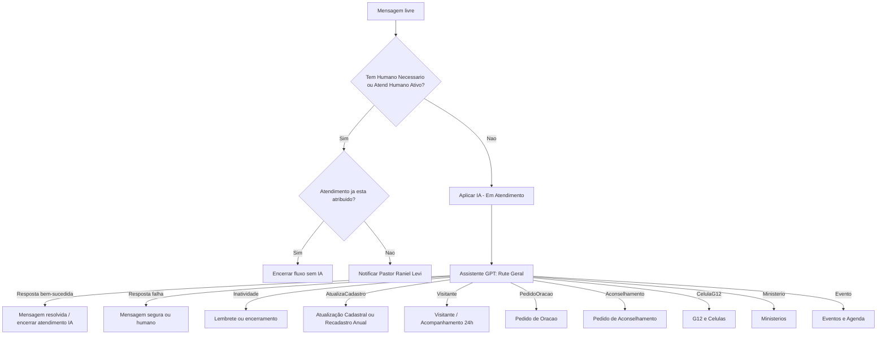

### Campos que a IA salva

- `Resumo_Atend_IA`
- `Ultima_Intencao`
- `Precisa_Encaminhar`
- `Nivel_Urgencia`
- `Status_Atendiment_IA`

### Mensagem curta antes da IA

```text
Estou verificando sua mensagem para te encaminhar da melhor forma. 😊
```

### Conexoes atuais do bloco Assistente GPT

Como as saidas condicionais aparecem diretamente no bloco da `Rute Geral`, conectar assim:

| Saida do Assistente GPT | Proximo passo no fluxo |
|---|---|
| `Resposta bem-sucedida` | Remover `IA - Em Atendimento` e encerrar ou enviar mensagem curta: `Se precisar de algo mais, pode me chamar por aqui.` |
| `Resposta falha` | Aplicar `Humano Necessario`, remover `IA - Em Atendimento`, notificar Pastor Raniel Levi e enviar mensagem segura. |
| `Inatividade` | Enviar lembrete curto e remover `IA - Em Atendimento` se encerrar. |
| `AtualizaCadastro` | Remover `IA - Em Atendimento` e conectar ao fluxo `Atualização Cadastral` ou `Recadastro Anual`. |
| `Visitante` | Remover `IA - Em Atendimento` e conectar ao fluxo `Visitante / Acompanhamento 24h`. |
| `PedidoOracao` | Remover `IA - Em Atendimento` e conectar ao fluxo `Pedido de Oracao`. |
| `Aconselhamento` | Aplicar `Humano Necessario`, remover `IA - Em Atendimento` e conectar ao fluxo `Pedido de Aconselhamento`. |
| `CelulaG12` | Remover `IA - Em Atendimento` e conectar ao fluxo `G12 e Celulas`. |
| `Ministerio` | Remover `IA - Em Atendimento` e conectar ao fluxo `Ministerios e Voluntariado`. |
| `Evento` | Remover `IA - Em Atendimento` e conectar ao fluxo `Eventos e Agenda`. |

Se a saida `Humano` nao aparecer no bloco, usar `Aconselhamento`, `Resposta falha` ou a transferencia humana do proprio assistente para aplicar `Humano Necessario` e notificar o pastor.

### Regras da Rute Geral

- Pode responder informacoes confirmadas.
- Deve rotear para o fluxo correto.
- Nao deve fazer aconselhamento profundo.
- Nao deve inventar data, evento, celula, responsavel ou agenda.

---

## 8. Fluxo 3 - Atualizacao Cadastral

### Funcao

Fazer cadastro inicial ou completar cadastro incompleto.

### Assistente

`Rute Cadastro`

### Onde a IA entra

Depois das perguntas estruturadas, quando:

- a pessoa preferir explicar por texto/audio;
- algum campo vier ambiguo;
- for necessario extrair varios dados de uma fala natural.

### Diagrama

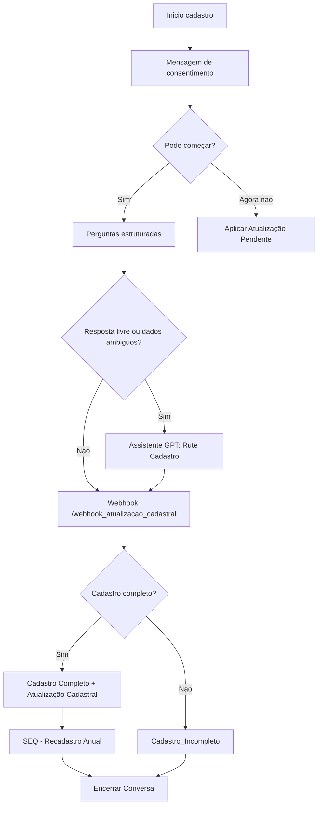

### Mensagem inicial

```text
*Atualização cadastral* 📝

Queremos manter seus dados em dia para cuidar melhor de voce e da sua familia.

_Leva poucos minutos._

Podemos começar?
```

Botoes:

- `Sim, vamos`
- `Agora nao`
- `Falar com equipe`

### Saidas do assistente

| Saida | Acao |
|---|---|
| `Sucesso` | Chamar webhook cadastral |
| `CadastroIncompleto` | Manter pendencia e pedir dados faltantes |
| `Humano` | Abrir atendimento humano |
| `Inatividade` | Inscrever retomada |

---

## 9. Fluxo 4 - Recadastro Anual

### Funcao

Verificar uma vez por ano se os dados continuam corretos.

### Assistente

`Rute Cadastro`

### Onde a IA entra

Somente quando a pessoa tocar em `Mudar algo` ou explicar por texto/audio o que mudou.

### Mensagem inicial

```text
*Recadastro anual* 📝

Para mantermos nosso cuidado pastoral em dia, confira as informações que temos no seu cadastro:

• *Bairro:* {{Bairro}}
• *Célula:* {{Celula_Atual}}
• *Líder:* {{Lider_Celula}}
• *G12:* {{G12_Pastoral}}

Esses dados continuam iguais?
```

Botoes:

- `Tudo igual`
- `Mudar algo`
- `Falar com equipe`

### Diagrama

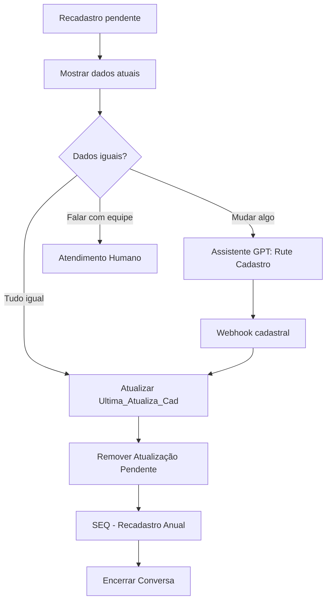

Regra:

```text
Nao existe revisao semestral. Depois do cadastro completo, somente recadastro anual.
```

---

## 10. Fluxo 5 - Visitante / Acompanhamento 24h

### Funcao

Acolher visitante e garantir acompanhamento humano em ate 24h.

### Assistente

`Caleb Visitantes`

### Onde a IA entra

Depois de:

1. aplicar `Visitante`;
2. aplicar `Consolidação 24h` internamente;
3. perguntar se a pessoa aceita acompanhamento.

### Linguagem obrigatoria

```text
Nao usar "consolidador" com visitante.
Usar "alguem da nossa igreja", "uma pessoa da nossa equipe" ou "um amigo proximo".
```

### Mensagem inicial

```text
*Que alegria receber voce!* 😊

Queremos te acolher bem e te ajudar nos proximos passos.

Como podemos te chamar?
```

### Pergunta de acompanhamento

```text
Voce gostaria que *alguem da nossa igreja* falasse com voce com calma para te acolher e ajudar nos proximos passos?
```

Botoes:

- `Sim, pode`
- `Agora nao`
- `Quero célula`

### Diagrama

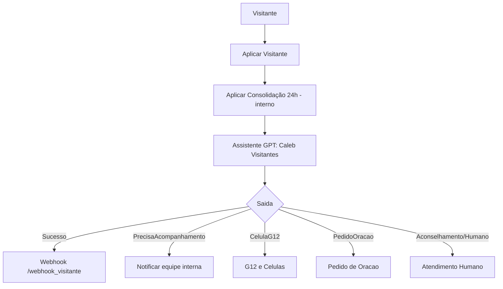

### Saidas do assistente

| Saida | Acao |
|---|---|
| `Sucesso` | Registrar visitante |
| `PrecisaAcompanhamento` | Notificar equipe interna |
| `CelulaG12` | Conectar ao fluxo `G12 e Celulas` |
| `PedidoOracao` | Conectar ao fluxo `Pedido de Oracao` |
| `Aconselhamento` | Abrir atendimento humano |
| `Humano` | Abrir atendimento humano |

---

## 11. Fluxo 6 - Pedido de Oracao

### Assistente

`Intercessao Oracao`

### Onde a IA entra

Apos a pessoa aceitar registrar o pedido.

### Mensagem inicial

```text
*Pedido de oração* 🙏

Sera um privilegio orar por voce.

Posso registrar seu pedido para nossa equipe de intercessao?
```

Botoes:

- `Pode registrar`
- `Prefiro não`
- `Falar com equipe`

### Diagrama

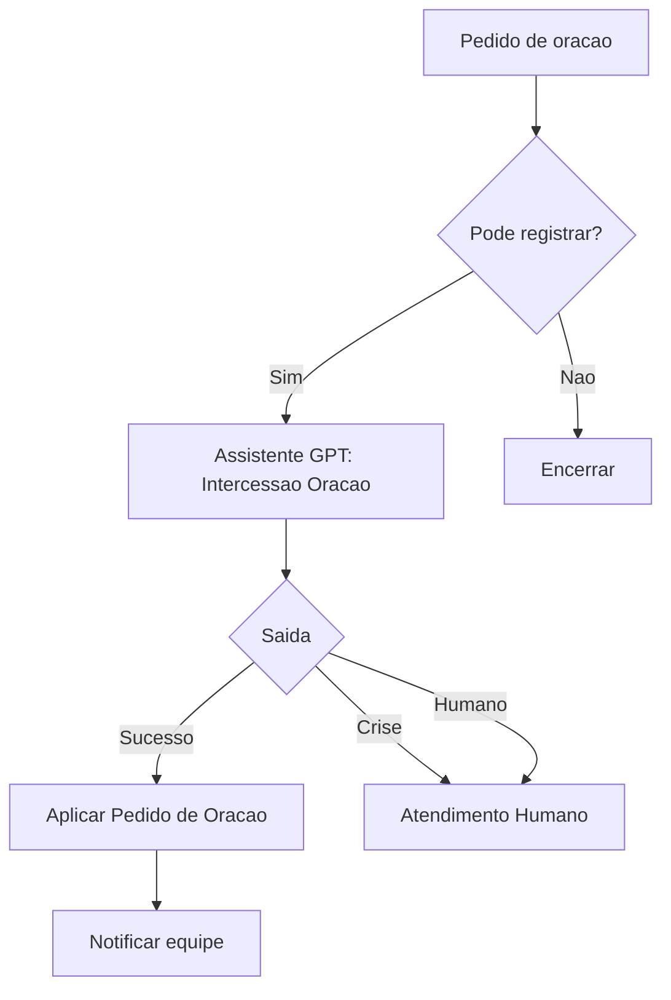

---

## 12. Fluxo 7 - Pedido de Aconselhamento

### Assistente

`Triagem Aconselhamento`

### Onde a IA entra

Depois de uma mensagem de privacidade e cuidado.

### Mensagem inicial

```text
Entendo. Esse assunto merece cuidado e privacidade.

Vou encaminhar voce para nossa equipe pastoral/secretaria.

Se puder, me diga em poucas palavras o motivo do atendimento.
```

### Diagrama

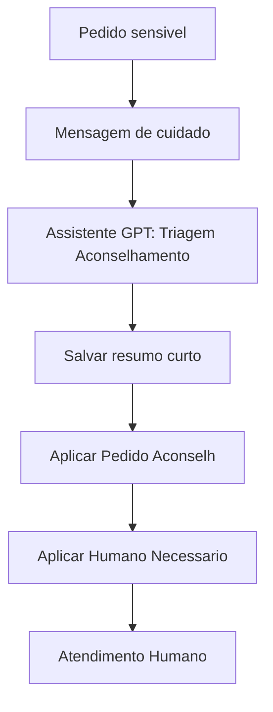

Regra:

```text
A IA acolhe e resume. O atendimento pastoral profundo e humano.
```

---

## 13. Fluxo 8 - G12 e Celulas

### Assistente

`Caleb Celulas G12`

### Onde a IA entra

Quando a pessoa escreve livremente sobre:

- celula;
- G12;
- lider;
- trilhas;
- encontro;
- duvida sobre participar;
- relatorio.

### Mensagem inicial

```text
*Células e G12* 🌱

Me diga como posso te ajudar:
```

Botoes:

- `Quero célula`
- `Sou líder`
- `Tenho dúvida`
- `Relatório célula`

### Diagrama

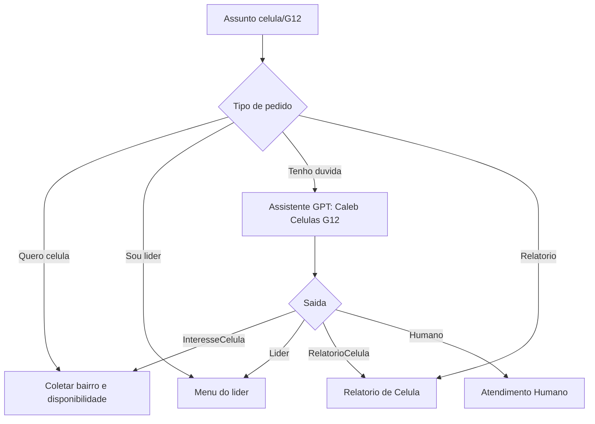

---

## 14. Fluxo 9 - Relatorio de Celula

### Assistente

`Caleb Relatorios Celula`

### Onde a IA entra

Depois que o lider inicia o relatorio ou recebe lembrete 1h apos a celula.

### Mensagem inicial

```text
*Relatório da célula* 📋

Vamos registrar como foi a reunião.

Qual foi a *data da célula*?
```

### Diagrama

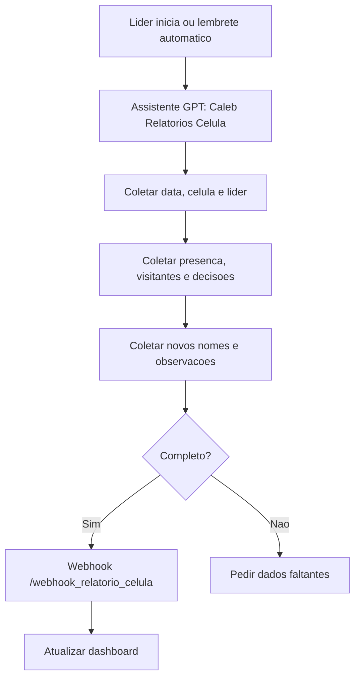

Regra:

```text
Se uma celula ficar 3 semanas sem relatorio, alertar o Pastor.
```

---

## 15. Fluxo 10 - Agenda G12

### Assistente

`Rute Agenda G12`

### Onde a IA entra

Quando existe calendario mensal ou semanal aprovado.

### Mensagem mensal

```text
*Agenda G12 - {{Mes}}* 📅

Confira os principais compromissos deste mês:

{{Agenda_Mensal}}

_Qualquer ajuste será informado pelos canais oficiais._
```

### Diagrama

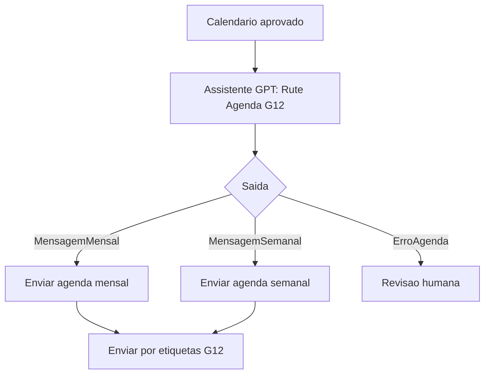

Regra:

```text
Nao inventar datas. Usar somente calendario aprovado.
```

---

## 16. Fluxo 11 - Publicar Resumo do Culto

### Assistente

`Barnabe Sermoes`

### Onde a IA entra

Depois que o Hermes recebe:

- link do Spotify;
- imagem do sermao;
- tema/titulo;
- transcricao, resumo bruto ou observacoes.

### Mensagem final para WhatsApp

```text
*Resumo do culto* 🙏

{{Resumo_1_Paragrafo}}

Ouça a mensagem completa aqui:
{{Link_Spotify}}
```

### Diagrama

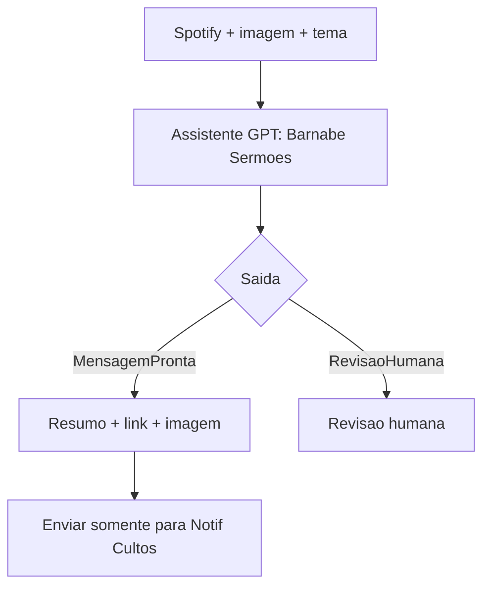

Regra:

```text
Enviar apenas para quem aceitou notificacoes de cultos.
```

---

## 17. Fluxo 12 - Ministerios

### Assistente

`Ministerios Voluntariado`

### Mensagem inicial

```text
*Servir na igreja* 🙌

Que bom saber do seu desejo de servir.

Em qual area voce gostaria de ajudar?
```

Botoes:

- `Louvor`
- `Kids`
- `Obreiros`
- `Outro`

### Diagrama

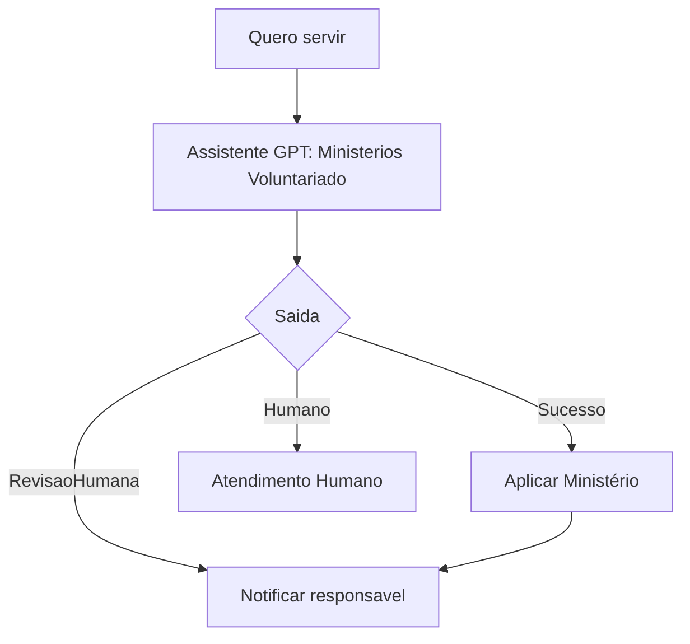

---

## 18. Fluxo 13 - Eventos e Agenda

### Assistente

`Eventos Agenda`

### Mensagem se evento confirmado

```text
*{{Nome_Evento}}* 📅

Data: *{{Data_Evento}}*
Horário: *{{Horario_Evento}}*
Local: *{{Local_Evento}}*

{{Instrucao_Evento}}
```

### Mensagem se nao confirmado

```text
Ainda nao tenho essa informação confirmada por aqui.

Vou encaminhar para a secretaria te responder com segurança.
```

### Diagrama

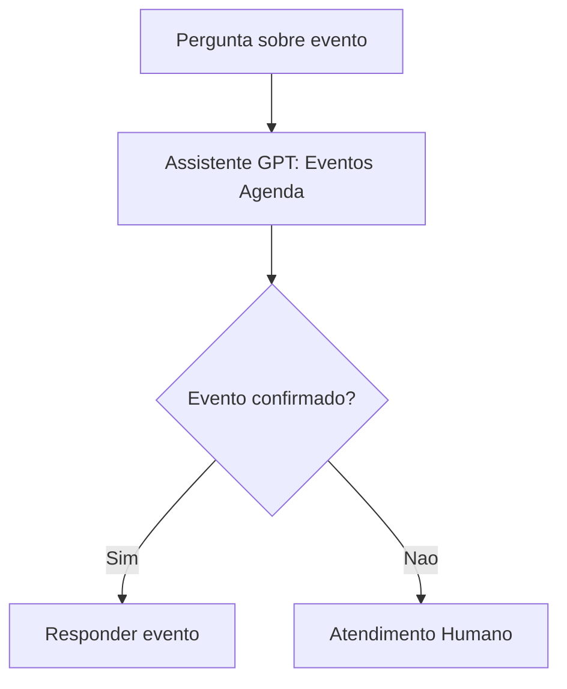

---

## 19. Fluxos Internos

### 19.1 Comunicacao / Barnabe

Assistente: `Barnabe Comunicacao`

Uso:

- ideias de posts;
- roteiros;
- avisos;
- mensagens internas;
- conteudo para redes.

Saidas:

- `Ideia`;
- `Roteiro`;
- `RevisaoHumana`.

### 19.2 Neemias Pastor

Assistente: `Neemias Pastor`

Uso:

- 3 vitorias do dia;
- rotina protegida;
- registro de procrastinacao;
- resumo semanal.

Saidas:

- `Metas`;
- `Procrastinacao`;
- `ResumoSemanal`.

---

## 20. Checklist de Validacao

Antes de considerar o BotConversa pronto, testar:

- [ ] Novo contato cai em `0- Boas Vindas Filadelfia`.
- [ ] Mensagem livre chama `Rute Geral`.
- [ ] `Rute Geral` identifica cada intencao principal.
- [ ] Cadastro chama `Rute Cadastro` quando ha texto/audio livre.
- [ ] Recadastro anual chama `Rute Cadastro` quando a pessoa muda dados.
- [ ] Visitante chama `Caleb Visitantes`.
- [ ] Visitante nao recebe a palavra "consolidador".
- [ ] Pedido de oracao chama `Intercessao Oracao`.
- [ ] Aconselhamento chama `Triagem Aconselhamento` e abre humano.
- [ ] G12/celulas chama `Caleb Celulas G12`.
- [ ] Relatorio chama `Caleb Relatorios Celula`.
- [ ] Agenda G12 chama `Rute Agenda G12`.
- [ ] Resumo de culto chama `Barnabe Sermoes`.
- [ ] Ministerios chama `Ministerios Voluntariado`.
- [ ] Eventos chama `Eventos Agenda`.
- [ ] Pos-atendimento nao chama IA sem necessidade.
- [ ] Midia recebida pede explicacao ou abre humano.
