# Guia Visual - Fluxos e Passo a Passo de Criacao no BotConversa

Data: 2026-06-03  
Projeto: Hermes Filadelfia  
Foco: somente fluxos, conexoes e ordem de criacao

---

## 1. Tela de Fluxos Padroes

Na tela **Configuracoes > Fluxos Padroes**, configurar:

| Campo | Fluxo | Funcao |
|---|---|---|
| Fluxo de boas vindas | `0- Boas Vindas Filadelfia` | Primeira porta para novo contato; roda uma unica vez |
| Fluxo de resposta padrao | `1- RUTE SECRETARIA` | Secretaria geral para mensagem livre que nao bateu palavra-chave |
| Fluxo padrao para midia | `00 - Midia Recebida - Rute` | Tratamento de anexo fora de contexto |
| Fluxo Pos-Atendimento | `000- Pos-atendimento - Feedback` | Feedback automatico apos conversa concluida |

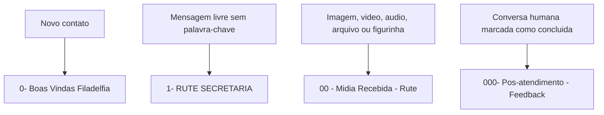

Resumo pratico:

| Fluxo | Nao deve fazer | Deve fazer |
|---|---|---|
| `0- Boas Vindas Filadelfia` | Nao virar conversa longa | Acolher e direcionar para membro, visitante ou outro vinculo |
| `1- RUTE SECRETARIA` | Nao ignorar atendimento humano ativo | Usar Rute Geral para rotear mensagem livre |
| `00 - Midia Recebida - Rute` | Nao tentar resolver midia fora de contexto como se fosse texto comum | Pedir explicacao ou abrir humano |
| `000- Pos-atendimento - Feedback` | Nao iniciar novo atendimento longo automaticamente | Perguntar se resolveu e reabrir humano se necessario |

---

## 2. Padrao de Mensagens para WhatsApp

O WhatsApp precisa de mensagens curtas, claras e bem quebradas em linhas. A pessoa deve entender rapidamente o que esta acontecendo e qual botao tocar.

### 2.1 Formatacao recomendada

| Recurso | Como usar | Exemplo |
|---|---|---|
| Negrito | Para titulo, palavra-chave e acao principal | `*Atualizacao cadastral*` |
| Italico | Para observacao leve ou orientacao secundaria | `_Leva menos de 3 minutos._` |
| Emoji | 1 emoji por bloco, quando ajuda o tom | `😊`, `🙏`, `📝`, `📍`, `📅` |
| Caixa alta | Evitar. Usar somente siglas ou alerta muito curto | `ATENCAO` apenas se realmente necessario |
| Lista | Usar linhas curtas com marcadores simples | `• Nome` |
| Pergunta | Uma pergunta por vez | `Qual seu bairro?` |

### 2.2 Regras de escrita

- Comecar com `Graça e Paz!` quando for inicio de atendimento.
- Usar no maximo 4 a 6 linhas por mensagem.
- Evitar blocos grandes.
- Evitar jargoes internos com visitantes.
- Nao usar "consolidador" com visitante.
- Usar "alguem da nossa igreja", "uma pessoa da nossa equipe", "um amigo proximo" ou "alguem para te acompanhar".
- Em assuntos sensiveis, nao usar emoji alegre.
- Quando houver botao, terminar com uma pergunta clara.
- Quando o bot vai encaminhar, dizer o que vai acontecer.
- Nao prometer horario, vaga, inscricao ou resposta imediata sem confirmacao humana.

### 2.3 Modelo de tom

Bom:

```text
*Graça e Paz!* 😊
Que alegria falar com voce.

Para te atender melhor, escolha uma opcao abaixo:
```

Evitar:

```text
OLA, INFORME TODOS OS SEUS DADOS PARA CADASTRO.
```

### 2.4 Padrao para botoes

Preferir botoes curtos:

- `Sou membro`
- `Sou visitante`
- `Quero conhecer`
- `Atualizar dados`
- `Tudo igual`
- `Mudar algo`
- `Falar com equipe`
- `Sim, pode`
- `Agora nao`

---

## 3. Mapa Geral dos Fluxos

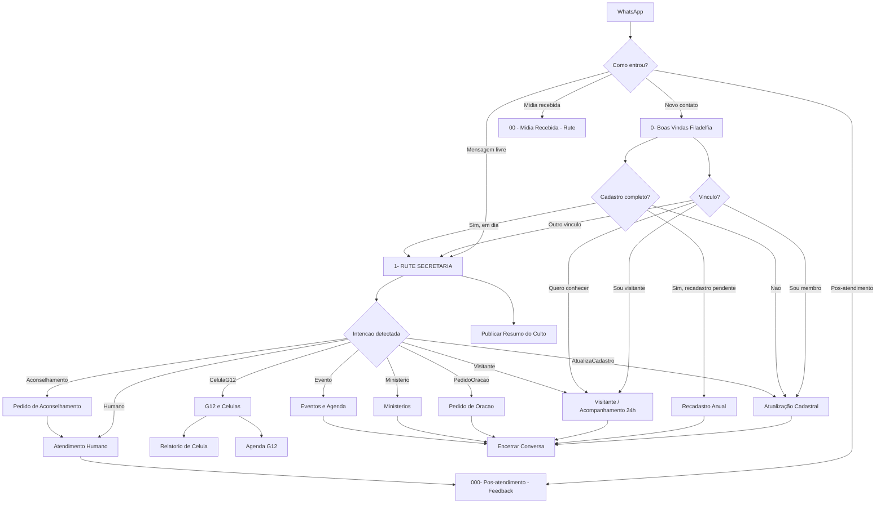

---

## 4. Mensagens Prontas por Fluxo

Esta secao contem textos para copiar, adaptar e colar nos blocos de conteudo do BotConversa.

### 4.1 `0- Boas Vindas Filadelfia`

#### Mensagem inicial

```text
*Graça e Paz!* 😊
Seja bem-vindo(a) à *Igreja Batista Filadélfia Internacional de Corrente*.

Eu sou a *Rute*, assistente da secretaria pastoral.

Para te atender melhor, escolha uma opção:
```

Botoes:

- `Sou membro`
- `Sou visitante`
- `Quero conhecer`
- `Outro vínculo`

#### Se escolher `Sou membro`

```text
Que bom ter voce por aqui. 🙏

Vou verificar seu cadastro para mantermos nosso cuidado pastoral organizado.

Se faltar alguma informacao, vou te encaminhar para uma atualizacao rapidinha.
```

Acao:

- aplicar `Membro`;
- se cadastro incompleto, conectar em `Atualização Cadastral`;
- se cadastro completo e recadastro pendente, conectar em `Recadastro Anual`;
- se cadastro em dia, conectar em `1- RUTE SECRETARIA`.

#### Se escolher `Sou visitante`

```text
*Que alegria receber voce!* 😊

Queremos te acolher com carinho.

Posso pedir para *alguem da nossa igreja* falar com voce com calma e te ajudar nos proximos passos?
```

Botoes:

- `Sim, pode`
- `Agora nao`
- `Quero saber mais`

Acao:

- aplicar `Visitante`;
- salvar `Tipo_Vinculo = Visitante`;
- conectar no menu `Permitir Acompanhamento Visitante`.

Conexoes do menu:

| Botao / Saida | Acao | Destino |
|---|---|---|
| `Sim, pode` | Aplicar `Consolidação 24h`; salvar `Aceita_Acompanhamento = Sim` se o campo existir | `Visitante / Acompanhamento 24h` |
| `Agora nao` | Salvar `Aceita_Acompanhamento = Nao` se o campo existir | Mensagem curta de acolhimento -> `Encerrar Conversa` |
| `Quero saber mais` | Manter `Visitante`; salvar `Ultima_Intencao = Visitante` | Bloco de informacoes basicas -> `1- RUTE SECRETARIA` |
| Entrada invalida / limite de erro | Nao aplicar nova etiqueta | Repetir menu; apos 3 erros -> `1- RUTE SECRETARIA` |
| `Se usuario nao responder` | Manter `Visitante` | Lembrete curto -> `Encerrar Conversa` |

#### Se escolher `Quero conhecer`

```text
Que alegria! 😊

Nossos cultos fixos acontecem:
• *Domingo às 19h30*
• *Quarta-feira às 19h30*

📍 Estamos em Corrente-PI.

Voce quer que alguem da nossa igreja te ajude com orientacoes para sua primeira visita?
```

Botoes:

- `Sim, quero`
- `Nao precisa`
- `Falar com equipe`

Conexoes:

| Botao | Acao | Destino |
|---|---|---|
| `Sim, quero` | Aplicar `Consolidação 24h`; salvar `Aceita_Acompanhamento = Sim` se o campo existir | `Visitante / Acompanhamento 24h` |
| `Nao precisa` | Salvar `Aceita_Acompanhamento = Nao` se o campo existir | `Encerrar Conversa` |
| `Falar com equipe` | Aplicar `Humano Necessario`; notificar Pastor Raniel Levi | Atendimento humano |

Regra:

```text
Nenhum botao, erro ou inatividade pode ficar sem conexao.
```

### 4.2 `1- RUTE SECRETARIA`

#### Mensagem curta antes da IA, se quiser usar

```text
Estou verificando sua mensagem para te encaminhar da melhor forma. 😊
```

#### Quando a Rute identifica cadastro

```text
Claro. Vou te encaminhar para a *atualizacao cadastral* agora. 📝
```

#### Quando a Rute identifica visitante

```text
Que bom falar com voce. 😊

Vou te encaminhar para nosso atendimento de visitantes, para alguem da nossa igreja te acolher com carinho.
```

#### Quando a Rute identifica pedido de oracao

```text
Claro. 🙏

Posso registrar seu pedido para nossa equipe de intercessao orar por voce?
```

Botoes:

- `Pode registrar`
- `Prefiro não`
- `Falar com equipe`

#### Quando a Rute identifica aconselhamento

```text
Entendo. Esse assunto merece cuidado e privacidade.

Vou encaminhar sua mensagem para nossa equipe pastoral/secretaria te atender melhor.
```

Acao:

- aplicar `Humano Necessario`;
- conectar em `Atendimento Humano`.

### 4.3 `00 - Midia Recebida - Rute`

#### Mensagem inicial

```text
Recebi sua mídia. 📎

Para eu entender melhor e encaminhar corretamente, me diga em uma frase do que se trata.
```

Botoes:

- `Vou explicar`
- `Falar com equipe`
- `Encerrar`

#### Se escolher `Vou explicar`

```text
Perfeito.

Escreva em poucas palavras o que voce gostaria que fizéssemos com essa mídia.
```

#### Se escolher `Falar com equipe`

```text
Certo. Vou encaminhar sua mensagem para nossa equipe te ajudar melhor.
```

### 4.4 `000- Pos-atendimento - Feedback`

#### Mensagem inicial

```text
*Graça e Paz!* 🙏

Seu atendimento foi finalizado.

Sua solicitação foi resolvida?
```

Botoes:

- `Sim, resolvido`
- `Ainda preciso`
- `Enviar feedback`

#### Se `Sim, resolvido`

```text
Que bom. Ficamos felizes em ajudar. 🙏

Deus abençoe sua vida!
```

#### Se `Ainda preciso`

```text
Sem problema.

Vou reabrir seu atendimento para alguem da equipe continuar te ajudando.
```

#### Se `Enviar feedback`

```text
Pode escrever seu feedback em uma mensagem curta.

Isso nos ajuda a cuidar melhor das pessoas.
```

### 4.5 `Atualização Cadastral`

#### Introducao

```text
*Atualização cadastral* 📝

Queremos manter seus dados em dia para cuidar melhor de voce e da sua familia.

_Leva poucos minutos._

Podemos começar?
```

Botoes:

- `Sim, vamos`
- `Agora nao`
- `Falar com equipe`

#### Pergunta nome

```text
Qual seu *nome completo*?
```

#### Pergunta nascimento

```text
Qual sua *data de nascimento*?

Pode enviar assim: _25/12/1990_
```

#### Pergunta bairro

```text
Em qual *bairro ou cidade* voce mora?
```

#### Pergunta tempo de igreja

```text
Ha quanto tempo voce participa da Filadélfia?
```

Botoes:

- `Menos de 6 meses`
- `6 meses a 2 anos`
- `Mais de 2 anos`

#### Pergunta celula

```text
Voce participa de alguma *celula*?

Se sim, me diga o nome da celula ou do lider.
```

#### Pergunta trilhas

```text
Voce ja fez o *Encontro com Deus*?
```

Botoes:

- `Sim`
- `Nao`
- `Quero informações`

#### Encerramento com sucesso

```text
*Cadastro atualizado com sucesso!* ✅

Obrigado por separar esse tempo.

Isso nos ajuda a cuidar melhor de voce.
Deus abençoe!
```

#### Se adiar

```text
Tudo bem. 😊

Vou deixar sua atualizacao pendente e podemos continuar depois.
```

### 4.6 `Recadastro Anual`

#### Mensagem inicial

```text
*Recadastro anual* 📝

Para mantermos nosso cuidado pastoral em dia, confira as informações que temos no seu cadastro:

• *Bairro:* {{Bairro}}
• *Célula:* {{Celula_Atual}}
• *Líder:* {{Lider_Celula}}
• *G12:* {{G12_Pastoral}}

Esses dados continuam iguais?
```

Botoes:

- `Tudo igual`
- `Mudar algo`
- `Falar com equipe`

#### Se `Tudo igual`

```text
Perfeito. ✅

Seu cadastro foi confirmado.

Obrigado por nos ajudar a manter tudo organizado.
```

#### Se `Mudar algo`

```text
Claro.

Me diga o que mudou. Pode escrever de forma simples, por exemplo:
_Mudei de bairro_ ou _agora estou em outra célula_.
```

### 4.7 `Visitante / Acompanhamento 24h`

#### Mensagem inicial

```text
*Que alegria receber voce!* 😊

Queremos te acolher bem e te ajudar nos proximos passos.

Como podemos te chamar?
```

#### Pergunta bairro

```text
Em qual *bairro ou cidade* voce mora?

Isso nos ajuda a te orientar melhor.
```

#### Pergunta origem

```text
Como voce conheceu a Filadélfia?
```

Botoes:

- `Redes sociais`
- `Amigo/familia`
- `Culto`
- `Internet`

#### Pergunta acompanhamento

```text
Voce gostaria que *alguem da nossa igreja* falasse com voce com calma para te acolher e ajudar nos proximos passos?
```

Botoes:

- `Sim, pode`
- `Agora nao`
- `Quero célula`

#### Encerramento

```text
Muito obrigado! 😊

Suas informações foram registradas com carinho.

Em até 24 horas, alguem da nossa igreja vai falar com voce para te acolher e ajudar nos proximos passos.
```

Regra:

```text
Nao usar "consolidador" com visitante.
```

### 4.8 `Pedido de Oracao`

#### Mensagem inicial

```text
*Pedido de oração* 🙏

Sera um privilegio orar por voce.

Posso registrar seu pedido para nossa equipe de intercessao?
```

Botoes:

- `Pode registrar`
- `Prefiro não`
- `Falar com equipe`

#### Pedir pedido

```text
Pode escrever seu pedido em uma mensagem curta.

Se preferir, envie apenas o tema da oração.
```

#### Encerramento

```text
Seu pedido foi registrado com carinho. 🙏

Nossa equipe vai apresentar isso em oração.
Deus abençoe voce.
```

### 4.9 `Pedido de Aconselhamento`

#### Mensagem inicial

```text
Entendo. Esse assunto merece cuidado e privacidade.

Vou encaminhar voce para nossa equipe pastoral/secretaria.

Se puder, me diga em poucas palavras o motivo do atendimento.
```

#### Transicao para humano

```text
Obrigado por compartilhar.

Vou parar meu atendimento automatico e encaminhar sua mensagem para uma pessoa da equipe cuidar disso com voce.
```

Regra:

```text
A IA nao faz aconselhamento profundo. Ela acolhe, resume e abre atendimento humano.
```

### 4.10 `G12 e Celulas`

#### Mensagem inicial

```text
*Células e G12* 🌱

Me diga como posso te ajudar:
```

Botoes:

- `Quero célula`
- `Sou líder`
- `Tenho dúvida`
- `Relatório célula`

#### Se `Quero célula`

```text
Que bom! 😊

Me diga seu *bairro* e quais dias/horarios costumam ser melhores para voce.
```

#### Se `Sou líder`

```text
Perfeito.

Voce deseja atualizar dados da sua célula ou enviar o relatório da reunião?
```

Botoes:

- `Atualizar célula`
- `Enviar relatório`
- `Falar com equipe`

### 4.11 `Relatorio de Celula`

#### Mensagem inicial

```text
*Relatório da célula* 📋

Vamos registrar como foi a reunião.

Qual foi a *data da célula*?
```

#### Perguntas principais

```text
Quantos *membros* estiveram presentes?
```

```text
Quantos *visitantes* participaram?
```

```text
Houve *decisões de fé*?
Se sim, quantas?
```

```text
Teve algum nome novo que precisamos acompanhar?
```

```text
Deseja deixar alguma observação sobre a célula?
```

#### Encerramento

```text
Relatório registrado. ✅

Obrigado por cuidar da célula com responsabilidade.
```

### 4.12 `Agenda G12`

#### Mensagem mensal

```text
*Agenda G12 - {{Mes}}* 📅

Confira os principais compromissos deste mês:

{{Agenda_Mensal}}

_Qualquer ajuste será informado pelos canais oficiais._
```

#### Mensagem semanal

```text
*Agenda da semana* 📅

{{Agenda_Semanal}}

Vamos caminhar com organização e unidade.
```

Regra:

```text
Nao inventar datas. Usar somente calendario aprovado.
```

### 4.13 `Publicar Resumo do Culto`

#### Mensagem para notificação

```text
*Resumo do culto* 🙏

{{Resumo_1_Paragrafo}}

Ouça a mensagem completa aqui:
{{Link_Spotify}}
```

Observacao:

- enviar com a imagem do sermao;
- enviar apenas para quem aceitou `Notif Cultos` ou `Recebe_Notif_Cultos = Sim`.

### 4.14 `Ministerios`

#### Mensagem inicial

```text
*Servir na igreja* 🙌

Que bom saber do seu desejo de servir.

Em qual area voce gostaria de ajudar?
```

Botoes:

- `Louvor`
- `Kids`
- `Obreiros`
- `Outro`

#### Encerramento

```text
Obrigado por compartilhar. 🙏

Vou encaminhar seu interesse para a equipe responsavel avaliar os proximos passos.
```

### 4.15 `Eventos e Agenda`

#### Evento confirmado

```text
*{{Nome_Evento}}* 📅

Data: *{{Data_Evento}}*
Horário: *{{Horario_Evento}}*
Local: *{{Local_Evento}}*

{{Instrucao_Evento}}
```

#### Evento nao confirmado

```text
Ainda nao tenho essa informação confirmada por aqui.

Vou encaminhar para a secretaria te responder com segurança.
```

---

## 5. Ordem de Criacao dos Fluxos

Criar nesta ordem para evitar conexoes quebradas:

| Ordem | Fluxo | Motivo |
|---:|---|---|
| 1 | `Encerrar Conversa` | Todos os fluxos precisam de final seguro |
| 2 | `Atendimento Humano` | Necessario para interrupcao, crise e pedido de atendente |
| 3 | `00 - Midia Recebida - Rute` | Fluxo padrao para anexos |
| 4 | `000- Pos-atendimento - Feedback` | Fluxo padrao apos conversa concluida |
| 5 | `0- Boas Vindas Filadelfia` | Porta de entrada de novos contatos |
| 6 | `1- RUTE SECRETARIA` | Roteamento geral por IA |
| 7 | `Atualização Cadastral` | Base cadastral inicial |
| 8 | `Recadastro Anual` | Verificacao anual depois do cadastro completo |
| 9 | `Visitante / Acompanhamento 24h` | Acolhimento de novos contatos |
| 10 | `Pedido de Oracao` | Cuidado espiritual simples |
| 11 | `Pedido de Aconselhamento` | Encaminhamento humano seguro |
| 12 | `G12 e Celulas` | Entrada para celulas, G12 e lideres |
| 13 | `Relatorio de Celula` | Coleta de relatorio dos lideres |
| 14 | `Agenda G12` | Envio mensal e semanal aos G12 |
| 15 | `Publicar Resumo do Culto` | Resumo de sermoes e notificacao |
| 16 | `Ministerios` | Interesse em servir |
| 17 | `Eventos e Agenda` | Eventos confirmados |

---

## 6. Passo a Passo - Criacao Base

### 6.1 Criar `Encerrar Conversa`

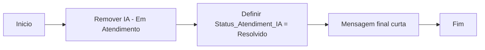

Blocos:

1. Acao: remover etiqueta `IA - Em Atendimento`.
2. Acao: definir `Status_Atendiment_IA = Resolvido`.
3. Conteudo: mensagem curta de encerramento.

### 6.2 Criar `Atendimento Humano`

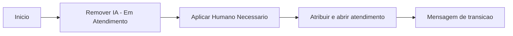

Blocos:

1. Acao: remover `IA - Em Atendimento`.
2. Acao: aplicar `Humano Necessario`.
3. Acao: atribuir e abrir atendimento.
4. Conteudo: avisar que a equipe vai responder.

### 6.3 Criar `00 - Midia Recebida - Rute`

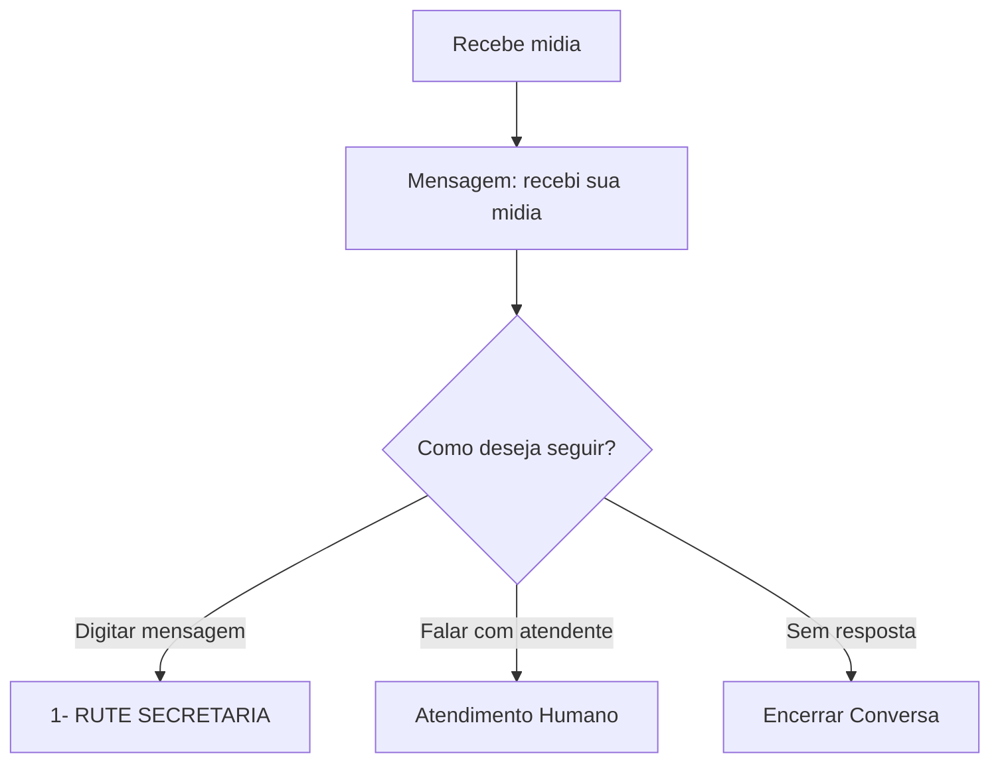

Mensagem sugerida:

```text
Recebi sua midia. Para eu entender melhor e encaminhar corretamente, me diga em uma frase do que se trata.
```

### 6.4 Criar `000- Pos-atendimento - Feedback`

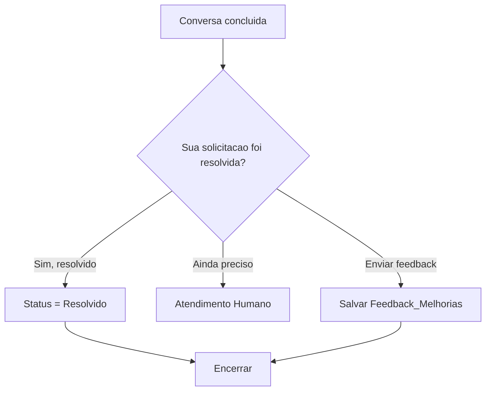

---

## 7. Passo a Passo - Entrada e Roteamento

### 7.1 Criar `0- Boas Vindas Filadelfia`

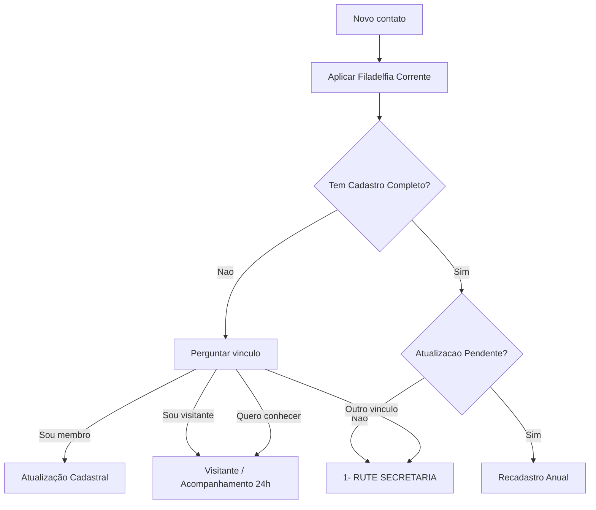

Blocos:

1. Acao: aplicar `Filadelfia Corrente`.
2. Condicao: tem `Cadastro Completo`?
3. Condicao: tem `Atualização Pendente`?
4. Conteudo com botoes: `Sou membro`, `Sou visitante`, `Quero conhecer`, `Outro vínculo`.
5. Conectar cada botao ao fluxo correto.

### 7.2 Criar `1- RUTE SECRETARIA`

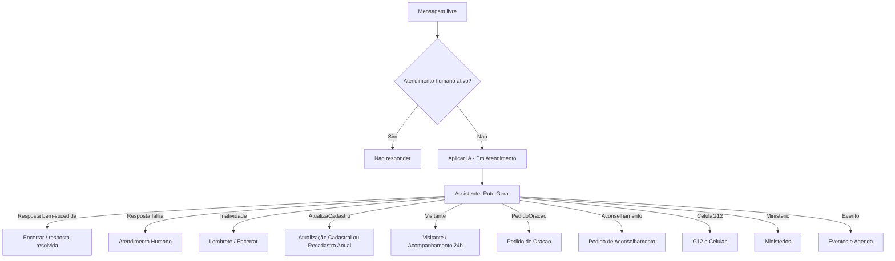

Blocos:

1. Condicao: se tem `Atend Humano Ativo` ou `Humano Necessario`, encerrar fluxo.
2. Acao: aplicar `IA - Em Atendimento`.
3. Bloco Assistente GPT: `Rute Geral`.
4. Conectar as saidas diretas do Assistente GPT aos fluxos corretos.
5. Antes de conectar a outro fluxo, remover `IA - Em Atendimento`.

Plano B: se em algum assistente as saidas condicionais nao aparecerem no bloco visual, usar `Resposta bem-sucedida` + condicoes por `Ultima_Intencao` e `Precisa_Encaminhar`.

---

## 8. Passo a Passo - Cadastro

### 8.1 Criar `Atualização Cadastral`

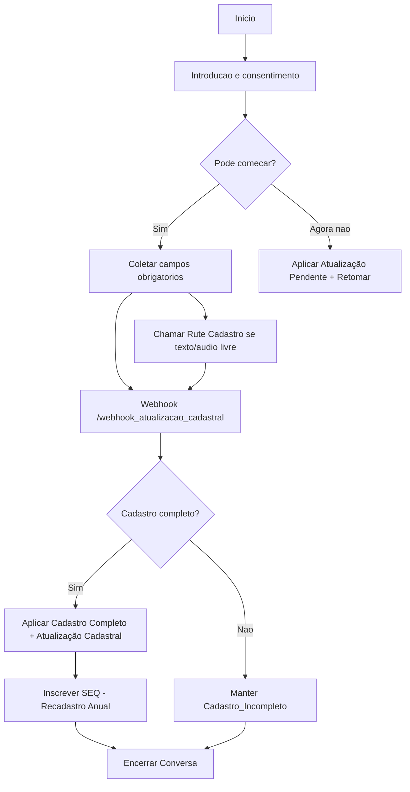

### 8.2 Criar `Recadastro Anual`

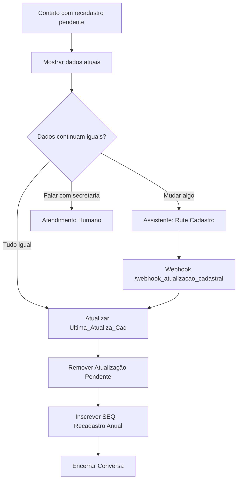

Regra:

```text
Nao criar revisao semestral. Depois do cadastro completo, somente recadastro anual.
```

---

## 9. Passo a Passo - Visitante

### Criar `Visitante / Acompanhamento 24h`

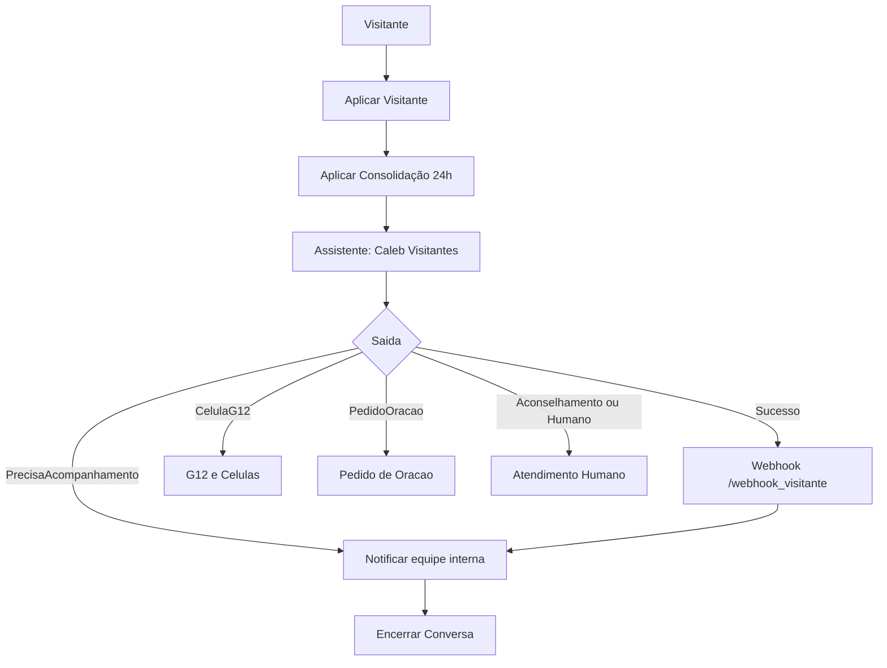

Linguagem para visitante:

```text
Foi uma alegria receber voce. Se quiser, posso pedir para alguem da nossa igreja falar com voce com calma, te acolher e ajudar nos proximos passos.
```

Regra:

```text
Nao usar "consolidador" com visitante. Esse termo e interno.
```

---

## 10. Passo a Passo - Cuidado Pastoral

### 10.1 Criar `Pedido de Oracao`

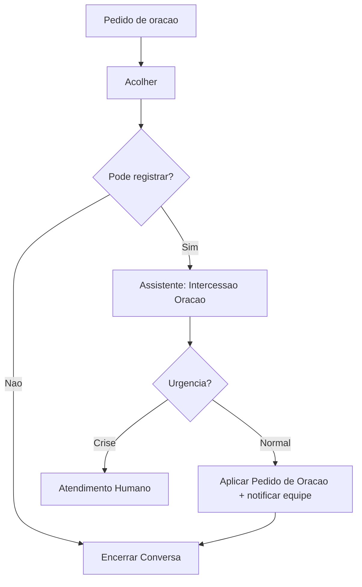

### 10.2 Criar `Pedido de Aconselhamento`

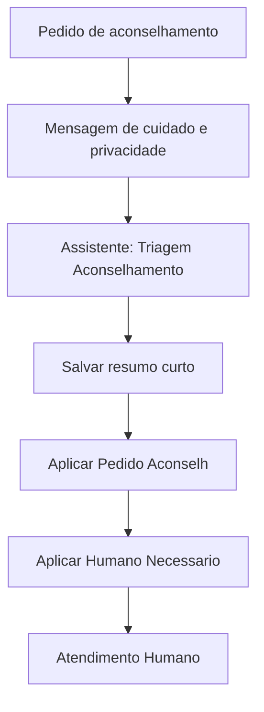

Regra:

```text
A IA acolhe e resume. O atendimento pastoral profundo e humano.
```

---

## 11. Passo a Passo - Celulas, G12 e Lideres

### 11.1 Criar `G12 e Celulas`

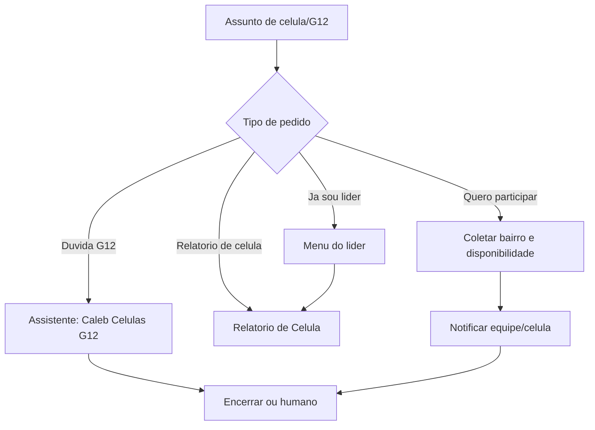

### 11.2 Criar `Relatorio de Celula`

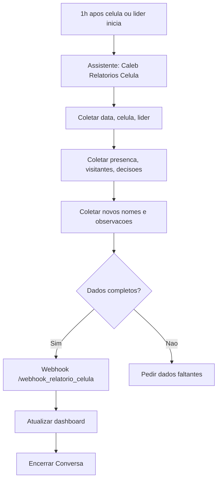

Regra de recuperacao:

```text
Se uma celula ficar 3 semanas sem relatorio, alertar o Pastor.
```

### 11.3 Criar `Agenda G12`

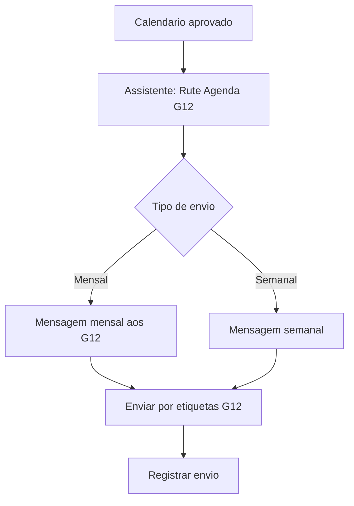

---

## 12. Passo a Passo - Comunicacao

### 12.1 Criar `Publicar Resumo do Culto`

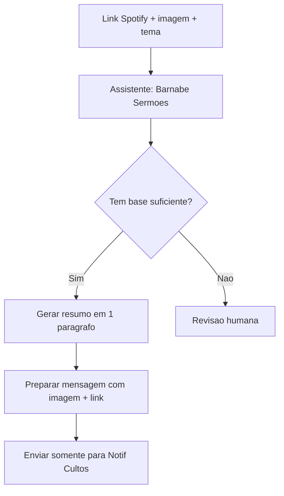

### 12.2 Criar `Ministerios`

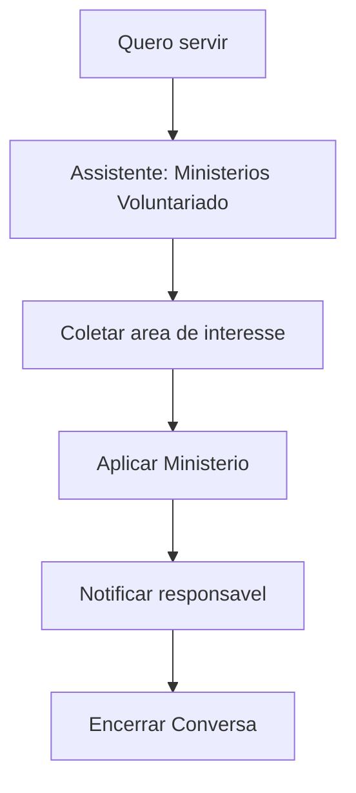

### 12.3 Criar `Eventos e Agenda`

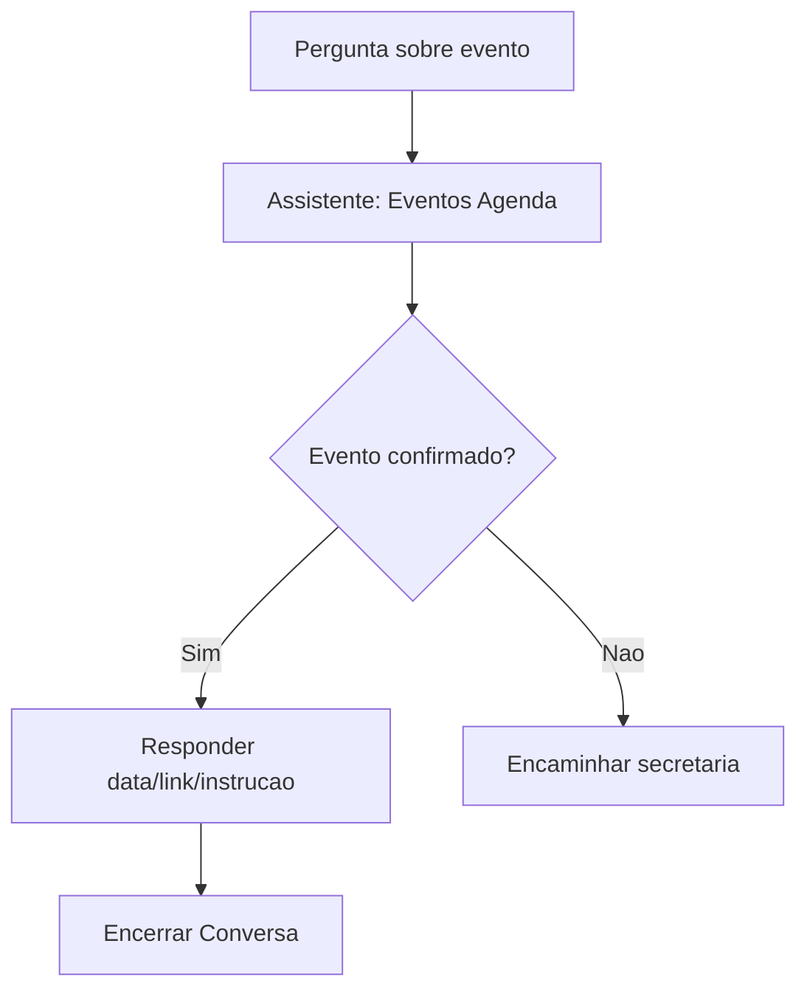

---

## 13. Checklist de Criacao no BotConversa

### A. Criar fluxos vazios primeiro

- [ ] `Encerrar Conversa`
- [ ] `Atendimento Humano`
- [ ] `00 - Midia Recebida - Rute`
- [ ] `000- Pos-atendimento - Feedback`
- [ ] `0- Boas Vindas Filadelfia`
- [ ] `1- RUTE SECRETARIA`
- [ ] `Atualização Cadastral`
- [ ] `Recadastro Anual`
- [ ] `Visitante / Acompanhamento 24h`
- [ ] `Pedido de Oracao`
- [ ] `Pedido de Aconselhamento`
- [ ] `G12 e Celulas`
- [ ] `Relatorio de Celula`
- [ ] `Agenda G12`
- [ ] `Publicar Resumo do Culto`
- [ ] `Ministerios`
- [ ] `Eventos e Agenda`

### B. Configurar fluxos padroes

- [ ] Boas vindas: `0- Boas Vindas Filadelfia`
- [ ] Resposta padrao: `1- RUTE SECRETARIA`
- [ ] Midia: `00 - Midia Recebida - Rute`
- [ ] Pos-atendimento: `000- Pos-atendimento - Feedback`

### C. Criar assistentes

- [ ] `Rute Geral`
- [ ] `Rute Cadastro`
- [ ] `Caleb Visitantes`
- [ ] `Caleb Celulas G12`
- [ ] `Intercessao Oracao`
- [ ] `Triagem Aconselhamento`
- [ ] `Ministerios Voluntariado`
- [ ] `Eventos Agenda`
- [ ] `Barnabe Comunicacao`
- [ ] `Neemias Pastor`
- [ ] `Barnabe Sermoes`
- [ ] `Caleb Relatorios Celula`
- [ ] `Rute Agenda G12`

### D. Testar em ordem

- [ ] Novo contato.
- [ ] Mensagem livre.
- [ ] Midia recebida.
- [ ] Visitante.
- [ ] Cadastro incompleto.
- [ ] Recadastro anual.
- [ ] Pedido de oracao.
- [ ] Pedido de aconselhamento.
- [ ] Interesse em celula.
- [ ] Relatorio de celula.
- [ ] Agenda G12.
- [ ] Resumo do culto.
- [ ] Pos-atendimento.
