# Projeto Visual do Chatbot com IA - BotConversa + Hermes

Pastor Raniel, este documento mostra como o chatbot pastoral deve funcionar dentro do BotConversa, como os fluxos se relacionam, quais campos e etiquetas controlam o atendimento, onde a IA entra e por que cada peça existe.

---

## 1. Visão Geral do Chatbot

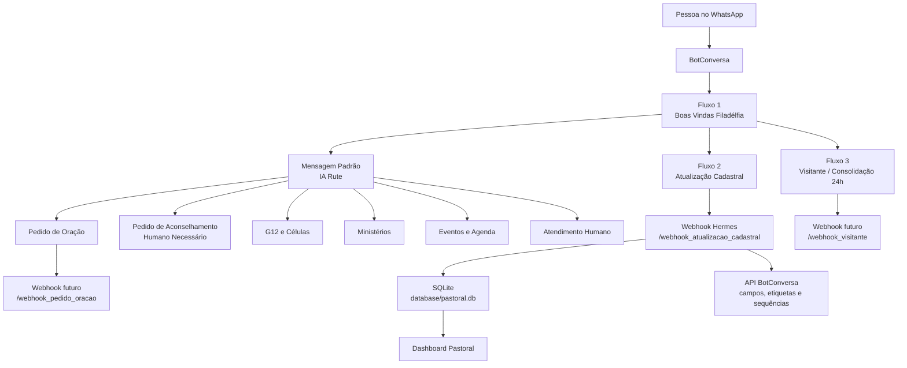

**Resumo simples:** o BotConversa conversa com a pessoa, os fluxos organizam o caminho, a IA interpreta mensagens livres, as etiquetas dizem o estado do contato, os campos guardam dados, o webhook envia informações para o Hermes, e o dashboard mostra a visão pastoral.

---

## 2. Papel de Cada Camada

| Camada | O que faz | Por que precisamos |
|---|---|---|
| WhatsApp | Entrada real das pessoas | É onde membros, visitantes e liderança já falam |
| BotConversa | Organiza fluxos, botões, campos e etiquetas | Dá controle visual e reduz dependência de código |
| IA Rute | Interpreta mensagens livres e identifica intenção | Pessoas não falam sempre por botões; a IA entende linguagem natural |
| Fluxos visuais | Executam passos exatos | Cadastro, etiquetas, sequências e webhooks precisam ser previsíveis |
| Campos personalizados | Guardam dados do contato | Permitem saber bairro, célula, líder, G12, ministérios, status |
| Etiquetas | Marcam estado operacional | Permitem segmentar, filtrar, encaminhar e impedir confusão |
| Sequências | Fazem follow-up por tempo | Retomar cadastro, recadastro anual, consolidar visitante em 24h |
| Webhook Hermes | Liga BotConversa ao sistema local | Salva dados no SQLite e sincroniza com o dashboard |
| Dashboard | Mostra métricas e pendências | O Pastor enxerga cuidado, cadastro, consolidação e comunicação |

---

## 3. Regra Principal da Arquitetura

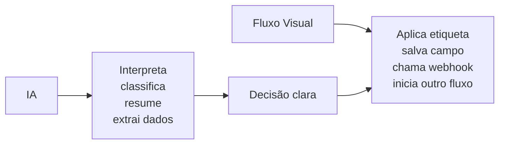

**A IA interpreta. O fluxo visual executa.**

Essa separação evita que a Rute diga “vou encaminhar” mas o BotConversa não encaminhe de verdade. O encaminhamento real precisa acontecer por saída do Assistente GPT, condição por campo, ou webhook/API.

---

## 4. Roteamento Principal da Rute

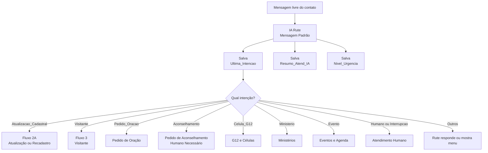

### Saídas recomendadas do Assistente GPT

| Saída | Quando usar | Destino |
|---|---|---|
| `AtualizaCadastro` | Pessoa quer atualizar ou confirmar dados | Atualização Cadastral |
| `PedidoOracao` | Pedido de oração/intercessão | Pedido de Oração |
| `Aconselhamento` | Pedido pastoral, crise, assunto sensível | Atendimento humano/pastoral |
| `CelulaG12` | Célula, G12, líder, participação | G12 e Células |
| `Ministerio` | Servir, ministério, louvor, mídia, recepção | Ministérios |
| `Evento` | Culto, agenda, inscrição, programação | Eventos e Agenda |
| `Humano` | Pede secretaria, pastor ou atendente | Atendimento humano |
| `Interrupcao` | Frustração, repetição, fora do escopo | Interrupção / humano |
| `Inatividade` | Não respondeu dentro do tempo | Encerrar ou retomar |
| `Menu` | Pedido confuso ou quer recomeçar | Menu principal |

---

## 5. Fluxos Visuais do Chatbot

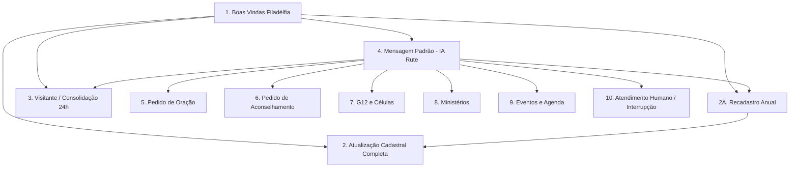

### Por que cada fluxo existe

| Fluxo | Objetivo | Por que não deixar tudo na IA |
|---|---|---|
| Boas Vindas | Receber e classificar contato | Primeiro contato precisa de caminho simples e controlado |
| Atualização Cadastral | Coletar dados obrigatórios | Cadastro exige campos específicos e confirmação |
| Recadastro Anual | Ver uma vez por ano se os dados continuam iguais | Mantém base limpa sem cansar membros |
| Visitante | Garantir consolidação em 24h | Visitante não pode ficar perdido em conversa livre |
| IA Rute | Responder e rotear mensagens livres | A pessoa pode escrever de muitos jeitos diferentes |
| Pedido de Oração | Registrar cuidado espiritual | Separa oração de cadastro e agenda |
| Aconselhamento | Triagem pastoral sensível | Precisa humano e cuidado, não automação livre |
| G12 e Células | Direcionar célula/consolidação | Ajuda Caleb e liderança a acompanhar |
| Ministérios | Organizar interesse em servir | Ajuda a conectar pessoas ao serviço correto |
| Eventos e Agenda | Informar datas confirmadas | Evita resposta inventada sobre eventos |
| Atendimento Humano | Encerrar automação quando necessário | Protege a pessoa e a igreja em casos sensíveis |

---

## 6. Etiquetas: O Estado do Contato

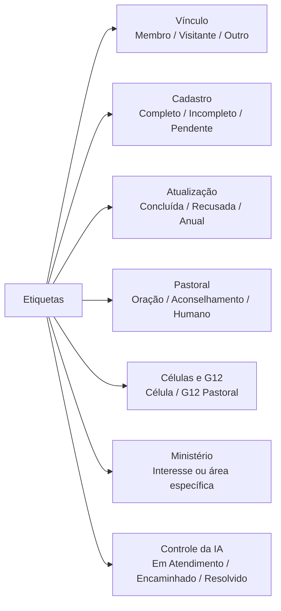

### Etiquetas globais recomendadas

| Etiqueta | Serve para |
|---|---|
| `Filadelfia Corrente` | Marcar todo contato do WhatsApp da igreja |
| `Membro` | Separar quem já faz parte da igreja |
| `Visitante` | Separar interessados e novos contatos |
| `Outro-Vinculo` | Pessoas que não entram claramente como membro ou visitante |
| `Cadastro Completo` | Dados mínimos preenchidos |
| `Cadastro Incompleto` | Faltam dados obrigatórios |
| `Atualização Cadastral` | Atualização do ciclo vigente concluída |
| `Atualização Pendente` | Precisa atualizar neste ciclo |
| `Atualização Recusada` | Pessoa recusou ou adiou |
| `Atualização Confirmada Sem Alteração` | Confirmou que nada mudou |
| `Recadastro Anual Agendado` | Está na rotina anual |
| `Consolidação 24h` | Visitante precisa de contato rápido |
| `Pedido de Oração` | Pedido registrado para intercessão |
| `Pedido de Aconselhamento` | Precisa triagem pastoral |
| `Humano Necessário` | Robô deve parar e humano assumir |
| `Em Atendimento Humano` | Conversa aberta com atendente |
| `Célula` | Interesse ou assunto de célula |
| `Ministério` | Interesse em servir |
| `IA - Em Atendimento` | IA está conduzindo a conversa |
| `IA - Encaminhado` | IA já enviou para outro fluxo |
| `IA - Resolvido` | Atendimento automatizado concluído |

**Por que etiquetas são essenciais:** elas impedem que todos os contatos sejam tratados igual. Sem etiqueta, o bot não sabe se está falando com membro, visitante, pessoa em crise, cadastro incompleto ou alguém aguardando humano.

---

## 7. Campos Personalizados: A Memória do Contato

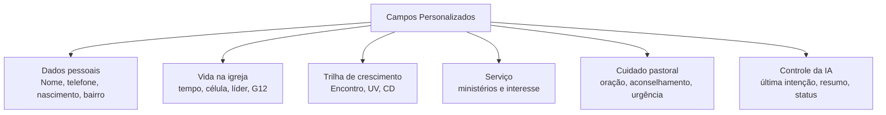

### Campos principais

| Campo | Uso lógico |
|---|---|
| `Data Nascimento` | Dados pessoais e cuidado por faixa etária/aniversário |
| `Bairro` | Saber região, célula próxima e logística pastoral |
| `Tempo_Igreja` | Entender maturidade e integração |
| `Lider_Celula` | Saber quem acompanha a pessoa |
| `Celula_Atual` | Mapear vínculo com célula |
| `G12_Pastoral` | Identificar rede pastoral |
| `Fez_Encontro` | Saber etapa da trilha de crescimento |
| `Universidade_Vida` | Acompanhar formação |
| `Capacitacao_Destino` | Acompanhar capacitação |
| `Ministerios` | Saber onde já serve |
| `Interesse_Ministerio` | Encaminhar para área de serviço |
| `Feedback_Melhorias` | Ouvir sugestões da igreja |
| `Feedback_falta` | Perceber dores e necessidades |
| `Ultima_Atualiz_Cadas` | Saber quando o cadastro foi atualizado |
| `Prox_Recadastro` | Programar recadastro anual |
| `Status_Cadastro` | Completo, Incompleto, Atualizar ou Recusou |
| `Tipo_Vinculo` | Membro, Visitante, Líder ou Outro |
| `Resumo_Atend_IA` | Auditoria da conversa com IA |
| `Ultima_Intencao` | Roteamento da Rute geral |
| `Nivel_Urgencia` | Baixa, Média, Alta ou Crise |
| `Status_Atendimento_IA` | Aberto, Encaminhado, Resolvido ou Humano |
| `Ultimo_Fluxo_Encaminhado` | Evita repetição e mostra para onde foi enviado |

**Por que campos são essenciais:** etiqueta diz “estado”; campo guarda “informação”. Exemplo: `Visitante` é etiqueta; `Bairro`, `Como_Conheceu_Igreja` e `Disponibilidade_Celula` são campos.

---

## 8. Cadastro: Como o Bot Decide se Está Completo

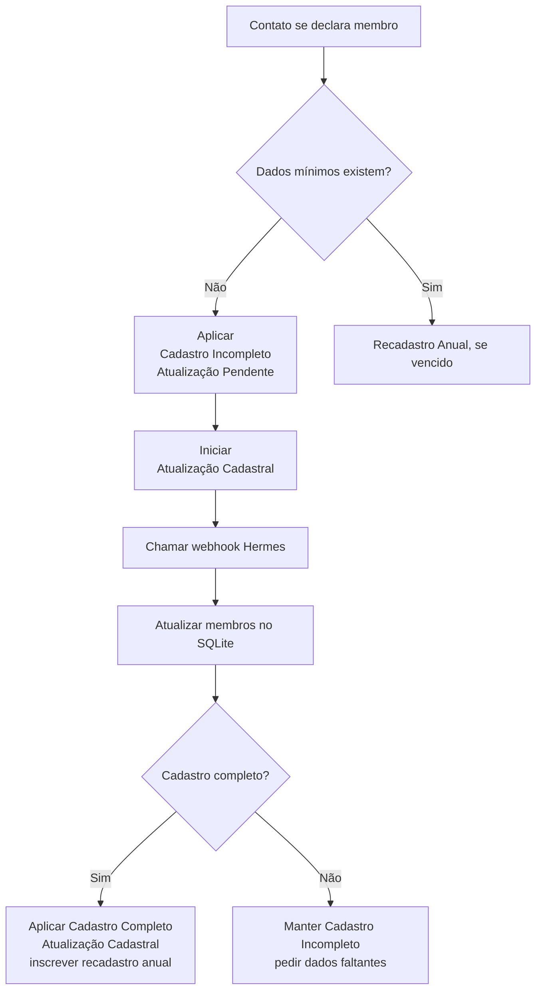

### Campos mínimos para membro

| Obrigatório | Por que importa |
|---|---|
| Nome | Identificação básica |
| Telefone | Contato pastoral |
| Bairro/cidade | Célula, logística e cuidado regional |
| Tempo de igreja | Maturidade e histórico |
| Líder de célula | Responsável pelo acompanhamento |
| Célula atual | Vínculo prático de cuidado |
| G12 pastoral | Rede pastoral |
| Fez Encontro | Trilha de consolidação |
| Universidade da Vida | Formação |
| Capacitação Destino | Capacitação |

---

## 9. Fluxo de Atualização Cadastral com Webhook

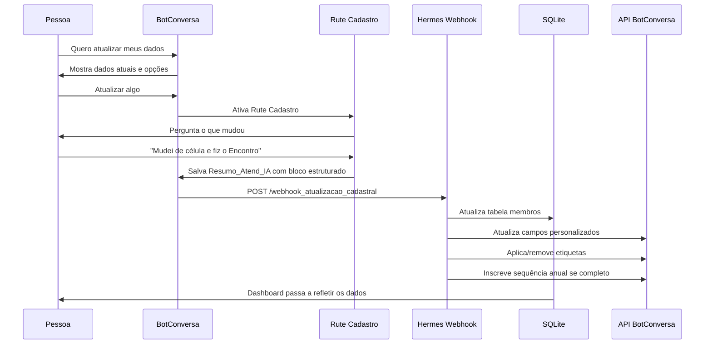

### Endpoint já existente

```text
POST /webhook_atualizacao_cadastral
```

### O que ele faz hoje

| Ação | Resultado |
|---|---|
| Recebe `subscriber_id`, `nome`, `telefone` e `resumo_ia` | Identifica o contato |
| Extrai bloco `[ATUALIZACAO_CADASTRAL]` | Transforma texto da IA em dados |
| Busca ou cria membro local | Garante vínculo com SQLite |
| Atualiza tabela `membros` | Mantém base pastoral local |
| Verifica se cadastro ficou completo | Decide status final |
| Atualiza campos no BotConversa | Mantém a plataforma sincronizada |
| Aplica/remove etiquetas | Atualiza estado operacional |
| Inscreve em sequências | Agenda recadastro anual |
| Grava `botconversa_sync_log` | Permite auditoria |

---

## 10. Visitante e Consolidação 24h

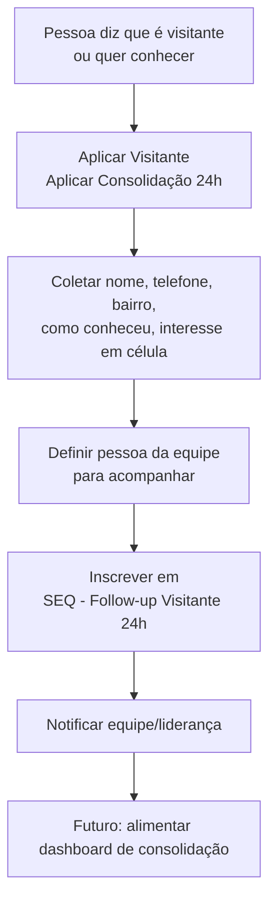

**Por que este fluxo existe:** visitante precisa ser cuidado rapidamente por alguem proximo. A etiqueta `Consolidação 24h` torna visível internamente quem ainda precisa de contato, mas a palavra "consolidador" nao deve ser usada com o visitante.

Campos recomendados:

| Campo | Por que |
|---|---|
| `Tipo_Vinculo = Visitante` | Separar visitante de membro |
| `Bairro` | Indicar célula próxima |
| `Como_Conheceu_Igreja` | Entender origem do visitante |
| `Disponibilidade_Celula` | Facilitar encaminhamento |
| `Consolidador_Responsavel` | Uso interno: saber quem vai acompanhar |
| `Status_Consolidacao` | Pendente, Contatado, Integrado ou Desistiu |

---

## 11. Controle Anti-Repetição da IA

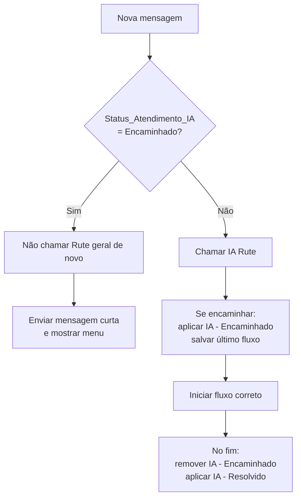

### Por que isso é necessário

Sem controle de estado, a IA pode repetir a mesma resposta quando a pessoa responde apenas “ok”, “sim”, “tá” ou “obrigado”.  
Com `Status_Atendimento_IA`, `Ultima_Intencao` e `Ultimo_Fluxo_Encaminhado`, o BotConversa entende se deve continuar, mostrar menu ou evitar repetição.

---

## 12. Sequências: O Relógio do Cuidado

| Sequência | Quando entra | Quando sai | Por que existe |
|---|---|---|---|
| `SEQ - Retomar Atualizacao Cadastral` | Pessoa adia ou abandona cadastro | Conclui cadastro | Evitar cadastro eternamente incompleto |
| `SEQ - Recadastro Anual` | Cadastro completo | Inicia recadastro anual | Fazer revisão completa 1 vez ao ano |
| `SEQ - Follow-up Visitante 24h` | Visitante registrado | Integrado/desistiu/contatado | Garantir cuidado rápido |
| `SEQ - Pedido de Oracao Follow-up` | Pedido de oração sem crise | Acompanhamento concluído | Demonstrar cuidado após intercessão |

---

## 13. Onde Cada Informação Fica

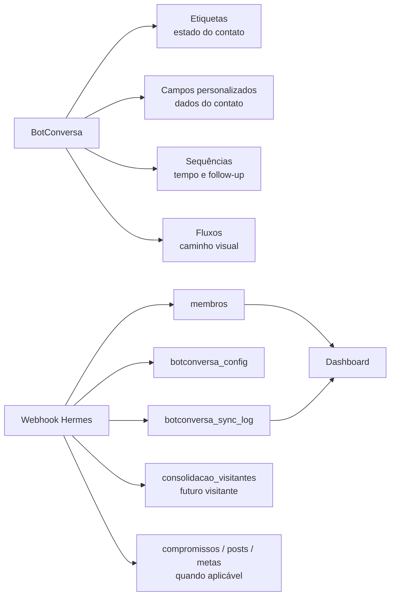

| Local | Guarda |
|---|---|
| BotConversa | Estado rápido do contato e conversa atual |
| `membros` | Cadastro pastoral local |
| `botconversa_config` | IDs de etiquetas, campos, fluxos e sequências |
| `botconversa_sync_log` | Histórico de sincronizações |
| `consolidacao_visitantes` | Visitantes e follow-up pastoral |
| Dashboard | Visão executiva do que está acontecendo |

---

## 14. Lógica de Decisão em Uma Página

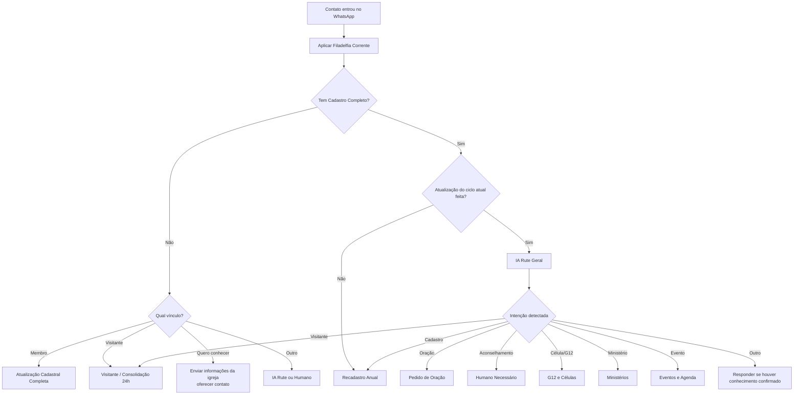

---

## 15. Ordem de Construção Recomendada

| Prioridade | Construir | Motivo |
|---|---|---|
| 1 | Etiquetas globais | Sem etiquetas o bot não sabe o estado do contato |
| 2 | Campos personalizados | Sem campos não há memória pastoral |
| 3 | Fluxo Boas Vindas | É a porta de entrada |
| 4 | Fluxo Atualização Cadastral | Base limpa para qualquer estratégia |
| 5 | Webhook cadastral | Liga BotConversa ao Hermes e dashboard |
| 6 | IA Rute geral com saídas | Roteia mensagens livres sem bagunça |
| 7 | Recadastro anual | Mantém dados atualizados sem cansar membros |
| 8 | Visitante / Consolidação 24h | Garante cuidado rápido com novos contatos |
| 9 | Oração, aconselhamento, célula, ministério e eventos | Expande cuidado por área |
| 10 | Sequências e automações por tempo | Fecha o ciclo de acompanhamento |

---

## 16. O Que Não Pode Ficar Solto

| Coisa solta | Deve virar |
|---|---|
| “Essa pessoa é visitante” | Etiqueta `Visitante` + campos de consolidação |
| “Faltam dados” | Etiqueta `Cadastro Incompleto` + `Status_Cadastro` |
| “Precisa atualizar” | Etiqueta `Atualização Pendente` + sequência de retomada |
| “Pediu oração” | Etiqueta `Pedido de Oração` + resumo |
| “Quer aconselhamento” | Etiqueta `Humano Necessário` + atendimento aberto |
| “Quer célula” | Intenção `Celula_G12` + fluxo G12 |
| “Quer servir” | Campo `Interesse_Ministerio` + etiqueta `Ministério` |
| “IA encaminhou” | `Status_Atendimento_IA = Encaminhado` + último fluxo |

---

## 17. Resumo Final

O chatbot com IA não é apenas uma conversa automática. Ele é um sistema de cuidado pastoral organizado:

1. Acolhe a pessoa.
2. Identifica o vínculo.
3. Coleta dados importantes.
4. Encaminha para o fluxo certo.
5. Marca o estado com etiquetas.
6. Salva informações em campos.
7. Usa sequências para não esquecer follow-up.
8. Envia dados ao Hermes por webhook.
9. Alimenta o dashboard.
10. Dá ao Pastor visão e controle sem depender de memória mental.

**Princípio central:** a conversa precisa virar estado, dado, acompanhamento e decisão.
