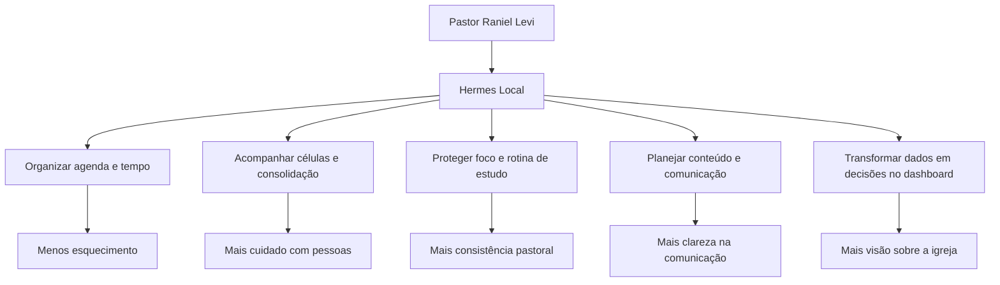
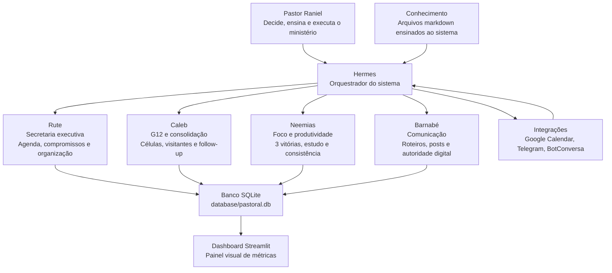
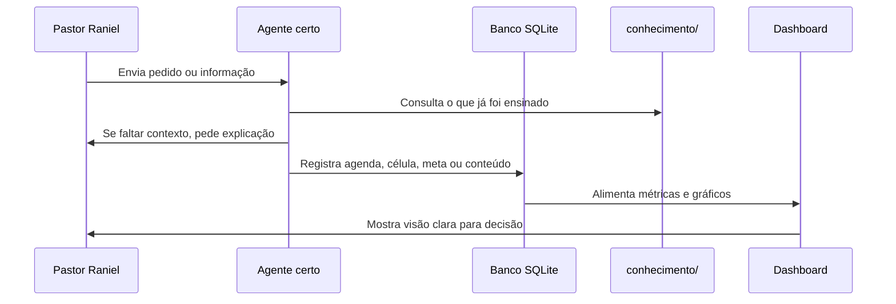
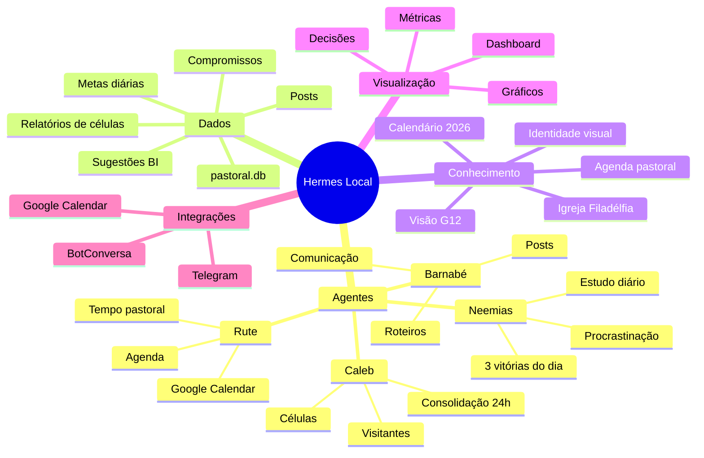
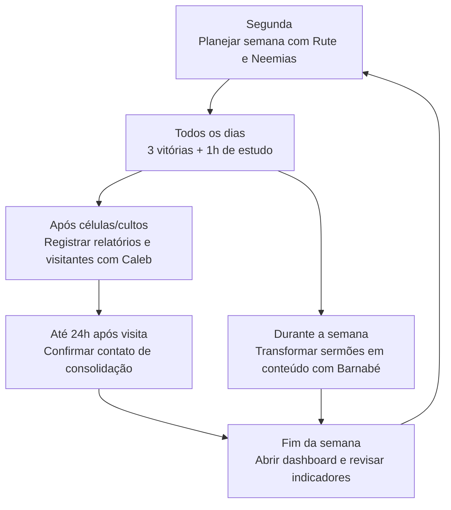
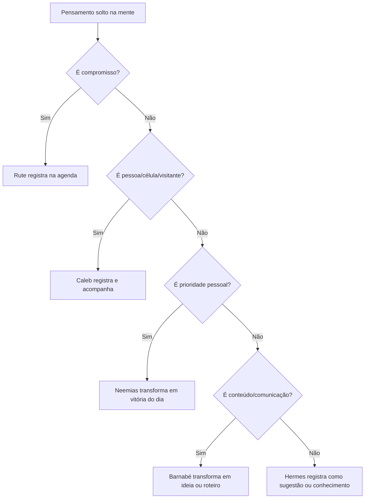

# Mapa Visual do Projeto Hermes Local

Pastor Raniel, este documento existe para reduzir a confusão mental sobre o projeto. Ele mostra, de forma visual, qual é o objetivo, quem faz o quê, como as informações circulam e quais tarefas vêm primeiro.

---

## 1. Objetivo Central

**Em uma frase:** o Hermes Local é um sistema para tirar informações soltas da cabeça do Pastor e transformar tudo em agenda, registros, acompanhamento, métricas e próximos passos.

---

## 2. Organograma dos Agentes

---

## 3. Como Isso Ajuda o Pastor na Prática

| Área da vida pastoral | Problema comum | Como o Hermes ajuda |
|---|---|---|
| Agenda | Compromissos espalhados na mente, WhatsApp e calendário | Rute registra, categoriza e sincroniza compromissos |
| Cuidado pastoral | Visitantes e pessoas novas podem ficar sem contato | Caleb registra visitantes e cobra follow-up em até 24h |
| Células | Relatórios podem se perder ou ficar sem leitura estratégica | Caleb organiza frequência, visitantes, decisões e redes |
| Foco pessoal | Muitas demandas competem com o estudo e prioridades | Neemias define 3 vitórias do dia e protege 1h de estudo |
| Procrastinação | Adiamentos viram culpa, mas não viram diagnóstico | Neemias registra motivo dos adiamentos e mede consistência |
| Comunicação | Ideias de pregação não viram conteúdo recorrente | Barnabé transforma temas em roteiros e posts organizados |
| Decisão | O Pastor sente muita coisa, mas vê poucos dados consolidados | Dashboard mostra tempo, foco, células, conteúdo e sugestões |

---

## 4. Fluxo Simples de Funcionamento

---

## 5. Módulos do Projeto

---

## 6. Tarefas por Agente

### Rute - Organização Executiva

**Responsável por:**
- Agendar compromissos.
- Classificar o tempo pastoral.
- Ajudar o Pastor a ver a semana com clareza.
- Integrar agenda local com Google Calendar quando configurado.

**Tabela principal:** `compromissos`

**Categorias:** `Aconselhamento`, `Culto`, `Reuniao Lideranca`, `Estudo/Sermao`, `Pessoal`, `Outros`.

---

### Caleb - Células e Consolidação

**Responsável por:**
- Registrar relatórios de células.
- Acompanhar membros, visitantes e decisões de fé.
- Registrar visitantes.
- Cobrar contato em até 24h.

**Tabelas principais:** `relatorios_celulas`, `consolidacao_visitantes`

---

### Neemias - Foco e Consistência

**Responsável por:**
- Definir as 3 vitórias do dia.
- Proteger 1h diária de estudo.
- Registrar tarefas adiadas.
- Medir pontuação diária e semanal de consistência.

**Tabelas principais:** `metas_diarias`, `registro_procrastinacao`

---

### Barnabé - Comunicação e Conteúdo

**Responsável por:**
- Transformar sermões e estudos em ideias de posts.
- Criar roteiros de Reels/Shorts.
- Organizar status do conteúdo.
- Apoiar comunicação interna e autoridade digital.

**Tabela principal:** `posts_conteudo`

---

## 7. O Que Já Existe no Projeto

| Parte | Local | Para que serve |
|---|---|---|
| Instruções dos agentes | `AGENTS.md` | Define personas, regras e banco |
| Prompts dos agentes | `agents/` | Arquivos separados de Rute, Caleb, Neemias e Barnabé |
| Banco local | `database/pastoral.db` | Guarda compromissos, células, metas, posts e BI |
| Migrações e scripts | `database/` | Criam e ajustam estrutura de dados |
| Dashboard | `dashboard/app.py` | Mostra indicadores pastorais em tela |
| Conhecimento local | `conhecimento/` | Guarda o que o sistema sabe sobre igreja, G12, agenda e identidade |
| Integrações | `integrations/` | Google Calendar, BotConversa, webhook e sincronização |
| Documentação | `docs/` | Fluxos, arquitetura e materiais de apoio |

---

## 8. Ordem Recomendada de Implantação

```mermaid
flowchart LR
    A["1. Clarear visão do projeto"] --> B["2. Conferir conhecimento da igreja"]
    B --> C["3. Usar Rute para agenda"]
    C --> D["4. Usar Neemias para rotina diária"]
    D --> E["5. Usar Caleb para células e visitantes"]
    E --> F["6. Usar Barnabé para conteúdo"]
    F --> G["7. Acompanhar dashboard semanalmente"]
    G --> H["8. Ajustar processos com base nos dados"]
```

### Fase 1 - Clareza

- Ler este mapa visual.
- Definir quais áreas causam mais peso mental hoje.
- Escolher no máximo 2 frentes para começar.

### Fase 2 - Rotina mínima

- Registrar agenda com Rute.
- Definir 3 vitórias do dia com Neemias.
- Conferir dashboard uma vez por semana.

### Fase 3 - Gestão ministerial

- Registrar relatórios de células com Caleb.
- Registrar visitantes e contatos de consolidação.
- Medir se o follow-up está acontecendo em até 24h.

### Fase 4 - Comunicação

- Separar sermões e estudos com potencial de conteúdo.
- Criar roteiros com Barnabé.
- Acompanhar status: `Ideia`, `Roteirizado`, `Gravado`, `Postado`.

---

## 9. Rotina Semanal Recomendada

---

## 10. Painel de Decisão do Pastor

Use estas perguntas para saber qual agente chamar:

| Se a pergunta for... | Chame |
|---|---|
| "O que tenho hoje/esta semana?" | Rute |
| "Agende isso para mim." | Rute |
| "Como estão as células?" | Caleb |
| "Registre este visitante." | Caleb |
| "Quais são minhas prioridades hoje?" | Neemias |
| "Estou procrastinando." | Neemias |
| "Transforme essa mensagem em conteúdo." | Barnabé |
| "Crie roteiro para Reels/Shorts." | Barnabé |
| "Me mostre os dados." | Dashboard / Hermes |

---

## 11. Regra de Ouro Para Não Voltar à Confusão

**Princípio:** nada importante deve ficar apenas na mente. O que é importante precisa virar agenda, tarefa, registro, conteúdo, conhecimento ou métrica.

---

## 12. Próximos 7 Dias Sugeridos

| Dia | Ação simples | Resultado esperado |
|---|---|---|
| Dia 1 | Ler este mapa e escolher 2 áreas prioritárias | Clareza inicial |
| Dia 2 | Registrar compromissos fixos da semana com Rute | Agenda visível |
| Dia 3 | Definir 3 vitórias do dia com Neemias | Foco prático |
| Dia 4 | Registrar dados reais de uma célula com Caleb | Primeiro indicador ministerial |
| Dia 5 | Registrar um visitante ou caso de consolidação | Follow-up organizado |
| Dia 6 | Criar 1 roteiro com Barnabé a partir de uma pregação | Conteúdo pronto |
| Dia 7 | Abrir dashboard e revisar o que apareceu | Decisão baseada em dados |

---

## 13. Resumo Final

O Hermes Local não substitui o Pastor. Ele organiza a vida pastoral para que o Pastor tenha mais clareza, mais memória operacional, mais acompanhamento das pessoas, mais foco no que importa e mais visão para tomar decisões.

O objetivo não é deixar o sistema complexo. O objetivo é fazer o básico muito bem:

1. Registrar.
2. Acompanhar.
3. Visualizar.
4. Decidir.
5. Melhorar.
