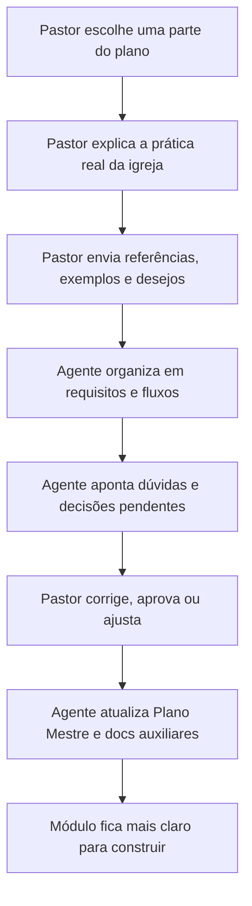

# Método de Planejamento Colaborativo - Hermes Filadélfia

Este documento registra a forma oficial de evoluir o Plano Mestre do projeto Hermes Filadélfia.

O projeto será lapidado junto com o Pastor Raniel, módulo por módulo, usando conversa, referências, explicações da prática real da igreja e atualização contínua da documentação.

---

## 1. Diretriz Principal

Cada parte do Plano Mestre deve ser desenvolvida em ciclos de planejamento colaborativo.

O Pastor explica:

- o que deseja;
- como a igreja funciona na prática;
- quais referências quer usar;
- quais dores precisa resolver;
- quais limites pastorais, operacionais ou espirituais devem ser respeitados.

O agente organiza:

- visão do módulo;
- requisitos;
- fluxos;
- campos;
- telas;
- integrações;
- regras de negócio;
- pendências;
- próximos passos;
- atualização dos documentos oficiais.

---

## 2. Como Cada Módulo Será Lapidado



---

## 3. Estrutura de Conversa por Módulo

Sempre que formos planejar uma parte do projeto, usar este roteiro:

1. **Objetivo:** o que este módulo precisa resolver.
2. **Referências:** sites, sistemas, prints, vídeos, fluxos, exemplos ou ideias.
3. **Prática real da igreja:** como a Filadélfia Corrente trabalha hoje.
4. **Públicos envolvidos:** Pastor, secretaria, líderes, membros, visitantes, financeiro, comunicação etc.
5. **Fluxo atual:** como funciona manualmente hoje.
6. **Fluxo desejado:** como deve funcionar com Hermes, BotConversa, site, dashboard ou sistema.
7. **Dados necessários:** campos, etiquetas, tabelas, documentos, permissões.
8. **Regras e limites:** o que pode automatizar e o que precisa de humano.
9. **Visual esperado:** telas, páginas, painéis, organogramas ou fluxos.
10. **Decisões tomadas:** o que ficou definido.
11. **Pendências:** o que ainda falta explicar ou decidir.
12. **Próxima ação:** o que será atualizado ou construído depois.

---

## 4. Módulos que Devem Passar por Esse Método

| Módulo | O que o Pastor vai explicar | Saída esperada |
|---|---|---|
| Site da igreja | Referências visuais, páginas desejadas, tom, fotos, chamadas, identidade | Briefing visual e estrutura do site |
| BotConversa | Como deve atender membros, visitantes, líderes e pedidos pastorais | Fluxos, etiquetas, campos e prompts |
| Consolidação | Como a igreja acompanha visitantes e novos convertidos | Sistema de consolidação e follow-up |
| Células/G12 | Como funcionam relatórios, redes, líderes e acompanhamento | Gestor de células e indicadores |
| Agenda pastoral | Como o Pastor organiza compromissos, cultos, aconselhamentos e estudos | Rotina de agenda e categorias |
| Financeiro | Como controlar receitas, despesas, categorias e relatórios | Modelo financeiro e permissões |
| Comunicação | Como planejar posts, vídeos, campanhas e avisos | Gestor editorial e fluxo de aprovação |
| BI Pastoral | Quais indicadores realmente ajudam o Pastor | Painéis e métricas prioritárias |
| Google Drive | Como organizar documentos, sermões, atas e materiais | Estrutura de acervo e conhecimento |
| Supabase/Sistema | Quais dados precisam estar online e seguros | Modelo de dados e regras de acesso |

---

## 5. Regra de Atualização dos Documentos

Depois de cada conversa de planejamento:

- atualizar o `PLANO_MESTRE_HERMES_FILADELFIA.md` quando houver decisão estratégica;
- atualizar documentos visuais quando houver mudança de fluxo ou arquitetura;
- atualizar documentos operacionais quando houver prompt, campo, etiqueta ou regra técnica;
- registrar pendências quando o Pastor ainda precisar ensinar algo;
- não inventar prática da igreja quando a informação não foi ensinada.

---

## 6. Template de Registro de Decisão

Usar este formato dentro do documento apropriado:

```text
## Decisão registrada - [Módulo]

Data:
Fonte: conversa com Pastor Raniel

### O que o Pastor explicou

### Referências recebidas

### Decisão tomada

### Regras práticas

### Pendências

### Próxima ação
```

---

## 7. Princípio Final

O Plano Mestre não é um documento fechado. Ele é um mapa vivo.

Cada módulo deve ser lapidado com a realidade da igreja antes de virar sistema, fluxo, tela ou automação.
