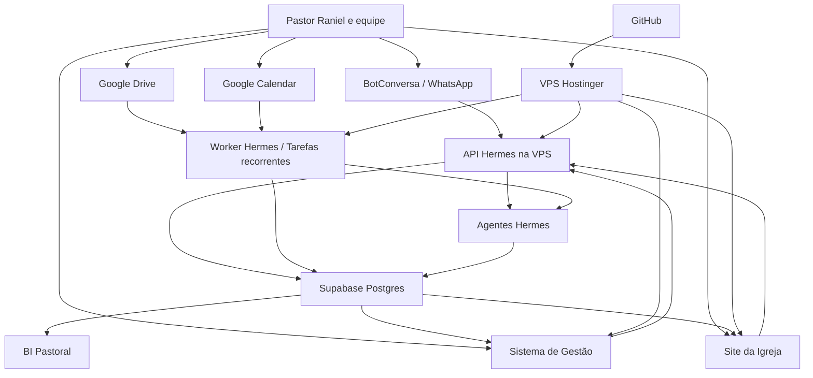
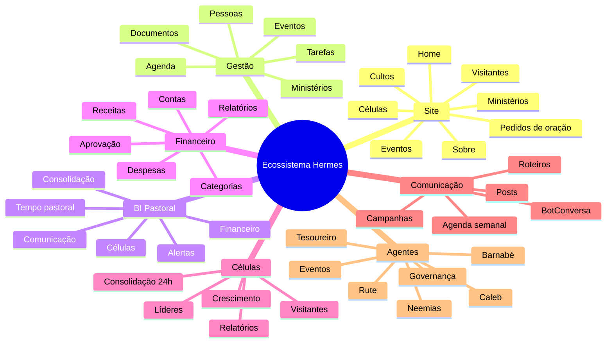
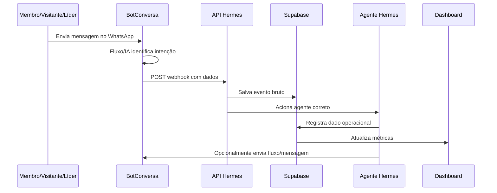

# Plano Mestre - Ecossistema Hermes Filadélfia

Data do plano: 2026-06-03  
Projeto: Gestão Pastoral - Pr. Raniel Levi - HERMES-LOCAL  
Formato escolhido: Markdown, porque funciona bem no GitHub, permite histórico de versões, revisão por etapas e pode ser exportado depois para PDF, Google Docs ou Notion.

---

## 1. Objetivo deste documento

Este documento consolida a visão completa do projeto:

- site público da igreja;
- sistema de gestão pastoral;
- BI para o Pastor;
- sistema financeiro;
- gestor de células e consolidação;
- gestor de comunicação;
- agentes Hermes trabalhando com rotinas, webhooks e tarefas recorrentes;
- BotConversa como interface principal com membros, visitantes e líderes;
- Google Drive como acervo bruto e fonte documental monitorada;
- GitHub como base oficial de código, prompts, regras e documentação;
- Supabase como banco central online.

Este passa a ser o documento de direção do projeto. Os arquivos antigos continuam úteis como detalhamento, mas este documento deve ser tratado como o mapa principal.

---

## 2. Decisão central

O projeto não deve ser apenas um chatbot.

O projeto deve ser um sistema operacional pastoral com:

1. entrada de informações pelo WhatsApp, site, Google Drive, agenda e painel;
2. processamento pelos agentes Hermes;
3. armazenamento confiável no Supabase;
4. governança no GitHub;
5. visualização em dashboard;
6. rotinas automáticas para não depender da memória humana.

Resumo:

```text
BotConversa = porta de entrada
Hermes = operação inteligente
Supabase = dados vivos
GitHub = regras, código e conhecimento oficial
Google Drive = acervo bruto da igreja
VPS = operação online 24h
Desktop = oficina de desenvolvimento e melhoria
```

---

## 3. O que aprendemos com o vídeo/transcrição

A ideia mais importante do vídeo é que um agente útil não nasce como "chatbot". Ele nasce dentro de um processo.

O modelo mostrado no vídeo usa:

- canais de entrada;
- inbox;
- classificação;
- score;
- divisão por prioridade;
- rotinas automáticas;
- feedback humano;
- melhoria contínua;
- permissões;
- ferramentas externas;
- um agente de governança.

Aplicação para a igreja:

```text
Entrada pastoral
    -> inbox operacional
    -> classificação por área
    -> agente responsável
    -> registro no banco
    -> acompanhamento
    -> dashboard
    -> revisão semanal
```

Exemplo:

```text
Líder envia relatório de célula no WhatsApp
    -> BotConversa recebe
    -> Hermes classifica como relatorio_celula
    -> Caleb valida dados
    -> Supabase registra
    -> BI atualiza presença, visitantes e decisões
    -> se houver visitante, cria acompanhamento 24h
```

---

## 4. Princípios do projeto

### 4.1 Simples primeiro, completo depois

Não construir tudo de uma vez. A ordem correta é:

1. base de dados central;
2. webhooks essenciais;
3. painel mínimo;
4. rotina de agenda e células;
5. Google Drive;
6. financeiro;
7. site;
8. BI avançado;
9. agentes independentes por área.

### 4.2 Uma fonte única para cada tipo de verdade

Não existe uma única ferramenta para tudo. Existe uma fonte correta para cada tipo de informação.

| Tipo de informação | Fonte oficial |
|---|---|
| Código, prompts, regras, documentação | GitHub |
| Membros, células, visitantes, financeiro, eventos, logs | Supabase |
| Arquivos originais, atas, PDFs, planilhas, materiais antigos | Google Drive |
| Agenda visual do Pastor e eventos públicos | Google Calendar, sincronizado com Supabase |
| Conversas e fluxo de atendimento | BotConversa |
| Desenvolvimento, testes e ajustes | Hermes Desktop |
| Operação 24h | Hermes VPS |

### 4.3 A IA interpreta, o sistema executa

A IA não deve ser a única responsável por "lembrar" o que aconteceu. Ela deve interpretar, resumir e classificar. O sistema deve salvar estado, dados e logs.

Exemplo:

```text
IA entende: "essa pessoa pediu aconselhamento"
Sistema executa:
- cria registro
- aplica etiqueta
- abre atendimento humano
- salva nível de urgência
- mostra no dashboard
```

### 4.4 Nada importante fica só em conversa

Toda informação relevante deve virar uma destas coisas:

- registro;
- tarefa;
- evento;
- pendência;
- documento;
- métrica;
- alerta;
- conhecimento aprovado.

### 4.5 Governança antes de autonomia

Agentes podem ajudar muito, mas não devem ter permissão irrestrita.

Regra:

```text
Agente pode sugerir muito.
Agente pode executar rotinas de baixo risco.
Agente precisa de aprovação para decisões sensíveis.
```

---

## 5. Arquitetura alvo



---

## 6. Ambientes

### 6.1 Hermes Desktop

Função:

- desenvolver;
- testar;
- revisar;
- criar prompts;
- organizar conhecimento;
- depurar integrações;
- preparar mudanças antes de publicar.

O desktop não deve ser responsável por rodar a operação da igreja 24h.

### 6.2 Hermes VPS

Função:

- receber webhooks do BotConversa;
- rodar tarefas recorrentes;
- consultar Google Drive;
- sincronizar Google Calendar;
- processar filas;
- alimentar Supabase;
- disponibilizar painel e site;
- enviar alertas para Pastor/equipe.

### 6.3 GitHub

Função:

- versionar código;
- versionar prompts;
- versionar regras;
- versionar documentação;
- permitir deploy controlado na VPS.

Fluxo:

```text
Desktop -> GitHub -> VPS -> Produção
```

### 6.4 Supabase

Função:

- banco Postgres online;
- autenticação do painel administrativo;
- Row Level Security;
- storage, se necessário;
- busca semântica com pgvector;
- logs e auditoria;
- fonte central dos dados operacionais.

### 6.5 Google Drive

Função:

- acervo bruto;
- arquivos originais;
- atas;
- sermões;
- planilhas;
- documentos administrativos;
- materiais de comunicação.

O Google Drive não deve ser tratado automaticamente como verdade final. Ele deve ser lido, classificado e aprovado.

### 6.6 BotConversa

Função:

- interface principal com membros, visitantes e líderes;
- fluxos visuais;
- etiquetas;
- campos personalizados;
- sequências;
- atendimento humano;
- envio de dados para Hermes por bloco de integração/webhook.

---

## 7. Fontes de verdade

### 7.1 Regra principal

```text
Google Drive guarda documentos.
GitHub guarda regras.
Supabase guarda dados.
BotConversa guarda estado de conversa.
Hermes coordena.
```

### 7.2 Níveis de conhecimento

| Nível | Nome | Pode ser usado em resposta automática? | Exemplo |
|---|---|---:|---|
| L0 | Bruto | Não | PDF recém-adicionado no Drive |
| L1 | Indexado | Não, salvo com aviso | Documento lido e resumido, ainda sem aprovação |
| L2 | Aprovado | Sim | Calendário validado pela secretaria |
| L3 | Regra operacional | Sim, com prioridade | "A Rute não inventa datas" |

### 7.3 Regra anti-dedução

O sistema não deve inventar sobre:

- funcionamento da igreja;
- G12;
- calendário;
- líderes;
- finanças;
- horários;
- procedimentos pastorais;
- aconselhamento;
- eventos.

Se não houver informação aprovada, o agente responde que ainda não possui confirmação e encaminha para humano ou pede ensino.

---

## 8. Stack recomendada

### 8.1 Stack alvo

| Camada | Tecnologia recomendada | Motivo |
|---|---|---|
| Site público | Next.js | Bom para site, páginas públicas, SEO e área administrativa |
| Sistema administrativo | Next.js | Permite unificar painel, BI e gestão em uma aplicação |
| API/Webhooks | Python Starlette/FastAPI | Já existe base Python no projeto e integra bem com Google/BotConversa |
| Worker/Tarefas | Python | Reaproveita integrações existentes |
| Banco | Supabase Postgres | Online, robusto, RLS, Auth, pgvector |
| BI inicial | Streamlit ou Next.js | Streamlit já existe; Next.js vira alvo final |
| Deploy | Docker Compose na VPS | Simples para múltiplos serviços |
| Proxy/SSL | Caddy ou Nginx | HTTPS para site e webhooks |
| Versionamento | GitHub | Fonte de código e documentação |

### 8.2 Por que não colocar tudo em uma ferramenta só

Um único sistema para tudo ficaria frágil e difícil de manter.

O melhor desenho é:

- BotConversa conversa;
- Hermes processa;
- Supabase armazena;
- GitHub governa;
- Drive arquiva;
- site e painel exibem.

---

## 9. Estado atual do repositório

O projeto já possui uma base local funcional. A próxima etapa não é começar do zero, mas evoluir esta base para uma arquitetura online.

| Item atual | Local | Papel atual |
|---|---|---|
| Instruções dos agentes | `AGENTS.md` | Define personas, regra anti-dedução, SQLite e conhecimento |
| Prompts dos agentes | `agents/` | Rute, Caleb, Barnabé e Neemias |
| Conhecimento local | `conhecimento/` | Base ensinada ao sistema |
| Dashboard local | `dashboard/app.py` | BI em Streamlit |
| Banco local | `database/pastoral.db` | Dados atuais em SQLite |
| Schema SQL | `database/schema.sql` | Modelo relacional inicial em estilo Postgres |
| Migração pastoral | `database/migrate_pastoral_system.py` | Tabelas de membros, BotConversa e comunicação |
| Cliente BotConversa | `integrations/botconversa_client.py` | API para tags, campos, fluxos, mensagens e sequências |
| Webhook local | `integrations/webhook_server.py` | Endpoint cadastral atual |
| Google Calendar | `integrations/google_calendar_sync.py` | Sincronização local com agenda Google |
| Watch de conhecimento | `integrations/watch_knowledge.py` | Base para monitoramento local |
| Planejamento BotConversa | `docs/planejamento_completo_fluxos_botconversa_hermes.md` | Detalhamento dos fluxos |
| Base Rute | `docs/base_conhecimento_rute/` | Textos para alimentar a Rute |

Decisão:

```text
Manter o que existe.
Migrar gradualmente SQLite -> Supabase.
Transformar webhook local em API de produção.
Transformar dashboard local em BI online.
```

---

## 10. Módulos finais do sistema



---

## 11. Agentes Hermes

### 11.1 Agente orquestrador

Nome sugerido: Hermes Central.

Responsável por:

- receber eventos;
- classificar intenção;
- decidir qual agente acionar;
- registrar logs;
- pedir aprovação quando necessário;
- gerar relatórios executivos.

### 11.2 Rute

Área:

- secretaria;
- agenda;
- cadastro;
- atendimento;
- encaminhamento humano.

Tarefas:

- registrar compromissos;
- classificar agenda;
- sincronizar Google Calendar;
- acompanhar cadastros incompletos;
- apoiar atendimento via BotConversa.

### 11.3 Caleb

Área:

- células;
- G12;
- consolidação;
- visitantes.

Tarefas:

- registrar relatórios;
- monitorar visitantes;
- cobrar follow-up 24h;
- alertar líderes;
- gerar relatório semanal de células.

### 11.4 Barnabé

Área:

- comunicação;
- marketing;
- roteiros;
- conteúdo.

Tarefas:

- transformar sermões em roteiros;
- gerar ideias de posts;
- organizar calendário editorial;
- reaproveitar comunicados do WhatsApp no site e redes sociais.

### 11.5 Neemias

Área:

- foco;
- produtividade;
- rotina pastoral.

Tarefas:

- 3 vitórias do dia;
- bloco diário de estudo;
- registro de procrastinação;
- consistência semanal.

### 11.6 Tesoureiro

Área:

- financeiro.

Tarefas:

- classificar receitas e despesas;
- gerar relatório mensal;
- alertar despesas pendentes;
- acompanhar orçamento por ministério;
- nunca expor dados financeiros sensíveis para usuários sem permissão.

### 11.7 Agente de Eventos

Área:

- eventos;
- inscrições;
- presença;
- comunicação pré e pós-evento.

Tarefas:

- organizar inscrições;
- monitorar interessados;
- gerar listas;
- criar checklist;
- alimentar calendário.

### 11.8 Agente de Governança

Área:

- saúde do sistema;
- qualidade dos dados;
- falhas de automação;
- permissões;
- auditoria.

Tarefas:

- verificar se jobs rodaram;
- verificar webhooks com erro;
- revisar registros pendentes;
- emitir relatório diário de saúde do sistema;
- sugerir melhorias.

---

## 12. BotConversa como interface principal

### 12.1 Papel do BotConversa

O BotConversa deve:

- receber mensagens;
- identificar fluxo;
- coletar campos;
- aplicar etiquetas;
- executar sequências;
- chamar webhooks;
- abrir atendimento humano;
- enviar mensagens e fluxos quando o Hermes mandar.

### 12.2 Papel que o BotConversa não deve assumir sozinho

O BotConversa não deve ser o banco central da igreja.

Ele não deve ser a única fonte para:

- cadastro oficial;
- células;
- financeiro;
- agenda;
- documentos;
- BI;
- histórico pastoral sensível.

### 12.3 Fluxo geral



### 12.4 Webhooks prioritários

| Endpoint | Prioridade | Finalidade |
|---|---:|---|
| `/webhook_atualizacao_cadastral` | Alta | Cadastro e recadastro |
| `/webhook_visitante` | Alta | Visitantes e consolidação |
| `/webhook_g12_celulas` | Alta | Relatórios e pedidos de célula |
| `/webhook_aconselhamento` | Alta | Triagem sensível e humano |
| `/webhook_pedido_oracao` | Média | Pedidos de oração |
| `/webhook_ministerio` | Média | Interesse em servir |
| `/webhook_evento` | Média | Eventos e inscrições |
| `/webhook_atendimento_humano` | Alta | Interrupções e fila humana |
| `/webhook_evento_contato` | Baixa | Entradas, inatividade e auditoria |

### 12.5 Regra técnica importante

O bloco de integração do BotConversa tem timeout curto. A documentação do bloco informa saída de sucesso com time-out de 10 segundos. Por isso, os webhooks do Hermes devem:

1. receber o payload;
2. validar minimamente;
3. salvar em uma fila/log;
4. responder rápido;
5. processar o trabalho pesado em segundo plano.

Isso reduz falha por timeout e deixa o fluxo mais confiável.

---

## 13. Google Drive

### 13.1 Papel no projeto

O Drive será o acervo bruto da igreja.

Exemplos:

- atas;
- documentos administrativos;
- planilhas;
- sermões;
- estudos;
- PDFs;
- imagens;
- materiais de evento;
- calendários;
- relatórios antigos.

### 13.2 Estrutura recomendada de pastas

```text
IGREJA - BASE HERMES
├── 00_INBOX_HERMES
├── 01_CONHECIMENTO_OFICIAL
├── 02_AGENDA_EVENTOS
├── 03_CELULAS_G12
├── 04_FINANCEIRO
├── 05_SERMOES_ESTUDOS
├── 06_MARKETING_COMUNICACAO
├── 07_ADMINISTRATIVO
└── 99_ARQUIVO_BRUTO
```

### 13.3 Como atualizar o sistema quando algo mudar no Drive

Fase inicial:

```text
Worker Hermes roda a cada 30 minutos
    -> usa Google Drive changes API
    -> busca arquivos novos/alterados
    -> exporta conteúdo quando possível
    -> salva metadados no Supabase
    -> classifica
    -> cria pendência de aprovação
```

Fase futura:

```text
Google Drive push notification
    -> webhook HTTPS na VPS
    -> Hermes acorda imediatamente
    -> ainda consulta changes API para saber o que mudou
```

### 13.4 Por que começar com tarefa recorrente

É mais simples, mais previsível e mais fácil de depurar.

Webhooks do Google Drive exigem:

- URL HTTPS pública;
- canal de notificação;
- renovação de canal;
- controle de tokens;
- tratamento de eventos duplicados ou genéricos.

Por isso, a primeira versão deve usar polling incremental com `startPageToken` e `newStartPageToken`.

### 13.5 Limites de extração

Arquivos Google Docs/Sheets/Slides precisam ser exportados antes de virar texto pesquisável. A API `files.export` retorna o conteúdo exportado em bytes e a documentação informa limite de 10 MB para conteúdo exportado. Arquivos maiores devem ser tratados por estratégia específica:

- salvar apenas metadados;
- dividir manualmente;
- exportar em formato alternativo;
- marcar para revisão humana.

### 13.6 Tabelas para Drive

| Tabela | Função |
|---|---|
| `drive_sources` | Pastas monitoradas |
| `drive_files` | Arquivos encontrados |
| `document_ingestion_jobs` | Fila de extração/classificação |
| `document_chunks` | Trechos pesquisáveis |
| `knowledge_items` | Conhecimento aprovado |
| `knowledge_approvals` | Aprovações/rejeições |

### 13.7 Estados de documento

```text
descoberto
extraido
classificado
pendente_aprovacao
aprovado
rejeitado
arquivado
erro
```

### 13.8 Regra de segurança

Arquivo financeiro, aconselhamento ou lista de membros nunca deve virar resposta pública automática.

---

## 14. Google Calendar e agenda

### 14.1 Papel no projeto

Google Calendar será a agenda visual. Supabase será a base operacional.

```text
Supabase = dados estruturados
Google Calendar = visualização e notificação
```

### 14.2 Sincronização inicial

O projeto já possui script local de sincronização com Google Calendar.

Próxima evolução:

- mover sincronização para a VPS;
- guardar `google_event_id`;
- guardar `sync_token`;
- evitar duplicações;
- usar categorias pastorais;
- diferenciar agenda pessoal, igreja e eventos públicos.

### 14.3 Incremental sync

Google Calendar permite sincronização incremental com `syncToken`. A rotina correta é:

```text
Primeira sincronização completa
    -> guardar nextSyncToken

Próximas sincronizações
    -> consultar usando syncToken
    -> processar mudanças
    -> guardar novo token
```

### 14.4 Push notification futura

Google Calendar também permite push notifications para eventos, mas cada calendário/recurso precisa de canal de notificação. Deve ser fase futura, não início.

---

## 15. Supabase

### 15.1 Papel

Supabase será o banco central online do projeto.

Usaremos:

- Postgres;
- Auth;
- Row Level Security;
- migrations;
- service role somente no backend;
- pgvector para busca semântica;
- Storage se for necessário guardar arquivos derivados.

### 15.2 Regras de segurança

1. Ativar RLS em tabelas expostas.
2. Nunca expor `service_role` no navegador.
3. Criar papéis de acesso por função ministerial.
4. Registrar auditoria para ações sensíveis.
5. Separar dados públicos de dados pastorais.
6. Evitar views inseguras em schema público.
7. Usar policies específicas, não uma policy genérica para tudo.

### 15.3 Perfis de acesso

| Perfil | Acesso |
|---|---|
| `pastor_admin` | Visão total, exceto segredos técnicos |
| `secretaria` | Pessoas, agenda, eventos, atendimento |
| `lider_celula` | Sua célula, seus relatórios, consolidação atribuída |
| `financeiro` | Financeiro, relatórios e categorias financeiras |
| `comunicacao` | Conteúdo, campanhas, site e posts |
| `intercessao` | Pedidos de oração autorizados |
| `agente_service` | Escrita técnica controlada via backend |
| `publico` | Apenas site público |

---

## 16. LGPD e dados sensíveis

Dados de igreja exigem cuidado especial.

Pela LGPD, informação sobre convicção religiosa ou filiação a organização religiosa é dado pessoal sensível. Isso afeta:

- cadastro de membros;
- célula;
- G12;
- pedidos de oração;
- aconselhamento;
- participação em ministérios;
- contribuições financeiras identificadas;
- histórico pastoral.

### 16.1 Regras práticas

1. Coletar apenas o necessário.
2. Informar finalidade do cadastro.
3. Guardar consentimento quando aplicável.
4. Restringir acesso por função.
5. Registrar auditoria.
6. Não usar dados sensíveis para respostas públicas.
7. Ter rotina de correção/exclusão quando solicitado.
8. Evitar expor dados completos em mensagens do WhatsApp.

### 16.2 Financeiro

Decisão importante:

```text
Começar com financeiro por lançamentos e categorias.
Evitar, no MVP, exposição ampla de contribuição individual por membro.
```

Se a igreja quiser registrar dízimos/ofertas por pessoa, isso precisa de permissão estrita e política clara.

---

## 17. Modelo de dados inicial

Este é o modelo alvo para Supabase. Ele deve ser implementado por migrations.

### 17.1 Núcleo de pessoas

| Tabela | Função |
|---|---|
| `pessoas` | Cadastro central de pessoas |
| `pessoa_contatos` | Telefones, e-mails e canais |
| `membros` | Informações específicas de membros |
| `visitantes` | Informações de visitantes |
| `consentimentos` | Consentimento e finalidade |
| `enderecos` | Bairro/cidade/endereço quando necessário |

### 17.2 Organização ministerial

| Tabela | Função |
|---|---|
| `ministerios` | Ministérios da igreja |
| `ministerio_membros` | Pessoas vinculadas a ministérios |
| `lideres` | Lideranças |
| `redes_g12` | Redes e descendências |
| `celulas` | Células |
| `celula_membros` | Integrantes por célula |
| `relatorios_celulas` | Relatórios semanais |

### 17.3 Consolidação

| Tabela | Função |
|---|---|
| `consolidacao_visitantes` | Visitantes em acompanhamento |
| `consolidacao_acoes` | Contatos realizados |
| `pedidos_celula` | Pessoas querendo célula |
| `pedidos_oracao` | Pedidos de oração |
| `pedidos_aconselhamento` | Triagem de aconselhamento |

### 17.4 Agenda e eventos

| Tabela | Função |
|---|---|
| `compromissos` | Agenda pastoral |
| `eventos` | Eventos da igreja |
| `evento_inscricoes` | Inscrições |
| `evento_presencas` | Check-in/presença |
| `google_calendar_sync_state` | Tokens e estado de sincronização |

### 17.5 Financeiro

| Tabela | Função |
|---|---|
| `financeiro_contas` | Contas/caixas |
| `financeiro_categorias` | Categorias |
| `financeiro_lancamentos` | Receitas/despesas |
| `financeiro_anexos` | Comprovantes, se necessário |
| `financeiro_orcamentos` | Orçamento por mês/ministério |
| `financeiro_aprovacoes` | Aprovação de gastos |

### 17.6 Comunicação

| Tabela | Função |
|---|---|
| `conteudos` | Ideias, roteiros, posts |
| `campanhas` | Campanhas de comunicação |
| `comunicacoes` | Mensagens enviadas ou planejadas |
| `site_pages` | Conteúdo administrável do site |
| `midia_assets` | Imagens e arquivos de comunicação |

### 17.7 Conhecimento e Drive

| Tabela | Função |
|---|---|
| `drive_sources` | Pastas monitoradas |
| `drive_files` | Arquivos do Drive |
| `document_ingestion_jobs` | Fila |
| `document_chunks` | Trechos para busca |
| `knowledge_items` | Conhecimento aprovado |
| `knowledge_approvals` | Aprovações |
| `embeddings` | Vetores semânticos, se separado |

### 17.8 Agentes e auditoria

| Tabela | Função |
|---|---|
| `agent_tasks` | Tarefas criadas para agentes |
| `agent_runs` | Execuções |
| `agent_feedback` | Notas e feedback |
| `webhook_events` | Payloads recebidos |
| `integration_logs` | Logs de integrações |
| `audit_log` | Auditoria de ações humanas e automáticas |
| `system_health_checks` | Saúde das rotinas |

---

## 18. Sistema financeiro

### 18.1 Objetivo

Dar visão simples e confiável sobre:

- receitas;
- despesas;
- saldo;
- categorias;
- compromissos financeiros;
- orçamento por ministério;
- relatórios mensais.

### 18.2 MVP financeiro

Primeira versão:

- cadastrar contas/caixas;
- cadastrar categorias;
- registrar receita/despesa;
- anexar comprovante opcional;
- filtrar por mês;
- gerar relatório mensal;
- restringir acesso ao perfil financeiro.

Não incluir inicialmente:

- conciliação bancária automática;
- nota fiscal;
- folha de pagamento;
- contribuição individual detalhada aberta;
- integração bancária.

### 18.3 Campos mínimos de lançamento

| Campo | Uso |
|---|---|
| `data_lancamento` | Data real |
| `tipo` | Receita ou despesa |
| `categoria_id` | Categoria |
| `valor` | Valor |
| `descricao` | Descrição |
| `forma_pagamento` | Pix, dinheiro, cartão, transferência |
| `ministerio_id` | Opcional |
| `responsavel_id` | Quem registrou |
| `status` | Pendente, aprovado, pago, cancelado |

---

## 19. Gestor de células

### 19.1 Objetivo

Dar ao Pastor visão sobre:

- células ativas;
- líderes;
- presença;
- visitantes;
- decisões de fé;
- consolidação;
- crescimento ou queda;
- células sem relatório;
- visitantes sem contato.

### 19.2 Fluxo de relatório

```text
Líder envia relatório no WhatsApp
    -> BotConversa coleta ou encaminha texto livre
    -> Hermes interpreta
    -> Caleb valida campos obrigatórios
    -> Supabase registra relatório
    -> BI atualiza
    -> se visitante > 0, cria acompanhamento
```

### 19.3 Campos mínimos do relatório

| Campo | Obrigatório |
|---|---:|
| Data | Sim |
| Nome da célula | Sim |
| Líder | Sim |
| Rede | Sim |
| Presença de membros | Sim |
| Visitantes | Sim |
| Decisões de fé | Sim |
| Observações | Não |

---

## 20. Gestor de comunicação

### 20.1 Objetivo

Organizar a comunicação da igreja:

- agenda semanal;
- anúncios;
- posts;
- roteiros;
- campanhas;
- eventos;
- devocionais;
- conteúdo a partir de sermões.

### 20.2 Fluxo de conteúdo

```text
Sermão / estudo / ideia / evento
    -> Barnabé classifica
    -> cria pauta
    -> cria roteiro ou post
    -> status: Ideia -> Rascunho -> Aprovado -> Publicado
    -> registra performance quando houver
```

### 20.3 Canais

- WhatsApp;
- Instagram;
- YouTube;
- site;
- e-mail, se for adotado;
- materiais internos.

---

## 21. Site da igreja

### 21.1 Objetivo

O site deve ser útil, não apenas bonito.

Deve permitir:

- conhecer a igreja;
- ver horários e endereço;
- conhecer ministérios;
- ver eventos;
- pedir oração;
- pedir aconselhamento, com triagem segura;
- pedir célula;
- acessar conteúdos;
- conectar visitante ao fluxo do BotConversa.

### 21.2 Páginas iniciais

| Página | Objetivo |
|---|---|
| `/` | Apresentação clara da igreja |
| `/cultos` | Horários e localização |
| `/eventos` | Eventos confirmados |
| `/celulas` | Explicação e formulário de interesse |
| `/ministerios` | Áreas de serviço |
| `/pedidos/oracao` | Pedido de oração |
| `/visitantes` | Primeiro contato |
| `/conteudos` | Sermões, posts, estudos |
| `/admin` | Entrada do sistema interno |

### 21.3 Integração com BotConversa

Botões públicos podem levar para WhatsApp/BotConversa com palavra-chave:

```text
Quero visitar
Quero uma célula
Pedido de oração
Falar com secretaria
```

---

## 22. BI Pastoral

### 22.1 Objetivo

O BI deve responder perguntas pastorais, não apenas mostrar gráficos.

Perguntas importantes:

- Como o Pastor está distribuindo o tempo?
- Quantos visitantes chegaram?
- Quantos foram contatados em 24h?
- Quais células estão crescendo?
- Quais células não enviaram relatório?
- Quantos pedidos de oração chegaram?
- Quantos aconselhamentos estão pendentes?
- Como está a saúde financeira?
- Quais eventos estão próximos?
- Quais conteúdos estão parados?

### 22.2 Painéis iniciais

| Painel | Métricas |
|---|---|
| Visão Geral | Pendências, alertas, semana |
| Agenda | Tempo por categoria, próximos compromissos |
| Células | Presença, visitantes, relatórios faltantes |
| Consolidação | Visitantes 24h, status, responsáveis |
| Financeiro | Receita, despesa, saldo, categorias |
| Comunicação | Conteúdos por status, próximos posts |
| Sistema | Webhooks, jobs, erros, saúde |

---

## 23. Infraestrutura na VPS Hostinger

### 23.1 Modelo recomendado

Usar VPS com Docker.

Serviços:

```text
reverse-proxy
web-admin-site
api-hermes
worker-hermes
scheduler
uptime-monitor
```

Supabase fica fora da VPS, como serviço gerenciado.

### 23.2 Docker Compose alvo

```text
docker-compose.yml
├── caddy ou nginx
├── web
├── api
├── worker
├── scheduler
└── uptime-kuma opcional
```

### 23.3 Ambientes

```text
local
staging
production
```

Para início, podemos trabalhar com:

```text
local = desktop
production = VPS
```

Mas o código deve já separar variáveis de ambiente.

### 23.4 Portas

| Serviço | Porta interna | Público? |
|---|---:|---:|
| web | 3000 | Sim |
| api | 5050 ou 8000 | Via proxy |
| worker | sem porta | Não |
| scheduler | sem porta | Não |
| Supabase | externo | Não via VPS |

---

## 24. Jobs recorrentes do Hermes

### 24.1 Jobs essenciais

| Job | Frequência inicial | Responsável |
|---|---:|---|
| `sync_google_calendar` | 15 min | Rute |
| `sync_google_drive_changes` | 30 min | Hermes Central |
| `check_visitantes_24h` | 30 min | Caleb |
| `check_webhook_errors` | 1 h | Governança |
| `daily_pastor_briefing` | 6h | Rute/Neemias |
| `weekly_cells_report` | Segunda 6h | Caleb |
| `monthly_finance_report` | Dia 1 | Tesoureiro |
| `content_pipeline_review` | Segunda 8h | Barnabé |
| `system_health_report` | Diário 7h | Governança |

### 24.2 Regra de execução

Todo job deve registrar:

- início;
- fim;
- status;
- quantidade processada;
- erro, se houver;
- próxima execução sugerida.

---

## 25. Desenvolvimento por fases

### Fase 0 - Consolidação e preparação

Objetivo:

- organizar visão;
- consolidar este plano;
- decidir stack;
- preparar repositório;
- separar segredos.

Entregáveis:

- este documento;
- `.env.example`;
- mapa de módulos;
- checklist de contas e acessos.

### Fase 1 - Supabase como banco central

Objetivo:

- criar projeto Supabase;
- definir schema inicial;
- ativar RLS;
- criar migrations;
- migrar dados do SQLite.

Entregáveis:

- migrations Supabase;
- tabelas principais;
- script de migração SQLite -> Supabase;
- teste de leitura/escrita.

### Fase 2 - API Hermes online

Objetivo:

- subir API na VPS;
- mover webhook cadastral para produção;
- registrar payloads;
- processar eventos com fila.

Entregáveis:

- `/health`;
- `/webhook_atualizacao_cadastral`;
- `/webhook_visitante`;
- `/webhook_g12_celulas`;
- logs no Supabase;
- Dockerfile e compose.

### Fase 3 - BotConversa essencial

Objetivo:

- ligar BotConversa aos webhooks;
- validar campos e etiquetas;
- testar fluxo real com contatos fictícios.

Entregáveis:

- Boas-vindas;
- Atualização cadastral;
- Visitante;
- Relatório de célula;
- Atendimento humano;
- logs no dashboard.

### Fase 4 - BI mínimo

Objetivo:

- criar visão pastoral útil.

Entregáveis:

- visão geral;
- células;
- consolidação;
- agenda;
- erros de integração.

Pode começar em Streamlit e migrar depois para Next.js.

### Fase 5 - Google Drive

Objetivo:

- monitorar Drive;
- indexar documentos;
- classificar conhecimento;
- aprovar o que vira base oficial.

Entregáveis:

- job `sync_google_drive_changes`;
- tabela `drive_files`;
- tabela `document_chunks`;
- painel de aprovação;
- busca por documento.

### Fase 6 - Site público

Objetivo:

- lançar site institucional útil.

Entregáveis:

- home;
- cultos;
- eventos;
- células;
- visitantes;
- pedidos de oração;
- integração com WhatsApp/BotConversa.

### Fase 7 - Financeiro

Objetivo:

- gestão financeira simples e segura.

Entregáveis:

- lançamentos;
- categorias;
- contas;
- relatório mensal;
- permissões restritas;
- auditoria.

### Fase 8 - Comunicação

Objetivo:

- pipeline de conteúdo e campanhas.

Entregáveis:

- calendário editorial;
- roteiros;
- posts;
- status;
- campanhas BotConversa;
- relatórios.

### Fase 9 - Governança e agentes avançados

Objetivo:

- melhorar confiabilidade e automação.

Entregáveis:

- agente de governança;
- score de qualidade dos dados;
- alertas automáticos;
- relatórios semanais;
- feedback dos agentes.

---

## 26. Primeira sprint recomendada

### Objetivo da sprint

Tirar o projeto do local/SQLite e preparar a fundação online.

### Tarefas

1. Criar ou confirmar projeto Supabase.
2. Criar estrutura `supabase/`.
3. Criar migration inicial.
4. Criar `.env.example`.
5. Criar adaptador de banco:
   - SQLite local;
   - Supabase produção.
6. Migrar tabelas atuais:
   - `membros`;
   - `compromissos`;
   - `relatorios_celulas`;
   - `consolidacao_visitantes`;
   - `metas_diarias`;
   - `posts_conteudo`;
   - `botconversa_config`;
   - `botconversa_sync_log`.
7. Criar tabela `webhook_events`.
8. Ajustar webhook para registrar evento bruto antes de processar.
9. Criar rota `/health`.
10. Criar plano de deploy Docker.

### Resultado esperado

Ao fim da sprint:

```text
BotConversa pode chamar a API Hermes online
API salva eventos no Supabase
Dashboard lê dados do Supabase
SQLite deixa de ser a fonte principal
```

---

## 27. Checklist de contas e acessos

Precisaremos confirmar:

- domínio do site;
- acesso à VPS Hostinger;
- acesso ao GitHub;
- acesso ao BotConversa;
- plano BotConversa com API/bloco de integração;
- chave API BotConversa;
- conta Google da igreja;
- acesso ao Google Drive da igreja;
- acesso ao Google Calendar da igreja;
- projeto Supabase;
- chave pública Supabase;
- service role Supabase somente para backend;
- e-mail oficial para sistema;
- quem terá acesso financeiro;
- quem terá acesso de secretaria;
- quem aprova conhecimento do Drive.

---

## 28. Perguntas pendentes

Estas perguntas precisam ser respondidas antes de implementar partes sensíveis.

### 28.1 Identidade e domínio

1. Qual será o domínio oficial do site?
2. O site será apenas da Igreja Filadélfia Corrente ou também do ministério pastoral?
3. O nome público oficial deve ser "Igreja Batista Filadélfia Internacional de Corrente"?

### 28.2 Acessos

1. Quem além do Pastor usará o painel?
2. A secretária terá acesso a cadastro completo?
3. Líderes de célula terão login próprio?
4. Financeiro será acessado por quem?

### 28.3 Financeiro

1. A igreja quer registrar contribuições por pessoa ou apenas totais por categoria?
2. Quem pode ver relatório financeiro?
3. Haverá aprovação de despesas?
4. Os comprovantes ficarão no Drive ou no Supabase Storage?

### 28.4 Google Drive

1. A igreja já tem uma pasta raiz organizada?
2. Quais pastas podem ser lidas pelo Hermes?
3. Quais pastas são sensíveis e não devem entrar em busca automática?
4. Quem aprova documentos que viram conhecimento oficial?

### 28.5 BotConversa

1. O plano atual possui bloco de integração?
2. O plano atual possui Assistente GPT?
3. Os fluxos já foram criados no painel ou ainda serão criados?
4. O número do WhatsApp será oficial da igreja?

---

## 29. Riscos e mitigação

| Risco | Mitigação |
|---|---|
| Automatizar bagunça | Criar processos mínimos antes de automatizar |
| Dados sensíveis expostos | RLS, perfis, auditoria e consentimento |
| BotConversa travar por timeout | Webhook responde rápido e processa depois |
| Drive virar fonte confusa | Fluxo de aprovação de conhecimento |
| Agente inventar informação | Regra anti-dedução e status de conhecimento |
| VPS cair | Backups, health checks e logs |
| Perder dados | Supabase gerenciado, backups e exportações |
| Complexidade excessiva | MVP por fases |
| Financeiro sensível demais | Começar agregado e com permissão restrita |

---

## 30. Critérios de pronto

Um módulo só está pronto quando:

- tem tabela definida;
- tem permissões definidas;
- tem fluxo de entrada;
- tem validação;
- tem log;
- aparece no dashboard;
- tem teste com dado fictício;
- tem documentação;
- tem plano de erro;
- não depende de informação solta na conversa.

---

## 31. Referências oficiais consultadas

### Supabase

- [Supabase Row Level Security](https://supabase.com/docs/guides/auth/auth-deep-dive/auth-row-level-security)
- [Supabase Semantic Search](https://supabase.com/docs/guides/ai/semantic-search)
- [Supabase local development and migrations](https://supabase.com/docs/guides/cli/local-development)
- [Supabase server-side auth](https://supabase.com/docs/guides/auth/server-side)

### Google Drive e Calendar

- [Google Drive API - Retrieve changes](https://developers.google.com/workspace/drive/api/guides/manage-changes)
- [Google Drive API - Push notifications](https://developers.google.com/workspace/drive/api/guides/push)
- [Google Drive API - files.export](https://developers.google.com/workspace/drive/api/reference/rest/v3/files/export)
- [Google Calendar API - incremental sync](https://developers.google.com/workspace/calendar/api/guides/sync)
- [Google Calendar API - push notifications](https://developers.google.com/workspace/calendar/api/guides/push)

### BotConversa

- [BotConversa - Introdução às APIs](https://ajuda.botconversa.com.br/integracoes/introducao-as-apis)
- [BotConversa - Documentação API](https://ajuda.botconversa.com.br/pt-br/category/introducao-as-apis-e-webhooks/article/documentacao-api-botconversa/)
- [BotConversa - Bloco de Integração](https://botconversa.gitbook.io/bem-vindo-ao-botconversa/integracoes/api-botconversa/bloco-de-integracao)

### VPS e Docker

- [Hostinger - Docker VPS template](https://support.hostinger.com/en/articles/8306612-how-to-use-the-docker-vps-template)
- [Hostinger - conectar via SSH](https://support.hostinger.com/en/articles/5723772-how-to-connect-to-your-vps-via-ssh)
- [Hostinger - backups e snapshots VPS](https://support.hostinger.com/en/articles/1583232-how-to-back-up-or-restore-a-vps)
- [Docker Compose](https://docs.docker.com/compose/)
- [Next.js self-hosting](https://nextjs.org/docs/app/guides/self-hosting)

### LGPD

- [Gov.br - LGPD e dados pessoais sensíveis](https://www.gov.br/mcti/pt-br/acesso-a-informacao/lei-geral-de-protecao-de-dados-pessoais-lgpd)
- [ANPD - perguntas frequentes](https://www.gov.br/anpd/pt-br/canais_atendimento/agente-de-tratamento/perguntas-frequentes-anpd)

---

## 32. Próximo passo técnico

O próximo passo recomendado é implementar a Fase 1:

```text
Supabase como banco central online
```

Primeiras ações:

1. confirmar se o projeto Supabase já existe;
2. criar estrutura de migrations;
3. desenhar o schema v1;
4. criar `.env.example`;
5. preparar script de migração SQLite -> Supabase;
6. adaptar webhooks para gravar em `webhook_events`;
7. criar `/health`;
8. preparar Dockerfile da API.

Depois disso, o BotConversa poderá começar a alimentar o sistema online com segurança.
