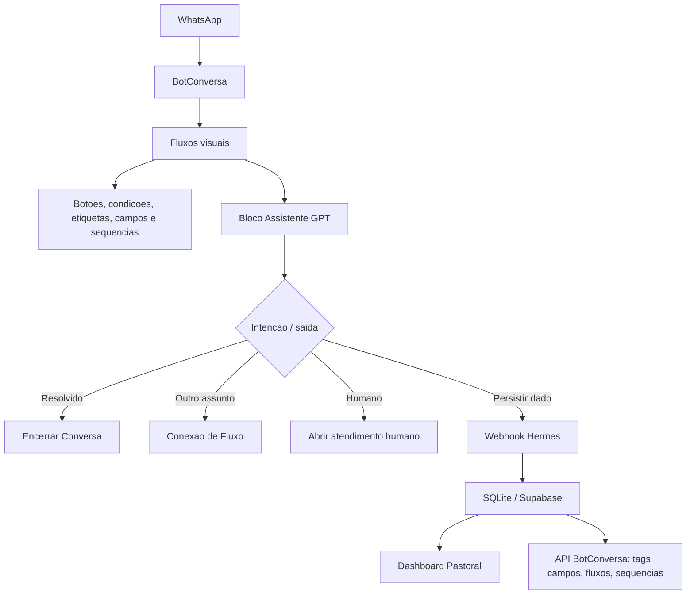

# Guia Mestre - Chatbot WhatsApp, BotConversa e Hermes

Data: 2026-06-04  
Projeto: Hermes Filadelfia  
Status: guia mestre para desenho, revisao e implementacao dos fluxos no BotConversa

Este documento consolida a arquitetura correta para construir o atendimento pastoral no WhatsApp usando BotConversa, assistentes de IA e webhooks do Hermes.

O ponto central e simples:

```text
Nenhuma ponta pode ficar solta.
Toda saida precisa terminar em uma destas acoes:
1. responder e encerrar;
2. encaminhar para outro fluxo;
3. abrir atendimento humano;
4. chamar webhook do Hermes;
5. pausar por inatividade com retomada definida.
```

---

## 1. Fontes consultadas

### Documentacao local do projeto

- `docs/Lixeira/_apoio_botconversa/planejamento_completo_fluxos_botconversa_hermes.md`
- `docs/Lixeira/_apoio_botconversa/CONFIGURACAO_TOTAL_BOTCONVERSA_ASSISTENTES_IA.md`
- `docs/Lixeira/_apoio_botconversa/DOCUMENTO_OFICIAL_FLUXOS_E_ASSISTENTES_IA_BOTCONVERSA.md`
- `docs/Lixeira/_apoio_botconversa/botconversa_arquitetura_fluxos_rute.md`
- `docs/base_conhecimento_assistentes_ia/00_matriz_assistentes_ia.md`
- `integrations/botconversa_client.py`
- `integrations/webhook_server.py`
- `database/migrate_pastoral_system.py`
- `supabase/migrations/20260603080710_initial_pastoral_foundation.sql`

### Referencias externas

- BotConversa - API: https://botconversa.gitbook.io/bem-vindo-ao-botconversa/integracoes/api-botconversa/documentacao-api-botconversa
- BotConversa - criacao de fluxo: https://ajuda.botconversa.com.br/comece-por-aqui-aulas-sequenciais/primeiros-passos-botconversa-api-nao-oficial/aula-6-criando-seu-primeiro-fluxo-no-botconversa
- BotConversa - trilha API Oficial: https://ajuda.botconversa.com.br/comece-por-aqui-aulas-sequenciais/primeiros-passos-botconversa-api-oficial
- BotConversa Swagger: https://backend.botconversa.com.br/swagger/
- Meta/WhatsApp Cloud API overview: https://developers.facebook.com/docs/whatsapp/cloud-api/
- Meta/WhatsApp Webhooks: https://developers.facebook.com/docs/whatsapp/cloud-api/webhooks/
- Meta/WhatsApp Message Templates: https://developers.facebook.com/docs/whatsapp/message-templates/
- Meta/WhatsApp Pricing: https://developers.facebook.com/docs/whatsapp/pricing/
- Blip - atendimento humano no Builder: https://help.blip.ai/hc/en-us/articles/4474381608471-Setting-up-Desk-Human-Service-in-Builder
- Blip - variaveis de Builder: https://help.blip.ai/hc/en-us/articles/4474417686039-Builder-variables
- Blip - WhatsApp Flows: https://help.blip.ai/hc/en-us/articles/19143153044375-What-is-WhatsApp-Flows
- Rasa - boas praticas de Flow Builder: https://rasa.com/docs/studio/build/flow-building/best-practices/

Observacao sobre politica de IA no WhatsApp: em 2026 existe risco regulatorio/politico para bots de IA de proposito geral dentro do WhatsApp Business Platform. A arquitetura do Hermes deve ser defendida como atendimento de negocio/organizacao religiosa, suporte, cadastro, agenda, consolidacao e comunicacao autorizada, nao como "ChatGPT geral dentro do WhatsApp".

---

## 2. Decisao de arquitetura

O BotConversa deve ser a camada de execucao de estado.

O assistente de IA deve ser a camada de interpretacao.

O Hermes deve ser a camada de persistencia, auditoria, dashboard, sincronizacao e tarefas de tempo confiavel.



Regra de ouro:

```text
A IA nunca deve ser a unica responsavel por uma transicao.
Se a IA disser "vou encaminhar", mas o BotConversa nao chamou outro fluxo, isso e falha de arquitetura.
```

---

## 3. O que o BotConversa faz bem

Pela documentacao do BotConversa, a plataforma oferece blocos de conteudo, acao, conexao de fluxo, condicao, randomizador, botoes e integracao/webhook.

Use o BotConversa para:

- receber o contato no WhatsApp;
- disparar fluxo de boas-vindas apenas uma vez;
- usar resposta padrao para mensagem livre;
- usar fluxo padrao para midia fora de contexto;
- abrir fluxo pos-atendimento;
- salvar respostas em campos personalizados;
- aplicar e remover etiquetas;
- testar condicoes por etiqueta ou campo;
- iniciar outro fluxo via conexao de fluxo;
- chamar webhook externo;
- inscrever contato em sequencia;
- abrir atendimento humano.

Erro comum:

```text
Construir um fluxo grande demais, onde todos os caminhos ficam dentro de um unico mapa.
```

Padrao correto:

```text
Fluxos pequenos e especializados, conectados por estado.
```

---

## 4. O que o Hermes faz bem

O Hermes deve assumir o que o BotConversa nao deve carregar sozinho:

- persistencia relacional;
- historico confiavel;
- logs de eventos;
- painel de BI;
- jobs por data real;
- cruzamento com Supabase, SQLite, calendario e base de conhecimento;
- sincronizacao de etiquetas, campos, fluxos e sequencias por API;
- validacao de payloads;
- idempotencia e recuperacao de falhas.

Implementado hoje:

| Area | Estado real em 2026-06-05 |
|---|---|
| Cliente BotConversa | Existe em `integrations/botconversa_client.py` (com suporte a `send_media`) |
| Listar contatos/tags/fluxos/sequencias/campos | Implementado |
| Enviar mensagem / Mídia | Implementado |
| Enviar fluxo | Implementado |
| Aplicar/remover etiqueta | Implementado |
| Setar/limpar campo personalizado | Implementado |
| Inscrever/remover sequencia | Implementado |
| Abrir/fechar conversa humana | Implementado |
| Webhook cadastral | Implementado em `/webhook_atualizacao_cadastral` |
| Atendimento Rute | Implementado em `/webhook_atendimento_rute`, mas precisa correcao de sequencia/idempotencia no Postgres antes de producao |
| Visitante / Consolidação | Implementado em `/webhook_visitante` e `/webhook_consolidacao_contato`; teste local/Postgres respondeu OK |
| Mídia recebida e auditoria | Implementado em `/webhook_midia` |
| Áudio resposta (TTS) | Implementado em `/webhook_audio_tts` (usando ElevenLabs / OpenAI TTS) |
| Leitura de documentos | Implementado em `/webhook_documento` (extração de PDFs, DOCX e XLSX) |
| G12/celulas | Implementado em `/webhook_g12_celulas` (focado em relatórios) |
| Pedido de oracao especifico | Pode usar `/webhook_midia` ou `/webhook_atendimento_rute` |
| Pedido de aconselhamento especifico | Pode usar `/webhook_atendimento_rute` |
| Ministerio | Pendente |
| Evento/agenda | Pendente |
| Atendimento humano generico | Pode usar `/webhook_atendimento_rute`; tabela `atendimentos_rute` ativa |

Validacao em 2026-06-05:

- `/health` respondeu `status: ok`;
- a conexao ativa do servidor foi confirmada como Postgres;
- `/webhook_documento`, `/webhook_audio_tts` e `/webhook_midia` responderam `200 OK` em modo teste do BotConversa;
- `/webhook_visitante`, `/webhook_consolidacao_contato`, `/webhook_midia`, `/webhook_g12_celulas` e `/webhook_atualizacao_cadastral` responderam OK em teste local;
- `/webhook_atendimento_rute` falhou em um caso com `duplicate key value violates unique constraint "atendimentos_rute_pkey"`. Causa provavel: dados migrados com `id` explicito sem ajuste da sequence do Postgres. Corrigir antes de conectar aconselhamento/oracao em producao.

Inventario BotConversa via API em 2026-06-05:

| Item | Total | Observacao |
|---|---:|---|
| Fluxos | 19 | Fluxos principais existem, mas ha nomes duplicados/conflitantes a padronizar |
| Etiquetas | 28 | Falta `Atualização Recusada`; existe `Revisao 6M Agend`, que deve ser substituida por regra anual |
| Campos personalizados | 39 | Campos essenciais existem |
| Sequencias | 1 | Existe apenas `SEQ - Revisao Cadastral 6M`; faltam sequencias operacionais anuais e pastorais |

Pendencias de saneamento antes de criar todos os fluxos restantes:

1. Corrigir `/webhook_atendimento_rute` no Postgres.
2. Criar `SEQ - Recadastro Anual`.
3. Criar `SEQ - Follow-up Visitante 24h`.
4. Criar `SEQ - Retomar Atualizacao Cadastral`.
5. Criar `SEQ - Pedido de Oracao Follow-up`.
6. Criar/localizar etiqueta `Atualização Recusada`.
7. Remover da documentacao e dos fluxos ativos a regra de revisao cadastral de 6 meses; usar recadastro anual.
8. Padronizar nomes duplicados: `Encerrar Conversa`, `1- RUTE SECRETARIA`, fluxos numerados com `5-`.
9. Manter `docs/Lixeira/PLANO-ATUALIZADO-PELO-HERMES/` apenas como rascunho historico; a fonte oficial e `_apoio_botconversa/`.

---

## 5. Modelo mental de cada ponta

Toda ponta de fluxo precisa ter uma decisao final.

### A. Ponta resolvida

Quando usar:

- pergunta simples respondida com informacao confirmada;
- cadastro concluido;
- visitante recusou acompanhamento;
- feedback recebido.

Acao:

- remover `IA - Em Atendimento`;
- salvar `Status_Atendimento_IA = Resolvido`;
- manter historico/resumo;
- conectar ao fluxo `Encerrar Conversa`.

Mensagem:

```text
Fico a disposicao. Deus abencoe!
```

### B. Ponta de encaminhamento para fluxo

Quando usar:

- a pessoa pediu cadastro, oracao, celula, ministerio, evento, visitante ou relatorio;
- a Rute identificou uma intencao que deve sair da conversa geral.

Acao:

- salvar `Ultima_Intencao`;
- salvar `Ultimo_Fluxo_Encaminhado`;
- aplicar `IA - Encaminhado`;
- remover `IA - Em Atendimento`;
- chamar `Conexao de Fluxo`.

Mensagem da IA:

```text
Nao prometa encaminhamento se o bloco visual nao estiver conectado.
```

### C. Ponta de webhook

Quando usar:

- qualquer dado precisa aparecer no dashboard;
- existe registro pastoral;
- existe follow-up futuro;
- existe medicao de conversao;
- existe risco de perda de informacao se ficar so no BotConversa.

Acao:

- chamar webhook;
- retornar JSON de sucesso;
- registrar log;
- se possivel, atualizar campos/tags no BotConversa pela API.

### D. Ponta humana

Quando usar:

- pessoa pede pastor, pastora, secretaria, atendente ou humano;
- aconselhamento;
- crise;
- assunto sensivel;
- reclamacao;
- informacao nao confirmada;
- IA falhou;
- repeticao detectada;
- midia que o bot nao consegue entender.

Acao:

- aplicar `Humano Necessario`;
- aplicar `Em Atendimento Humano` ou `Atend Humano Ativo`, padronizar um nome;
- remover `IA - Em Atendimento`;
- salvar `Nivel_Urgencia`;
- salvar `Resumo_Atend_IA`;
- abrir atendimento humano;
- registrar `/webhook_atendimento_rute` ou endpoint especifico.

Mensagem:

```text
Graca e Paz! Entendi.

Vou encaminhar sua conversa para uma pessoa da nossa equipe te atender com mais cuidado.
```

### E. Ponta de inatividade

Quando usar:

- menu aguardando resposta;
- cadastro abandonado;
- visitante nao respondeu;
- atendimento geral ficou sem resposta.

Acao:

- remover `IA - Em Atendimento`;
- aplicar `IA - Inativo`;
- salvar `Status_Atendimento_IA = Inativo`;
- manter `Ultima_Intencao`;
- se cadastro, manter `Atualizacao Pendente` e inscrever em retomada;
- se atendimento comum, encerrar.

Mensagem:

```text
Graca e Paz! Como nao tivemos resposta agora, vou pausar este atendimento.

Quando quiser continuar, e so me chamar por aqui.
```

---

## 6. Matriz de encerramento por fluxo

| Fluxo | Saida | Acao obrigatoria | Destino |
|---|---|---|---|
| `0- Boas Vindas Filadelfia` | `Sou membro` | aplicar `Membro`, `Cadastro Incompleto`, `Atualizacao Pendente` | `Atualizacao Cadastral` |
| `0- Boas Vindas Filadelfia` | `Sou visitante` | aplicar `Visitante`, salvar `Tipo_Vinculo = Visitante` | menu de acompanhamento |
| `0- Boas Vindas Filadelfia` | `Quero conhecer` | aplicar `Visitante`, salvar origem se houver | menu de acompanhamento |
| `0- Boas Vindas Filadelfia` | `Outro vinculo` | aplicar `Outro-Vinculo` | `1- RUTE SECRETARIA` ou humano |
| Menu visitante | `Sim, pode` | aplicar `Consolidacao 24h`, salvar aceite | `VISITANTE / Acompanhamento 24h` |
| Menu visitante | `Agora nao` | salvar recusa leve | `Encerrar Conversa` |
| Menu visitante | `Quero saber mais` | salvar `Ultima_Intencao = Visitante` | informacoes basicas, depois `1- RUTE SECRETARIA` |
| Menu visitante | entrada invalida | repetir ate limite | depois `1- RUTE SECRETARIA` |
| Menu visitante | inatividade | aplicar `IA - Inativo` se existir | `Encerrar Conversa` |
| `1- RUTE SECRETARIA` | resposta resolvida | limpar estado temporario | `Encerrar Conversa` |
| `1- RUTE SECRETARIA` | `AtualizaCadastro` | salvar intencao e fluxo encaminhado | `Atualizacao Cadastral` ou `Recadastro Anual` |
| `1- RUTE SECRETARIA` | `Visitante` | aplicar `Visitante` se necessario | `VISITANTE` |
| `1- RUTE SECRETARIA` | `PedidoOracao` | aplicar `Pedido de Oracao` ou iniciar coleta | `Pedido de Oracao` |
| `1- RUTE SECRETARIA` | `Aconselhamento` | aplicar humano e urgencia | `Pedido de Aconselhamento` + humano |
| `1- RUTE SECRETARIA` | `CelulaG12` | aplicar `Celula` | `G12 e Celulas` |
| `1- RUTE SECRETARIA` | `Ministerio` | aplicar `Ministerio` se confirmado | `Ministerios` |
| `1- RUTE SECRETARIA` | `Evento` | consultar base confirmada | `Eventos e Agenda` ou humano |
| `1- RUTE SECRETARIA` | falha | aplicar humano | atendimento humano |
| `1- RUTE SECRETARIA` | inatividade | limpar `IA - Em Atendimento` | inatividade/encerrar |
| `Atualizacao Cadastral` | completo | webhook cadastral, tags completas, sequencia anual | `Encerrar Conversa` |
| `Atualizacao Cadastral` | incompleto | manter pendencia, pedir faltantes ou sequencia retomada | retomada/encerrar |
| `Atualizacao Cadastral` | `Agora nao` | aplicar `Atualizacao Pendente`, sequencia retomada | `Encerrar Conversa` |
| `Atualizacao Cadastral` | humano | abrir atendimento | humano |
| `Recadastro Anual` | tudo igual | webhook cadastral com confirmacao, atualizar data | `Encerrar Conversa` |
| `Recadastro Anual` | mudar algo | Rute Cadastro + webhook | `Encerrar Conversa` ou pendencia |
| `VISITANTE` | aceitou acompanhamento | `/webhook_visitante`, tag 24h, sequencia | `Encerrar Conversa` |
| `VISITANTE` | quer celula | salvar bairro/disponibilidade | `G12 e Celulas` |
| `VISITANTE` | oracao | salvar intencao | `Pedido de Oracao` |
| `VISITANTE` | aconselhamento | humano | atendimento humano |
| `Pedido de Oracao` | sucesso | webhook futuro ou atendimento_rute, follow-up | `Encerrar Conversa` |
| `Pedido de Oracao` | crise | humano com urgencia `Crise` | atendimento humano |
| `Pedido de Aconselhamento` | qualquer coleta suficiente | salvar resumo, abrir humano | atendimento humano |
| `G12 e Celulas` | quero celula | webhook `pedido_celula` futuro | humano/Caleb |
| `G12 e Celulas` | relatorio | webhook `/webhook_g12_celulas` | `Encerrar Conversa` |
| `G12 e Celulas` | duvida respondida | limpar estado | `Encerrar Conversa` |
| `Ministerios` | interesse registrado | webhook futuro, notificar responsavel | `Encerrar Conversa` |
| `Eventos e Agenda` | evento confirmado | responder com dados confirmados | `Encerrar Conversa` |
| `Eventos e Agenda` | evento nao confirmado | humano | atendimento humano |
| `00 - Midia Recebida - Rute` | pessoa digitou explicacao | voltar para Rute Geral | `1- RUTE SECRETARIA` |
| `00 - Midia Recebida - Rute` | precisa humano | humano | atendimento humano |
| `000- Pos-atendimento - Feedback` | resolvido | registrar feedback | `Encerrar Conversa` |
| `000- Pos-atendimento - Feedback` | ainda preciso | reabrir humano | atendimento humano |

---

## 7. Estados obrigatorios

O problema mais perigoso em chatbot com IA e estado invisivel. O usuario muda de assunto, responde "sim", manda "ok", ou reclama que esta repetindo; sem estado, a IA revive a intencao antiga.

Campos individuais recomendados:

| Campo | Valores |
|---|---|
| `Status_Atendimento_IA` | `Aberto`, `Encaminhado`, `Resolvido`, `Humano`, `Inativo`, `Erro` |
| `Ultima_Intencao` | `Atualizacao_Cadastral`, `Visitante`, `Pedido_Oracao`, `Aconselhamento`, `Celula_G12`, `Ministerio`, `Evento`, `Humano`, `Menu`, `Outros` |
| `Ultimo_Fluxo_Encaminhado` | nome tecnico curto |
| `Nivel_Urgencia` | `Baixa`, `Normal`, `Alta`, `Crise` |
| `Resumo_Atend_IA` | resumo curto e objetivo |
| `Origem_Entrada` | `Redes sociais`, `Site`, `Campanha`, `Grupo igreja`, `Internet`, `Celula`, `Manual` |

Etiquetas operacionais:

| Etiqueta | Uso |
|---|---|
| `IA - Em Atendimento` | enquanto a IA esta ativa |
| `IA - Encaminhado` | quando a Rute ja mandou para outro fluxo |
| `IA - Resolvido` | atendimento resolvido |
| `IA - Inativo` | conversa pausada |
| `Humano Necessario` | precisa de equipe |
| `Em Atendimento Humano` | conversa humana aberta |

Padronizacao recomendada:

```text
Usar `Humano Necessario` e `Em Atendimento Humano`.
Evitar manter tambem `Atend Humano Ativo`, a menos que seja nome tecnico exigido no painel.
Se os dois existirem, documentar qual e fonte de verdade.
```

---

## 8. Controle anti-repeticao

Antes de chamar a Rute Geral:

1. Se tem `Em Atendimento Humano`, nao chamar IA.
2. Se tem `Humano Necessario`, nao chamar IA.
3. Se tem `IA - Encaminhado` e o ultimo fluxo ainda esta ativo, nao chamar IA geral.
4. Se a mensagem do usuario for curta (`ok`, `sim`, `ta`, `obrigado`, `amem`), nao repetir explicacao grande.

Resposta curta:

```text
Amem. Permaneço à disposição.
```

Se detectar repeticao:

```text
Desculpe pela repetição. Vou corrigir isso.

Sobre qual assunto voce quer falar agora?
```

Acao:

- limpar `Ultima_Intencao`;
- `Status_Atendimento_IA = Aberto`;
- remover `IA - Encaminhado`;
- conectar ao menu.

---

## 9. Uso correto de IA

Use IA para:

- entender texto livre;
- interpretar audio transcrito, se disponivel;
- resumir atendimento;
- extrair dados de uma fala natural;
- classificar intencao;
- perguntar campos faltantes;
- adaptar tom sem inventar informacao.

Nao use IA para:

- decidir se um cadastro esta completo sem validacao do webhook;
- prometer agenda pastoral;
- confirmar evento nao registrado;
- aconselhar profundamente;
- decidir crise sem humano;
- alterar estado critico sem bloco visual;
- mandar comunicados oficiais sem revisao quando houver risco.

Temperatura sugerida:

| Assistente | Temperatura |
|---|---:|
| Rute Cadastro | 0.2 |
| Triagem Aconselhamento | 0.2 |
| Rute Geral | 0.3 a 0.4 |
| Caleb Visitantes | 0.3 |
| Eventos Agenda | 0.2 |
| Barnabe Comunicacao | 0.5 a 0.7, apenas uso interno |

---

## 10. Assistentes oficiais e limites

| Assistente | Pode resolver | Deve encaminhar |
|---|---|---|
| `Rute Geral` | informacoes confirmadas, triagem, menu | humano, sensivel, informacao nao confirmada, fluxo especializado |
| `Rute Cadastro` | coletar e extrair dados cadastrais | duvida sensivel, recusa, dados confusos persistentes |
| `Caleb Visitantes` | acolhimento inicial, interesse em celula, dados de visitante | crise, aconselhamento, humano |
| `Caleb Celulas G12` | duvidas de celula/G12 ja ensinadas, relatorio | calendario nao confirmado, conflito de lideranca |
| `Intercessao Oracao` | registrar pedido simples | crise, risco, violencia, aconselhamento |
| `Triagem Aconselhamento` | acolher e resumir | sempre abrir humano |
| `Ministerios Voluntariado` | registrar interesse | aceitar pessoa oficialmente no ministerio |
| `Eventos Agenda` | responder evento confirmado | data nao confirmada |
| `Barnabe Comunicacao` | ideias, roteiros, drafts | publicacao oficial sem aprovacao |
| `Neemias Pastor` | uso privado do Pastor | publico geral |
| `Barnabe Sermoes` | resumo e mensagem de culto | disparo sem revisao se politica exigir |
| `Caleb Relatorios Celula` | coletar relatorio | conflito pastoral |
| `Rute Agenda G12` | formatar agenda aprovada | inventar datas |

---

## 11. BotConversa API e webhooks

O projeto ja implementa os principais endpoints do BotConversa usados pela documentacao:

- `/subscribers/`
- `/tags/`
- `/flows/`
- `/sequences/`
- `/campaigns/`
- `/custom_fields/`
- `/subscriber/get_by_phone/{phone}/`
- `/subscriber/`
- `/subscriber/{subscriber_id}/send_message/`
- `/subscriber/{subscriber_id}/send_flow/`
- `/subscriber/{subscriber_id}/tags/{tag_id}/`
- `/subscriber/{subscriber_id}/custom_fields/{custom_field_id}/`
- `/subscriber/{subscriber_id}/sequences/{sequence_id}/`
- `/subscriber/{subscriber_id}/campaigns/{campaign_id}/`
- `/subscriber/{subscriber_id}/change_conversation_status/`

Regra tecnica:

```text
O BotConversa chama o Hermes via bloco de integracao/webhook.
O Hermes devolve 200/JSON rapido.
Se precisar fazer processo demorado, registrar evento e processar depois.
```

Payload minimo para qualquer webhook:

```json
{
  "origem": "botconversa",
  "evento": "nome_do_evento",
  "subscriber_id": "{{subscriber_id}}",
  "nome": "{{nome}}",
  "telefone": "{{telefone}}",
  "ultima_intencao": "{{Ultima_Intencao}}",
  "nivel_urgencia": "{{Nivel_Urgencia}}",
  "resumo": "{{Resumo_Atend_IA}}"
}
```

Todo webhook deve:

1. aceitar chamadas de teste com variaveis cruas do BotConversa;
2. normalizar telefone;
3. registrar evento bruto;
4. validar campos obrigatorios;
5. inserir ou atualizar banco;
6. registrar log;
7. retornar status claro;
8. nao quebrar o fluxo visual por erro secundario de API.

---

## 12. WhatsApp: regras praticas para 2026

### Janela de 24 horas

Na API oficial do WhatsApp, respostas livres normalmente dependem da janela de atendimento aberta por mensagem do usuario. Fora da janela, a empresa precisa usar templates aprovados.

Implicacao para Hermes:

- atendimento reativo dentro da janela pode ser livre;
- retomada depois de 24h deve ser feita por sequencia/template permitido pela plataforma usada;
- recadastro anual, lembrete de celula e notificacao de culto precisam respeitar opt-in, categoria e politica do canal.

### Templates

Use templates para:

- recadastro anual;
- follow-up autorizado;
- lembrete de relatorio;
- agenda G12;
- resumo de culto para opt-ins;
- confirmacoes operacionais.

Evite:

- disparos sem consentimento;
- mensagens promocionais disfarçadas;
- variaveis com formato quebrado;
- promessas pastorais sensiveis por template.

### IA e compliance

O Hermes nao deve ser posicionado como assistente de IA geral. Deve ser:

```text
Assistente de atendimento, cadastro, cuidado pastoral, agenda, consolidacao e comunicacao da Igreja Filadelfia.
```

Isso reduz risco com regras contra bots generalistas e deixa o projeto alinhado ao objetivo do WhatsApp Business: suporte, atendimento e atualizacoes relevantes.

---

## 13. Licoes de concorrentes como Blip

O Blip reforca tres ideias uteis:

1. Variaveis de contexto e contato precisam ser bem separadas.
2. Atendimento humano precisa checar horario e disponibilidade.
3. WhatsApp Flows sao bons quando a coleta estruturada e melhor que conversa livre.

Aplicacao no Hermes:

- campos cadastrais sao individuais, nunca globais;
- dados fixos da igreja podem ser campos do robo;
- antes de abrir humano, classificar urgencia e responsavel;
- se fora de horario, informar que a equipe retornara sem prometer prazo especifico;
- para cadastro e relatorio de celula, usar fluxo estruturado sempre que possivel;
- usar IA como apoio para texto livre, nao como formulario principal.

---

## 14. Revisao critica do plano atual

### O que esta correto

- Separar Rute Geral de Rute Cadastro.
- Usar Rute Geral como triadora.
- Criar assistentes especializados por dominio.
- Usar etiquetas para estado.
- Usar campos individuais para dados por contato.
- Usar Hermes como fonte de auditoria.
- Usar webhook cadastral no final da atualizacao.
- Criar fluxo global de encerramento.
- Criar fluxo global de midia recebida.
- Criar pos-atendimento.
- Evitar a palavra "consolidador" com visitante.
- Regra anti-deducao: nao inventar calendario, G12, rotina ou lideranca.

### O que precisa corrigir

1. Documentos antigos dizem que alguns webhooks nao existem, mas hoje existem `/webhook_visitante` e `/webhook_g12_celulas`.
2. O nome dos campos precisa ser padronizado: ha mistura entre `Data Nascimento` e `Data_Nascimento`, `Ultima_Atualiz_Cadas` e `Ultima_Atualizacao_Cadastral`.
3. Ha etiquetas com acento e sem acento; BotConversa pode exibir nomes bonitos, mas o Hermes deve mapear por IDs em `botconversa_config`.
4. `G12 e Celulas` hoje grava relatorio; ainda falta diferenciar evento `pedido_celula` de `relatorio_celula`.
5. Pedido de oracao e aconselhamento ainda dependem de atendimento Rute generico ou plano futuro; precisam de endpoints/tabelas dedicadas se forem virar BI.
6. `Atend Humano Ativo` e `Em Atendimento Humano` aparecem como conceitos parecidos; escolher um padrao operacional.
7. Falta matriz de SLA: quem recebe, em quanto tempo, e o que acontece se ninguem assumir.
8. Falta idempotencia nos webhooks: se o BotConversa reenviar a mesma requisicao, pode duplicar visitante/relatorio.
9. Falta registrar `message_id`/`event_id` quando disponivel.
10. Falta politica de opt-in para notificacoes de culto, agenda e mensagens ativas.

---

## 15. Revisao do fluxo mostrado na imagem: `0- Boas Vindas Fila...`

Pelo desenho visivel, o fluxo ja tem boa estrutura inicial:

- aplica `Filadelfia Corrente`;
- checa `Cadastro Completo`;
- checa `Atualizacao Pendente`;
- roteia para recadastro anual;
- pergunta vinculo;
- separa membro, visitante e outro vinculo;
- manda membro para atualizacao cadastral;
- manda visitante para menu de acolhimento;
- manda outro vinculo para Rute Secretaria.

Ajustes recomendados:

1. Na primeira condicao, trocar a leitura mental de "contato corresponde a todas" por nomes mais explicitos no bloco: `Tem Filadelfia Corrente?`.
2. Antes do menu principal, limpar estados temporarios antigos: `IA - Em Atendimento`, `IA - Encaminhado`, `IA - Inativo`.
3. No ramo `Sou membro`, aplicar tambem `Atualizacao Pendente` antes do fluxo cadastral.
4. No ramo `Sou visitante`, aplicar `Visitante`, salvar `Tipo_Vinculo = Visitante`, salvar `Origem_Entrada` se houver.
5. No ramo `Outro vinculo`, salvar `Tipo_Vinculo = Outro` antes de mandar para Rute Secretaria.
6. No menu de visitante, a saida `Sim, pode` deve chamar `/webhook_visitante` ou pelo menos iniciar `VISITANTE` com tag `Consolidacao 24h`.
7. A saida `Agora nao` deve terminar em `Encerrar Conversa`, nao ficar so em mensagem solta.
8. A saida `Quero saber mais` deve entregar informacoes basicas e depois mandar para `1- RUTE SECRETARIA`.
9. A saida de erro/entrada invalida deve repetir no maximo 3 vezes e depois mandar para Rute Secretaria.
10. A saida "Se usuario nao responder" deve ir para inatividade ou encerramento.

Regra para este fluxo:

```text
Boas-vindas nao deve usar IA.
Boas-vindas e triagem estruturada.
Quem conversa livremente e a Rute Secretaria no fluxo 1.
```

---

## 16. Webhooks prioritarios

### Prioridade 1

| Endpoint | Estado | Acao |
|---|---|---|
| `/webhook_atualizacao_cadastral` | existe | manter e testar |
| `/webhook_visitante` | existe | adicionar idempotencia e mapear subscriber_id |
| `/webhook_atendimento_rute` | existe com alerta | corrigir sequence/idempotencia no Postgres antes de producao; depois usar para humano generico enquanto nao ha endpoints especificos |
| `/webhook_g12_celulas` | existe | separar `relatorio_celula` de `pedido_celula` |

### Prioridade 2

| Endpoint | Motivo |
|---|---|
| `/webhook_pedido_oracao` | BI de intercessao e follow-up |
| `/webhook_aconselhamento` | fila pastoral com urgencia |
| `/webhook_ministerio` | pipeline de voluntarios |

### Prioridade 3

| Endpoint | Motivo |
|---|---|
| `/webhook_evento` | interessados por evento |
| `/webhook_evento_contato` | auditoria ampla de entrada, abandono e origem |
| `/webhook_atendimento_humano` | fila humana dedicada, se `atendimentos_rute` ficar insuficiente |

---

## 17. Esquema de idempotencia

Adicionar em todo webhook:

```text
external_event_id = payload.event_id
ou payload.message_id
ou hash(provider + evento + subscriber_id + timestamp aproximado + payload normalizado)
```

Tabela recomendada no SQLite se nao usar Supabase:

```sql
CREATE TABLE IF NOT EXISTS botconversa_eventos (
    id INTEGER PRIMARY KEY AUTOINCREMENT,
    provider TEXT DEFAULT 'botconversa',
    event_type TEXT NOT NULL,
    external_event_id TEXT,
    subscriber_id INTEGER,
    telefone TEXT,
    payload TEXT,
    status TEXT DEFAULT 'recebido',
    resultado TEXT,
    criado_em TEXT DEFAULT CURRENT_TIMESTAMP,
    UNIQUE(provider, external_event_id)
);
```

No Supabase ja existe `webhook_events`, entao o ideal e usar essa tabela como fonte de idempotencia em producao.

---

## 18. Padrao de payload por evento

### Visitante

```json
{
  "evento": "visitante_registrado",
  "subscriber_id": "{{subscriber_id}}",
  "nome": "{{nome}}",
  "telefone": "{{telefone}}",
  "bairro": "{{Bairro}}",
  "como_conheceu": "{{Como_Conheceu_Igreja}}",
  "interesse_celula": "{{Interesse_Celula}}",
  "aceita_acompanhamento": "{{Aceita_Acompanhamento}}",
  "resumo": "{{Resumo_Atend_IA}}"
}
```

### Relatorio de celula

```json
{
  "evento": "relatorio_celula",
  "subscriber_id": "{{subscriber_id}}",
  "lider_nome": "{{nome}}",
  "telefone": "{{telefone}}",
  "data_relatorio": "{{Data_Celula}}",
  "nome_celula": "{{Nome_Celula}}",
  "presenca_membros": "{{Presenca_Membros}}",
  "visitantes": "{{Visitantes_Celula}}",
  "decisoes_fe": "{{Decisoes_Fe}}",
  "rede": "{{Rede}}",
  "novos_nomes": "{{Novos_Nomes}}",
  "observacoes": "{{Obs_Celula}}"
}
```

### Pedido de oracao

```json
{
  "evento": "pedido_oracao",
  "subscriber_id": "{{subscriber_id}}",
  "nome": "{{nome}}",
  "telefone": "{{telefone}}",
  "pedido": "{{Pedido_Oracao}}",
  "nivel_urgencia": "{{Nivel_Urgencia}}",
  "resumo": "{{Resumo_Atend_IA}}"
}
```

### Aconselhamento

```json
{
  "evento": "pedido_aconselhamento",
  "subscriber_id": "{{subscriber_id}}",
  "nome": "{{nome}}",
  "telefone": "{{telefone}}",
  "melhor_horario": "{{Melhor_Horario}}",
  "nivel_urgencia": "{{Nivel_Urgencia}}",
  "resumo": "{{Resumo_Aconselhamento}}"
}
```

---

## 19. SLA e regra de humano

Definir no projeto:

| Urgencia | Exemplos | Acao |
|---|---|---|
| `Normal` | duvida, secretaria, informacao simples | abrir humano ou registrar fila |
| `Alta` | aconselhamento, familia, conflito, pedido ao pastor | abrir humano e notificar responsavel |
| `Crise` | risco, violencia, desespero, emergencia | mensagem segura, orientar buscar ajuda imediata/local e acionar humano |

Mensagem para crise, sem fazer aconselhamento clinico:

```text
Sinto muito que voce esteja passando por isso.

Vou encaminhar sua mensagem agora para uma pessoa responsavel.

Se houver risco imediato para voce ou alguem proximo, procure ajuda presencial imediatamente ou acione o servico de emergencia da sua cidade.
```

---

## 20. Ordem de implementacao revisada

### Fase 1 - fechar as pontas dos fluxos existentes

1. Ajustar `0- Boas Vindas Filadelfia`.
2. Ajustar `1- RUTE SECRETARIA` com checagem de humano/estado antes da IA.
3. Criar ou revisar `Encerrar Conversa`.
4. Criar ou revisar `Inatividade - Encerrar ou Retomar`.
5. Criar ou revisar `Atendimento Humano`.
6. Criar ou revisar `00 - Midia Recebida - Rute`.
7. Criar ou revisar `000- Pos-atendimento - Feedback`.

### Fase 2 - dados essenciais

1. Rodar `python database/migrate_pastoral_system.py`.
2. Rodar `python integrations/sync_botconversa_config.py`.
3. Conferir IDs de tags, campos, fluxos e sequencias em `botconversa_config`.
4. Padronizar nomes de campos no BotConversa.
5. Padronizar nomes de etiquetas de estado.
6. Criar as sequencias faltantes: recadastro anual, visitante 24h, retomar atualizacao cadastral e follow-up de oracao.
7. Substituir qualquer regra `6M` por regra anual.
8. Corrigir `/webhook_atendimento_rute` antes de conectar aconselhamento/oracao em producao.

### Fase 3 - fluxos de maior valor pastoral

1. `Atualizacao Cadastral`.
2. `Recadastro Anual`.
3. `VISITANTE`.
4. `Pedido de Aconselhamento`.
5. `Pedido de Oracao`.
6. `G12 e Celulas`.
7. `Relatorio de Celula`.

### Fase 4 - webhooks que faltam

1. Adicionar idempotencia aos endpoints existentes.
2. Separar `pedido_celula` de `relatorio_celula`.
3. Criar `/webhook_pedido_oracao`.
4. Criar `/webhook_aconselhamento`.
5. Criar `/webhook_ministerio`.
6. Conectar dashboard.

### Fase 5 - comunicacao ativa

1. Opt-in de notificacoes de culto.
2. Templates/sequencias aprovadas.
3. Agenda G12.
4. Lembretes de relatorio.
5. Resumo de culto com revisao humana antes de disparo.

---

## 21. Checklist de qualidade de cada bloco

Um bloco esta pronto quando:

- tem nome claro;
- tem uma entrada;
- todas as saidas estao conectadas;
- tem tratamento de erro;
- tem tratamento de inatividade;
- salva campos antes de sair;
- aplica/remove etiquetas de estado;
- nao promete acao sem executar;
- se abre humano, para a IA;
- se chama webhook, payload tem `subscriber_id`, `nome`, `telefone`, `evento` e `resumo`;
- se encerra, limpa estado temporario;
- foi testado com contato ficticio.

---

## 22. Testes obrigatorios

Testar no WhatsApp:

1. Novo contato membro.
2. Novo contato visitante que aceita acompanhamento.
3. Visitante que clica `Agora nao`.
4. Visitante que pede celula.
5. Membro pede atualizacao cadastral.
6. Membro abandona cadastro.
7. Membro conclui cadastro.
8. Membro completo pergunta horario de culto.
9. Pessoa pede oracao simples.
10. Pessoa pede aconselhamento.
11. Pessoa pede pastor.
12. Pessoa manda midia fora de contexto.
13. Pessoa reclama que a IA esta repetindo.
14. Lider envia relatorio completo.
15. Lider envia relatorio incompleto.
16. Pessoa pergunta evento confirmado.
17. Pessoa pergunta evento nao confirmado.
18. Pessoa responde apenas `ok`.
19. Pessoa pede menu.
20. Pessoa fica inativa.

Conferir em cada teste:

- mensagem recebida;
- fluxo de destino;
- etiquetas;
- campos;
- webhook;
- banco;
- log;
- dashboard;
- se humano foi aberto quando necessario.

---

## 23. Decisao final para o Hermes

A arquitetura ideal do Hermes no BotConversa e um sistema de atendimento hibrido:

```text
Fluxo visual primeiro.
IA especializada quando houver linguagem livre.
Webhook sempre que houver dado pastoral.
Humano sempre que houver sensibilidade.
Encerramento sempre que a missao do fluxo terminar.
```

O erro a evitar:

```text
Transformar a Rute em uma IA gigante que conversa sobre tudo e decide tudo.
```

O caminho certo:

```text
Rute recebe e roteia.
Caleb cuida de visitantes/celulas.
Barnabe cuida de comunicacao.
Neemias cuida do Pastor.
Hermes registra, audita e cobra consistencia.
BotConversa executa o mapa.
```
